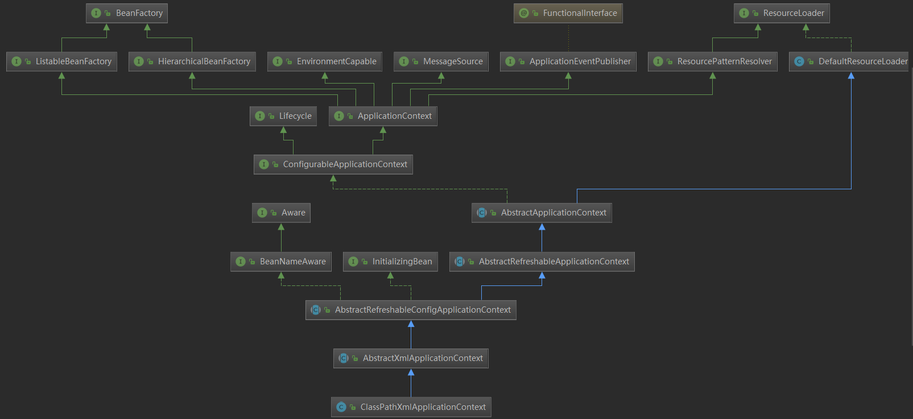

# SpringMVC初体验

### Spring前身前世与思想

#### Spring的前世今生

##### Spring的设计初衷

> Spring是为解决企业级应用开发的复杂性而设计，她的使命是：“简化开发”。有许多框架在某些方面做了简化，而Spring则立志于全面的简化Java开发，还充当了粘合剂的作用，可以将许多优秀框架整合在一起使用。
>
> 4个关键策略：
>
> 1. 基于POJO的轻量级和最小入侵性编程
>
>    （如：一个类若要支持动态代理，原生JDK层面就必须实现一个接口作为条件，但Spring层面可以不要任何条件，用CGlib满足；类有复制操作，JDK层面就必须实现Cloneable接口，Spring层面就不需要任何条件，用原型模式满足）
>
> 2. 通过依赖注入和面向接口松耦合
>
>    （不要手动new对象）
>
> 3. 基于切面和惯性进行声明式编程 
>
>    声明式的代码增强，把公共操作全部放在切面；惯性声明式编程：更符合我们编程习惯的可见的自由配置编程，比如通过xml配置
>
> 4. 通过切面和模板减少样板式代码

##### BOP编程伊始

> Bean Oriented Programming（面向bean编程）Spring中所有都是bean（Java普通类），bean放在spring容器中，spring容器本身也是bean。
>
> 对bean的控制（bean创建、销毁、管理）
>
> BeanFactory接口（工厂模式实现）允许通过名称创建和检索对象，也可管理对象之间关系。它最底层支持两个对象模型。
>
> 1. 单例：提供了具有特定类名的全局共享实例对象，可以在查询时对其进行检索，它是默认的也是最常用的对象模型。
> 2. 原型：确保每次检索都会创建单独的实例对象。在每个用户都需要自己的对象时采用原型模式。

##### AOP编程理念

> 面向切面编程，核心是构造切面，将那些影响多个类且与具体业务无关的行为封装到可重用的模块中来。
>
> AOP编程常用的场景有：Authentication（权限认证）、Logging（日志记录）、Transactions（事务处理）、Auto Caching（自动缓存处理）、Error Handling（统一错误处理）、Debugging（调试信息输出）等。

#### Spring中的编程思想总总结

| Spring思想 | 应用场景（特点）                                 | 归纳        |
| -------- | ---------------------------------------- | --------- |
| OOP      | 面向对象编程(Object Oriented Programming)用程序归纳总结生活中的一切事物。 | 继承、封装、多态  |
| BOP      | 面向Bean编程(Bean Oriented Programming)面向bean(普通java类)设计程序 | 一切从bean开始 |
| AOP      | 面向切面编程(Aspect Oriented Programming)找出多个类中有一定规律的代码，开发时拆开，运行时再合并(动态代理) | 解耦，专人做专事  |
| IOC      | 控制反转(Inversion of Control)将new对象的动作交给spring管理，并由spring保存已创建的对象(IOC容器) | 转交控制权     |
| DI/DL    | 依赖注入(Dependency Injection)依赖查找(Dependency Lookup)Spring不仅保存自己创建的对象还保存对象之间的关系。注入即赋值，有三种方式：构造方法、set方法、直接赋值。 | 赋值        |
|          |                                          |           |

#### Spring 5系统架构

> 以support结尾的模块都是提供扩展支持的模块

##### 

#### Spring版本命名规则

##### 语义化版本命名通用规则

##### 商业软件中常见的修饰词

##### 软件版本号使用限定

##### Spring 版本命名规则


### SpringMVC的设计

#### 思考设计

##### 解决痛点

> 直接在servlet上编写Controller太繁琐了，每编写一个servlet类都需要在xml中配置、且servlet类继承servlet官方提供的类并重写里面的一些方法。随着业务越来越复杂servlet类也会越来越多、配置也会越来越臃肿，非常不好管理，后期维护就变得异常困难。

##### 项目需求

> 解决上面痛点，基于servlet开发将配置和开发中，主要注意集中处理请求、封装请求参数、返回内容。

##### 技术方案

> 1. 容器化技术，对所有servlet类进行统一管理
>
> 2. 请求分发，有请求来时，统一交给一个类将请求分发给对应的类处理
>
> 3. 封装参数，post：用反射技术拿到处理请求的方法对应的接收参数的类，然后将请求体中的参数按照类中属性设置进去。get：用正则处理，从url中取出参数和值。
>
>    整体思路：容器启动时扫描注解，注册请求URL和对应的处理方法，请求时根据请求的URL定位到具体的处理方法；处理类中通过注解中加上对应URL，在反射方式拿到注解URL下的方法然后用反射调用该处理方法。

#### 实现案例


### Spring5注解编程基础组件

#### 配置组件

> - @Configuration：把类作为一个IOC容器，它的某个方法头上个若注册了@Bean就会作为这个Spring。（注解中可指定value，includeFilter，useDefaultFilter）
> - @ComponentScan：在配置类上添加该注解，默认就会扫描该类所在的包下所有的配置类，相当于<<content:component-scan>>
> - @Scope：用于指定scope作用域（用在类上）
> - @Lazy：表示延迟初始化，单例bean才延迟加载，不配默认非延迟加载（容器启动时不加载，调用时才加载）
> - @Condition：spring4开始提供支持，按照一定条件进行判断，满足条件才将该bean注册进IOC容器。配合继承Condition类的带有判断条件的类使用
> - @Import：导入外部资源
> - 生命周期控制
>   - @PostConstruct：用于指定初始化方法（用在方法上）
>   - @PreDestroy：用于指定销毁方法（用在方法上）
>   - @DependsOn：定义bean初始化及销毁时的顺序

#### 赋值（自动装配）组件

> **给IOC容器注册bean的方式**
>
> 1. @Bean 直接导入单个类
>
> 2. @ComponentScan 默认扫描@Controller @Service @Repostory @Component
>
> 3. @Import 快速给容器导入bean。 @Import直接导入、或者实现ImportSelector自定义规则实现、或者实现ImportDefinitionRegistrar获得BeanDefinitionRegistry可以手动直接往IOC容器中塞
>
> 4. FactoryBean把需要注册的对象封装为FactoryBean。FactoryBean负责将bean注册到IOC的bean，BeanFactory从IOC容器中获得Bean对象。
>
>    
>
>    **对Bean生命周期的监控**
>
>    1. 配置@Bean的参数init 
>    2. 分别实现InitializingBean和DisposableBean接口
>    3. 使用@PostConstruct和@PreDestroy注解
>    4. 自定义一个类，实现BeanPostProcessor接口
>
>    
>
>    @Value：支持基本数据类型、Spring EL 表达式
>
>    ```java
>    // 基本数据类型
>    @Value("XXX")
>    // spring el表达式
>    @Value("#{8-5}")
>    // 从环境变量，配置文件中取值
>    Environment em = applicationContext.getEnvironment();
>    @Value("${env.field}")
>
>    ```
>
>    - @Component：泛指组件
>    - @Service：标注业务层组件
>    - @Controller：标注控制层组件
>    - @Repository：标注数据访问层组件
>    - @PropertySource：读取配置文件赋值
>    - @Value：普通数据类型赋值
>    - @Qualifier：给实例取名用，若存在多个实例基本都要用它
>    - @Autowired：默认按类型装配，若想按名称装配可以结合@Qualifier使用
>    - @Resources：默认按名称装配，找不到名称匹配的bean就按类型装配
>    - @Primary：自动装配时出现多个bean候选时，加了该注解的作为首选，否则将异常
>
>    
>
>    

# Spring手写实战

### 顶层设计IOC与DI

#### 思考设计

##### 解决痛点

> 以前项目中手动new对象，声明后直接new或者在构造方法中new。如果一个类在多个地方都被使用到就会被new出来多个。不好控制对象的生命周期

##### 项目需求

> 1. 对所有对象统一管理

##### 技术方案

> 1. 存放，将所有对象保存在一个地方，用map存放，需要该对象时直接从map中取。
> 2. 属性赋值，将扫描到的类依次实例化，有依赖关系的就将实例化的对象的引用赋值给它。（有个循环依赖不好解决）

#### 实现案例

第一章：从Servlet到ApplicationContext

> ApplicationContext 简单理解为工厂类；getBean() 从IOC容器中获取一个实例方法。
>
> 在调用Servlet init()时就要触发ApplicationContext
>
> Spring中调用DI由getBean触发，调用getBean先创建对象后触发DI。
>
> 1. 调用Servlet init()，创建ApplicationContext
> 2. 调用ApplicationContext中的getBean创建对象然后发生DI
>
>
>
> 1. 调用Servlet init()，创建ApplicationContext
>
> 2. 读取配置文件(properties|xm|yml…)，创建BeanDefinitionReader
>
> 3. 扫描相关类，**配置文件中信息和扫描到的类相关信息都封装成BeanDefinition**保存在内存中(getBean要用)。从ApplicationContext到BeanDefinition过程中有个BeanDefinitionReader(解析文件)用来从文件中读取信息并将信息封装在BeanDefinition，因为ApplicationContext只负责创建bean不负责读取文件。（扫描类(遍历文件夹和文件)时记录类名，之后根据类名用反射拿到类信息）
>
> 4. 初始化容器(ApplicationContext.getBean())，并实例化对象，考虑到能够对对象进行很好的扩展用到了装饰器模式，因为这个对象可能变成代理对象，又考虑到代理对象与原生对象有关联关系，用**BeanWrapper保存原生对象与未来创建的各种扩展出的对象之间的关联关系**。
>
> 5. 完成DI（循环依赖：用两个缓存，循环两次；1.把第一次读取结果为空的BeanDefinition存到一个缓存，2.等第一次循环之后，第2次循环再检查第一次的缓存再进行赋值）
>
>    @Controller和@Service都是@Component的类似子类关系

第二章：基础流程设计

2.2.1、application.properties配置

2.2.2、pom.xml配置

2.2.3、web.xml配置

2.2.4、GPDispatcherServlet实现

第三章：顶层结构设计（配置解析和IOC）

2.3.1、annotation（自定义配置）模块

2.3.2、beans（配置封装）模块

> - BeanDefinition
> - BeanWrapper

2.3.3、context（IOC容器）模块

> - ApplicationContext

第四章：完成DI依赖注入功能

2.4.1、从getBean()开始


### SpringMVC

> 核心处理流程：
>
> DispatcherServlet中调用init()作为入口，init()中调用initStategers()初始化九大组件。一个HandlerMapping对应一个HandlerAdapter，ViewResolver是根据ModeAndView来关联数据。
>
> 运行阶段：service()通过HandlerMapping拿到对应HandlerAdapter，再拿到ModeAndView，根据ModeAndView判断返回页面还是数据，若返回页面就启动模板引擎最后生成一个View，若返回数据就用response.getWrite().write()输出数据。View中的render()是渲染页面，读取模板中的文件内容，用正则替换占位符，最后通过response输出到浏览器。
>
> 
>
> **九大组件中部分：**
>
> - MultpartResolver：多文件上传组件
> - LocaleResolver：本地语言环境
> - ThemeResolver：主题模板处理器
> - HandlerMapping：根据url找到对应的处理方法’
>
> - HandlerAdapter：动态参数适配器
> - HandlerExceptionResolver：异常拦截器
> - RequestToViewNameTranslator：视图提取器，从request获取viewName
>
> - ViewResolvers：视图转换器，模板引擎
> - FlashMapManager：参数缓存器

SpringMVC核心组件执行流程

> 1. HandlerMapping：在处理映射关系时没有用map的数据结构存储，因为map只能存储URL和参数较简单的情况，稍微复杂些来个在URL路径中参数就需要用正则去匹配，或者带参数名的又是其他处理方式等等，用简单的map存储就不太合适。于是这儿用 List 存储 Handler 其中Handler中存储了匹配URL的正则表达式等。
> 2. HandlerAdapter：动态参数适配，通过handlerMapping找到对应处理方法后将请求传的参数动态绑定在handlerAdapter中。
> 3. ModelAndView：调用了业务处理方法后，将处理后的返回结果存储在ModelAndView中，方便进行下一步将数据交给视图处理器处理。
> 4. ViewResolver：处理视图数据
> 5. View：转换为视图显示


> 视频中第二段开始晕车，还需要再看看
>
> 将url中的正则转义成java中正则。


### AOP

> 底层用动态代理实现，可以对功能增强和代码解耦。
>
> 织入一些新的代码，生成一个新的类。要么跟目标类实现一个相同的接口，要么就是直接继承目标类（JDK），覆盖目标类的方法（CGLIB）。
>
> 真正调用代码逻辑时直接运行生成的代理类的代码。
>
> 
>
> Advice 通知，一个处理方法对应多个通知，Map<<Method, List<Advice>>>,
>
> IOC/AOP/DI/MVC的顺序
>
> 从ApplicationContext中进入，判断BeanWarper中的类是否要生成代理类。需要生成代理类就生成代理类(根据切面表达式判断)，并在实例化bean中将代理类实例化的对象作为实例对象。

核心组件执行流程：

> ApplicationContext  ->  AdvisedSupport  ->  AopConfig  ->  Advice  ->   JDKDynamicAopProxy  


# Spring核心原理源码分析

### IOC运行时序图

#### 思考设计

> **1、对象与对象之间的关系如何表示？**
>
> xml、yml、注解等
>
> **2、描述对象关系的文件存放在哪儿？**	
>
> classpath、network、filesystem、servletContext.
>
> **3、不同配置文件对对象的描述不一样（标准的、自定义声明式的的）如何统一？**
>
> 在内部需要有一个统一的关于对象的定义，所有外部描述都必须转成统一的描述定义。
>
> **4、如何对不同的配置文件进行解析？**
>
> 需要有不同的配置文件语法，解析不同文件时采用不同的解析器解析。
>
> 
>
>
> spring读取时先要找到文件在哪儿，再加载里面的内容。由于来源广泛且不同配置文件书写语法不一致，于是就定义 了一个配置文件标准，将配置文件中的信息统一解析放在BeanDefinition中，统一格式。
>
> 在解析配置文件时根据不同配置文件类型实施不同解析策略。
>
> ClassPathApplicationContext/AnnotationConfigApplicationContext/WebApplicationContext等解析策略。BeanDefinitionReader也有多种（XmlBeanDefinitionReader等）BeanDefinition层次也有多种封装策略（如：XmlBeanDefinition等 ），但最终都需封装成BeanDefinition。

#### 设计点关键

##### 1、BeanFactory接口（定义IOC容器规范）

> 作为顶层的一个接口类，它定义了IOC容器的基本功能规范，其中有三个非常重要的子类：ListableBeanFactory、HierarchicalBeanFactory、AutowireCapableBeanFactory。
>
> 为什么需要这么多层次的接口呢？主要是**区分在spring内部在操作过程中对象的传递和转化过程时对对象的数据访问所做的限制**。ListableBeanFactory 接口表示这些接口是可列表化的，而HierarchicalBeanFactory表示这些bean是有继承关系的，也就是每个bean有可能有父类bean。AutowireCapableBeanFactory定义bean的自动装配规则。这三个接口共同定义了bean的集合、bean之间的关系、bean的行为。
>
> ```java
> public interface BeanFactory {
> 
> 	/**
> 	 * Used to dereference a {@link FactoryBean} instance and distinguish it from
> 	 * beans <i>created</i> by the FactoryBean. For example, if the bean named
> 	 * {@code myJndiObject} is a FactoryBean, getting {@code &myJndiObject}
> 	 * will return the factory, not the instance returned by the factory.
> 	 */
> 	//对FactoryBean的转义定义，因为如果使用bean的名字检索FactoryBean得到的对象是工厂生成的对象，
> 	//如果需要得到工厂本身，需要转义
> 	String FACTORY_BEAN_PREFIX = "&";
> 
> 	//根据bean的名字，获取在IOC容器中得到bean实例
> 	Object getBean(String name) throws BeansException;
> 
> 	//根据bean的名字和Class类型来得到bean实例，增加了类型安全验证机制。
> 	<T> T getBean(String name, @Nullable Class<T> requiredType) throws BeansException;
> 	Object getBean(String name, Object... args) throws BeansException;
> 	<T> T getBean(Class<T> requiredType) throws BeansException;
> 	<T> T getBean(Class<T> requiredType, Object... args) throws BeansException;
> 
> 	//提供对bean的检索，看看是否在IOC容器有这个名字的bean
> 	boolean containsBean(String name);
> 
> 	/**
> 	 * Is this bean a shared singleton? That is, will {@link #getBean} always
> 	 * return the same instance?
> 	 * <p>Note: This method returning {@code false} does not clearly indicate
> 	 * independent instances. It indicates non-singleton instances, which may correspond
> 	 * to a scoped bean as well. Use the {@link #isPrototype} operation to explicitly
> 	 * check for independent instances.
> 	 * <p>Translates aliases back to the corresponding canonical bean name.
> 	 * Will ask the parent factory if the bean cannot be found in this factory instance.
> 	 * @param name the name of the bean to query
> 	 * @return whether this bean corresponds to a singleton instance
> 	 * @throws NoSuchBeanDefinitionException if there is no bean with the given name
> 	 * @see #getBean
> 	 * @see #isPrototype
> 	 */
> 	//根据bean名字得到bean实例，并同时判断这个bean是不是单例
> 	boolean isSingleton(String name) throws NoSuchBeanDefinitionException;
> 	boolean isPrototype(String name) throws NoSuchBeanDefinitionException;
> 	boolean isTypeMatch(String name, ResolvableType typeToMatch) throws NoSuchBeanDefinitionException;
> 	boolean isTypeMatch(String name, @Nullable Class<?> typeToMatch) throws NoSuchBeanDefinitionException;
> 
> 	//得到bean实例的Class类型
> 	@Nullable
> 	Class<?> getType(String name) throws NoSuchBeanDefinitionException;
> 
> 	//得到bean的别名，如果根据别名检索，那么其原名也会被检索出来
> 	String[] getAliases(String name);
> }
> ```
>
> 


##### 2、BeanDefinition（定义对象描述）

> 装配bean时可以有多种方式（如：xml配置、注解配置等），它用于将各种配置方式转化成统一的描述定义。

##### 3、BeanDefinitionReader（读取bean配置信息）

> 在读取Bean信息时解析的过程非常复杂，功能被分得很细，需要被扩展的地方非常多。


#### 容器初始化过程

**IOC容器初始化三部曲**

> 1. **定位：**定位配置文件和扫描相关注解，容器通过BeanDefinitionReader来完成定义信息的解析和Bean信息的注册（如使用XmlBeanDefinitionReader来解析Bean的xml定义文件，但实际处理是委托给BeanDefinitionParserDelegate来完成，从而得到bean的定义信息），这些信息在spring中使用BeanDefinition对象来表示。
>
> 2. **加载：**通过ResourceLoader来完成资源文件位置的定位，DefaultResourceLoader是默认实现，同时上下文本身就给出了ResourceLoader的实现，可以从类路径、文件系统、URL等方式来定位资源位置。
>
> 3. **注册：**由BeanDefinitionRegistry接口来实现，注册过程就是在IOC容器中用hashmap来保存BeanDefinition的过程。

**大致步骤**

> 1. 初始化入口在容器中实现的refresh()调用来完成。
> 2. 对bean定义载入IOC容器使用的方法是loadBeanDefinition()


#### 容器初始化实例

##### 基于Web的IOC 

init()

> 从DispatchServlet的init()开始，但是发现init()在父类HttpServletBean中重写的init()

initServletBean()

> 真正完成初始化容器的动作

initWebApplicationContext()

> 可以看到在 configAndRefreshWebApplicationContext()中调用了refresh()，这个就是IOC容器真正的入口。IOC容器初始化后调用了DispatchServlet中的onRefresh()，在onRefresh()中调用了initStrategies()初始化SpringMVC 9大组件


##### 基于XML的IOC

> ApplicationContext允许上下文嵌套，通过保持父上下文可以维持一个上下文体系。对于bean的查找可以在这个上下文体系中发生，首先检查当前上下文，其次是父上下文，逐级向上，这样为不同的Spring应用提供了一个共享的bean定义环境。

**类图**



###### 1、寻找入口

```java
ApplicationContext app = new ClassPathXmlApplicationContext("application.xml"); 
```

> 于此类似的还有 AnnotationConfigApplicationContext、FileSystemXmlApplicationContext、XMLWebApplicationContext等都继承与父容器AbstractApplicationContext主要用到了装饰器模式和策略模式，最终都是调用的refresh()

**构造函数调用**

```java
// ============ ClassPathXmlApplicationContext ============ 
public ClassPathXmlApplicationContext(String configLocation) throws BeansException {
    this(new String[] {configLocation}, true, null);
}

public ClassPathXmlApplicationContext(
    String[] configLocations, boolean refresh, @Nullable ApplicationContext parent)
    throws BeansException {
	// 调用父类构造方法为容器设置好spring资源加载器
    super(parent);
    // 【后面分析该方法】
    setConfigLocations(configLocations);
    if (refresh) {
        // 重启、刷新、重置
        // 【后面分析该方法】
        refresh();
    }
}
```


###### 2、设置配置路径

```java
// ============ ClassPathXmlApplicationContext ============ 
// 解析Bean定义资源文件的路径，处理多个资源文件字符串数组
public void setConfigLocations(@Nullable String... locations) {
   if (locations != null) {
      Assert.noNullElements(locations, "Config locations must not be null");
      this.configLocations = new String[locations.length];
      for (int i = 0; i < locations.length; i++) {
         // resolvePath为同一个类中将字符串解析为路径的方法
         this.configLocations[i] = resolvePath(locations[i]).trim();
      }
   }
   else {
      this.configLocations = null;
   }
}
```


###### 3、开始启动

> spring对bean配置资源的载入是从refresh()开始的，refresh()是一个模板方法，规定了IOC容器的启动流程，有些逻辑交给子类去实现的。这儿ClassPathXmlApplicationContext通过调用父类AbstractApplicationContext#refresh()启动了IOC容器对bean的载入过程。

```java
// ============ AbstractApplicationContext ============ 
public void refresh() throws BeansException, IllegalStateException {
   synchronized (this.startupShutdownMonitor) {
      // Prepare this context for refreshing.
      // 1、调用容器准备刷新的方法，获取容器的当时时间，同时给容器设置同步标识
      prepareRefresh();

      // Tell the subclass to refresh the internal bean factory.
      // ==================== 载入配置信息 ====================
      // 2、告诉子类启动refreshBeanFactory()方法，
      // Bean定义资源文件的载入从子类的refreshBeanFactory()方法启动
      ConfigurableListableBeanFactory beanFactory = obtainFreshBeanFactory();

      // Prepare the bean factory for use in this context.
      // 3、为BeanFactory配置容器特性，例如类加载器、事件处理器等
      prepareBeanFactory(beanFactory);

      try {
         // Allows post-processing of the bean factory in context subclasses.
         // 4、为容器的某些子类指定特殊的BeanPost事件处理器
         postProcessBeanFactory(beanFactory);

         // Invoke factory processors registered as beans in the context.
         // 5、调用所有注册的BeanFactoryPostProcessor的Bean
         invokeBeanFactoryPostProcessors(beanFactory);

         // Register bean processors that intercept bean creation.
         // 6、为BeanFactory注册BeanPost事件处理器.
         // BeanPostProcessor是Bean后置处理器，用于监听容器触发的事件
         registerBeanPostProcessors(beanFactory);

         // Initialize message source for this context.
         // 7、初始化信息源，和国际化相关.
         initMessageSource();

         // Initialize event multicaster for this context.
         // 8、初始化容器事件传播器.
         initApplicationEventMulticaster();

         // Initialize other special beans in specific context subclasses.
         // 9、调用子类的某些特殊Bean初始化方法
         onRefresh();

         // Check for listener beans and register them.
         // 10、为事件传播器注册事件监听器.
         registerListeners();

         // Instantiate all remaining (non-lazy-init) singletons.
         // 11、初始化所有剩余的单例Bean
         finishBeanFactoryInitialization(beanFactory);

         // Last step: publish corresponding event.
         // 12、初始化容器的生命周期事件处理器，并发布容器的生命周期事件
         finishRefresh();
      } catch (BeansException ex) {
         // Destroy already created singletons to avoid dangling resources.
         // 13、销毁已创建的Bean
         destroyBeans();

         // Reset 'active' flag.
         // 14、取消refresh操作，重置容器的同步标识。
         cancelRefresh(ex);

         // Propagate exception to caller.
         throw ex;
      } finally {
         // Reset common introspection caches in Spring's core, since we
         // might not ever need metadata for singleton beans anymore...
         // 15、重设公共缓存
         resetCommonCaches();
      }
   }
}
```


###### 4、创建容器

```java
// ============ AbstractApplicationContext ============ 
protected ConfigurableListableBeanFactory obtainFreshBeanFactory() {
   // 使用了【委派模式】，父类定义了抽象的refreshBeanFactory()方法，
   // 具体实现调用子类容器的refreshBeanFactory()方法
   refreshBeanFactory();
   ConfigurableListableBeanFactory beanFactory = getBeanFactory();
   return beanFactory;
}
```

> 注意：下面是调用的子类AbstractRefreshableApplicationContext中的refreshBeanFactory
>
> 功能：若有容器则销毁后重新创建（操作BeanFactory），然后装载bean定义。
>
> 疑问：为什么需要销毁后再创建，不能用之前的容器吗，为什么？
```java
// ============ AbstractRefreshableApplicationContext ============ 
protected final void refreshBeanFactory() throws BeansException {
   // 若已经有容器，则销毁容器中的bean，关闭容器
   if (hasBeanFactory()) {
      destroyBeans();
      closeBeanFactory();	
   }
   try {
      // 创建IOC容器
      DefaultListableBeanFactory beanFactory = createBeanFactory();
      beanFactory.setSerializationId(getId());
      // 对IOC容器进行定制化，如设置启动参数，开启注解的自动装配等
      customizeBeanFactory(beanFactory);
      // 调用载入Bean定义的方法，又使用了【委派模式】，
      // 在当前类中只定义了抽象的loadBeanDefinitions方法，具体的实现调用子类容器
       // 【后面分析该方法】
      loadBeanDefinitions(beanFactory);
      synchronized (this.beanFactoryMonitor) {
         this.beanFactory = beanFactory;
      }
   }
   catch (IOException ex) {
      throw new ApplicationContextException("I/O error parsing bean definition source for " + getDisplayName(), ex);
   }
}
```


###### 5、载入配置路径

> 准备用XmlBeanDefinitionReader解析xml，设置xml解析器相关信息

```java
// ============ AbstractXmlApplicationContext ============ 
/**
 * 实现父类抽象的载入Bean定义方法
 */
protected void loadBeanDefinitions(DefaultListableBeanFactory beanFactory) throws BeansException, IOException {
   // Create a new XmlBeanDefinitionReader for the given BeanFactory.
   // 创建XmlBeanDefinitionReader，即创建Bean读取器，并通过回调设置到容器中去，容  器使用该读取器读取Bean定义资源
   XmlBeanDefinitionReader beanDefinitionReader = new XmlBeanDefinitionReader(beanFactory);

   // Configure the bean definition reader with this context's
   // resource loading environment.
   // 为Bean读取器设置Spring资源加载器，AbstractXmlApplicationContext的
   // 祖先父类AbstractApplicationContext继承DefaultResourceLoader，因此，容器本身也是一个资源加载器
   beanDefinitionReader.setEnvironment(this.getEnvironment());
   // 【注意】这儿设置的this(当前对象的引用)，当前对象是DefaultResourceLoader的子类，后面在AbstractBeanDefinitionReader#loadBeanDefinitions(String, Set<Resource>) 中调用getResource(String)时实际就是调用的DefaultResourceLoader中的方法
   beanDefinitionReader.setResourceLoader(this);
   // 为Bean读取器设置SAX xml解析器（ResourceEntityResolver继承自SAX xml解析器的实体）
   beanDefinitionReader.setEntityResolver(new ResourceEntityResolver(this));

   // Allow a subclass to provide custom initialization of the reader,
   // then proceed with actually loading the bean definitions.
   // 当Bean读取器读取Bean定义的Xml资源文件时，启用Xml的校验机制
   initBeanDefinitionReader(beanDefinitionReader);
   // Bean读取器真正实现加载的方法
   // 【后面分析该方法】
   loadBeanDefinitions(beanDefinitionReader);
}
```


###### 6、分配路径处理策略

> 获取到要加载的资源（获取Resource和configLocations），根据配置信息为其分配读取该配置的策略，情况比较复杂比较绕。

```java
// ================ AbstractXmlApplicationContext ================ 
/**
 * Xml Bean读取器加载Bean定义资源
 */
protected void loadBeanDefinitions(XmlBeanDefinitionReader reader) throws BeansException, IOException {
   // 获取Bean定义资源的定位
   Resource[] configResources = getConfigResources();
   if (configResources != null) {
      // Xml Bean读取器【调用其父类AbstractBeanDefinitionReader】读取定位的Bean定义资源
      reader.loadBeanDefinitions(configResources);
   }
   // 若子类中获取的Bean定义资源定位为空，则获取FileSystemXmlApplicationContext构造方法中setConfigLocations方法设置的资源
   String[] configLocations = getConfigLocations();
   if (configLocations != null) {
      // Xml Bean读取器【调用其父类AbstractBeanDefinitionReader】读取定位的Bean定义资源
      reader.loadBeanDefinitions(configLocations);
   }
}

// ================ AbstractBeanDefinitionReader ================
// 重载方法，调用loadBeanDefinitions(String);
@Override
public int loadBeanDefinitions(String... locations) throws BeanDefinitionStoreException {
   Assert.notNull(locations, "Location array must not be null");
   int counter = 0;
   for (String location : locations) {
      counter += loadBeanDefinitions(location);
   }
   return counter;
}

// 重载方法，调用下面的loadBeanDefinitions(String, Set<Resource>);方法
@Override
public int loadBeanDefinitions(String location) throws BeanDefinitionStoreException {
    return loadBeanDefinitions(location, null);
}

public int loadBeanDefinitions(String location, @Nullable Set<Resource> actualResources) throws BeanDefinitionStoreException {
    // 获取在IOC容器初始化过程中设置的资源加载器
    ResourceLoader resourceLoader = getResourceLoader();
    if (resourceLoader == null) {
        throw new BeanDefinitionStoreException("……");
    }

    if (resourceLoader instanceof ResourcePatternResolver) {
        // Resource pattern matching available.
        try {
            // 将指定位置的Bean定义资源文件解析为Spring IOC容器封装的资源
            // 【7、解析配置文件，加载多个指定位置的Bean定义资源文件】 ==== getResources(location) ======在AbstractXmlApplicationContext#loadBeanDefinitions(DefaultListableBeanFactory)设置的resourceLoader，此处调用的DefaultResourceLoader#getResource(String)
            Resource[] resources = ((ResourcePatternResolver) resourceLoader).getResources(location);
            // 【8、读取配置文件】委派调用其子类XmlBeanDefinitionReader的方法，实现加载功能
            int loadCount = loadBeanDefinitions(resources);
            if (actualResources != null) {
                for (Resource resource : resources) {
                    actualResources.add(resource);
                }
            }
            return loadCount;
        }
        catch (IOException ex) {
            throw new BeanDefinitionStoreException(
                "Could not resolve bean definition resource pattern [" + location + "]", ex);
        }
    }
    else {
        // Can only load single resources by absolute URL.
        // 将指定位置的Bean定义资源文件解析为Spring IOC容器封装的资源
        // 加载单个指定位置的Bean定义资源文件
        Resource resource = resourceLoader.getResource(location);
        // 【委派调用其子类XmlBeanDefinitionReader的方法】，实现加载功能
        int loadCount = loadBeanDefinitions(resource);
        if (actualResources != null) {
            actualResources.add(resource);
        }
        return loadCount;
    }
}
```


###### 7、解析配置文件路径

> 加载资源时用getResource()获取要加载的资源
>
> 加载多个指定位置的Bean定义资源文件，在AbstractXmlApplicationContext#loadBeanDefinitions(DefaultListableBeanFactory)设置的resourceLoader，但因为AbstractXmlApplicationContext是DefaultResourceLoader的子类，所以此处调用的DefaultResourceLoader的中的getResource(String)

```java
public Resource getResource(String location) {
    Assert.notNull(location, "Location must not be null");

    for (ProtocolResolver protocolResolver : this.protocolResolvers) {
        Resource resource = protocolResolver.resolve(location, this);
        if (resource != null) {
            return resource;
        }
    }
    // 若是类路径的方式，则使用ClassPathResource 来得到bean文件的资源对象
    if (location.startsWith("/")) {
        return getResourceByPath(location);
    }
    else if (location.startsWith(CLASSPATH_URL_PREFIX)) {
        return new ClassPathResource(location.substring(CLASSPATH_URL_PREFIX.length()), getClassLoader());
    }
    else {
        try {
            // Try to parse the location as a URL...
            // 若是URL 方式，使用UrlResource 作为bean 文件的资源对象
            URL url = new URL(location);
            return (ResourceUtils.isFileURL(url) ? new FileUrlResource(url) : new UrlResource(url));
        }
        catch (MalformedURLException ex) {
            // No URL -> resolve as resource path.
            // 若既不是classpath标识，又不是URL标识的Resource定位则调用
            // 容器本身的getResourceByPath方法获取Resource
            return getResourceByPath(location);
        }
    }
}
```

> DefaultResourceLoader中提供了getResourceByPath()的实现，是为了处理既不是classpath标识也不是URL标识的Resource定位的情况。
>
> ```java
> protected Resource getResourceByPath(String path) {
> return new ClassPathContextResource(path, getClassLoader());
> }
> ```
> 比如FileSystemXmlApplication容器就重写了getResourceByPath()，通过子类的覆盖巧妙完成了将类路径变成文件路径的转换。
>
> ```java
> // FileSystemResourceLoader#getResourceByPath
> protected Resource getResourceByPath(String path) {
>     if (path.startsWith("/")) {
>         path = path.substring(1);
>     }
>     // 这里使用文件系统资源对象来定义bean 文件
>     return new FileSystemResource(path);
> }
> ```


###### 8、读取配置文件内容

> 经过上面步骤解析到配置文件内容后，这步就准备读取配置文件信息了。
>
> 此步骤主要是载入bean配置信息，然后将其转换成流，准备进一步将其转为Document对象。

```java
// ============== AbstractBeanDefinitionReader ================
@Override
public int loadBeanDefinitions(Resource... resources) throws BeanDefinitionStoreException {
    Assert.notNull(resources, "Resource array must not be null");
    int counter = 0;
    for (Resource resource : resources) {
        counter += loadBeanDefinitions(resource);
    }
    return counter;
}

// ================= XmlBeanDefinitionReader ===================
// XmlBeanDefinitionReader加载资源的入口方法
@Override
public int loadBeanDefinitions(Resource resource) throws BeanDefinitionStoreException {
    // 将读入的XML资源进行特殊编码处理
    return loadBeanDefinitions(new EncodedResource(resource));
}

// 这里是载入XML形式Bean定义资源文件方法
public int loadBeanDefinitions(EncodedResource encodedResource) throws BeanDefinitionStoreException {
    Assert.notNull(encodedResource, "EncodedResource must not be null");

    Set<EncodedResource> currentResources = this.resourcesCurrentlyBeingLoaded.get();
    if (currentResources == null) {
        currentResources = new HashSet<>(4);
        this.resourcesCurrentlyBeingLoaded.set(currentResources);
    }
    if (!currentResources.add(encodedResource)) {
        throw new BeanDefinitionStoreException("……");
    }
    try {
        // 将资源文件转为InputStream的IO流
        InputStream inputStream = encodedResource.getResource().getInputStream();
        try {
            // 从InputStream中得到XML的解析源
            InputSource inputSource = new InputSource(inputStream);
            if (encodedResource.getEncoding() != null) {
                inputSource.setEncoding(encodedResource.getEncoding());
            }
            // 这里是具体的读取过程
            return doLoadBeanDefinitions(inputSource, encodedResource.getResource());
        }
        finally {
            // 关闭从Resource中得到的IO流
            inputStream.close();
        }
    }
    catch (IOException ex) {
        throw new BeanDefinitionStoreException("……");
    }
    finally {
        currentResources.remove(encodedResource);
        if (currentResources.isEmpty()) {
            this.resourcesCurrentlyBeingLoaded.remove();
        }
    }
}

// 从特定XML文件中实际载入Bean定义资源的方法
protected int doLoadBeanDefinitions(InputSource inputSource, Resource resource)
    throws BeanDefinitionStoreException {
    try {
        // 将XML文件转换为DOM对象，解析过程由documentLoader实现
        Document doc = doLoadDocument(inputSource, resource);
        // 这里是启动对Bean定义解析的详细过程，该解析过程会用到Spring的Bean配置规则
        return registerBeanDefinitions(doc, resource);
    }
    // ……
}
```


###### 9、准备文档

> 将配置信息的流转成文档对象

```java
// ================= XmlBeanDefinitionReader ===================
protected Document doLoadDocument(InputSource inputSource, Resource resource) throws Exception {
    return this.documentLoader.loadDocument(inputSource, getEntityResolver(), this.errorHandler,
                                            getValidationModeForResource(resource), isNamespaceAware());
}

// ================= DefaultDocumentLoader ===================
// 使用标准的JAXP将载入的Bean定义资源转换成document对象
@Override
public Document loadDocument(InputSource inputSource, EntityResolver entityResolver,
                             ErrorHandler errorHandler, int validationMode, boolean namespaceAware) throws Exception {

    // 创建文件解析器工厂
    DocumentBuilderFactory factory = createDocumentBuilderFactory(validationMode, namespaceAware);
    if (logger.isDebugEnabled()) {
        logger.debug("Using JAXP provider [" + factory.getClass().getName() + "]");
    }
    // 创建文档解析器
    DocumentBuilder builder = createDocumentBuilder(factory, entityResolver, errorHandler);
    // 解析Spring的Bean定义资源
    return builder.parse(inputSource);
}

protected DocumentBuilderFactory createDocumentBuilderFactory(int validationMode, boolean namespaceAware)
    throws ParserConfigurationException {

    // 创建文档解析工厂
    DocumentBuilderFactory factory = DocumentBuilderFactory.newInstance();
    factory.setNamespaceAware(namespaceAware);

    // 设置解析XML的校验
    if (validationMode != XmlValidationModeDetector.VALIDATION_NONE) {
        factory.setValidating(true);
        if (validationMode == XmlValidationModeDetector.VALIDATION_XSD) {
            // Enforce namespace aware for XSD...
            factory.setNamespaceAware(true);
            try {
                factory.setAttribute(SCHEMA_LANGUAGE_ATTRIBUTE, XSD_SCHEMA_LANGUAGE);
            }
            catch (IllegalArgumentException ex) {
                ParserConfigurationException pcex = new ParserConfigurationException("……");
                pcex.initCause(ex);
                throw pcex;
            }
        }
    }

    return factory;
}
```

> 此解析过程调用javaEE标准的JAXP标准进行处理。至此Sprig IOC容器根据定位的bean配置信息，将其加载并转换为Document对象过程完成。


###### 10、分配解析策略

> bean配置资源的载入解析分为两个过程：
>
> 1. 调用xml解析器将bean配置信息转换到document对象
> 2. 按照spring bean的定义规则对document对象进行解析，其解析过程在BeanDefinitionDocumentReader接口的实现类DefaultBeanDefinitionDocumentReader中实现。

```java
// ============ XmlBeanDefinitionReader ============
// 按照Spring的Bean语义要求将Bean定义资源解析并转换为容器内部数据结构
public int registerBeanDefinitions(Document doc, Resource resource) throws BeanDefinitionStoreException {
// 得到BeanDefinitionDocumentReader来对xml格式的BeanDefinition解析
    BeanDefinitionDocumentReader documentReader = createBeanDefinitionDocumentReader();
	// 获得容器中注册的Bean数量
    int countBefore = getRegistry().getBeanDefinitionCount();
    // 解析过程入口，使用了【委派模式】，BeanDefinitionDocumentReader只是接口,具体解析实现过程由实现类DefaultBeanDefinitionDocumentReader完成
    documentReader.registerBeanDefinitions(doc, createReaderContext(resource));
    // 统计解析的Bean数量
    return getRegistry().getBeanDefinitionCount() - countBefore;
}
```


###### 11、将配置载入内存

> BeanDefinitionDocumentReader通过registerBeanDefinitions()调用其实现类DefaultBeanDefinitionDocumentReader对Document对象进行解析

```java
// ============ DefaultBeanDefinitionDocumentReader ============
/**
 * 根据Spring DTD对Bean的定义规则解析Bean定义Document对象
 */
@Override
public void registerBeanDefinitions(Document doc, XmlReaderContext readerContext) {
    // 获得XML描述符
    this.readerContext = readerContext;
    logger.debug("Loading bean definitions");
    // 获得Document的根元素
    Element root = doc.getDocumentElement();
    doRegisterBeanDefinitions(root);
}

/**
 * 解析<beans/>根节点下的所有bean
 */
protected void doRegisterBeanDefinitions(Element root) {
    // Any nested <beans> elements will cause recursion in this method. In
    // order to propagate and preserve <beans> default-* attributes correctly,
    // keep track of the current (parent) delegate, which may be null. Create
    // the new (child) delegate with a reference to the parent for fallback purposes,
    // then ultimately reset this.delegate back to its original (parent) reference.
    // this behavior emulates a stack of delegates without actually necessitating one.

    // 具体的解析过程由BeanDefinitionParserDelegate实现，
    // BeanDefinitionParserDelegate中定义了Spring Bean定义XML文件的各种元素
    BeanDefinitionParserDelegate parent = this.delegate;
    // 【后面分析该方法】
    this.delegate = createDelegate(getReaderContext(), root, parent);
    // ……

    // 在解析Bean定义之前，进行自定义的解析，增强解析过程的可扩展性
    preProcessXml(root);
    // 从Document的根元素开始进行Bean定义的Document对象
     // 【后面分析该方法】
    parseBeanDefinitions(root, this.delegate);
    // 在解析Bean定义之后，进行自定义的解析，增加解析过程的可扩展性
    postProcessXml(root);

    this.delegate = parent;
}

/**
 * 创建BeanDefinitionParserDelegate，用于完成真正的解析过程
 */
protected BeanDefinitionParserDelegate createDelegate(
    XmlReaderContext readerContext, Element root, @Nullable BeanDefinitionParserDelegate parentDelegate) {

    BeanDefinitionParserDelegate delegate = new BeanDefinitionParserDelegate(readerContext);
    // BeanDefinitionParserDelegate初始化Document根元素
    delegate.initDefaults(root, parentDelegate);
    return delegate;
}

/**
 * 使用Spring的Bean规则从Document的根元素开始进行Bean定义的Document对象
 */
protected void parseBeanDefinitions(Element root, BeanDefinitionParserDelegate delegate) {
    // Bean定义的Document对象使用了Spring默认的XML命名空间
    if (delegate.isDefaultNamespace(root)) {
        // 获取Bean定义的Document对象根元素的所有子节点
        NodeList nl = root.getChildNodes();
        for (int i = 0; i < nl.getLength(); i++) {
            Node node = nl.item(i);
            // 获得Document节点是XML元素节点
            if (node instanceof Element) {
                Element ele = (Element) node;
                // Bean定义的Document的元素节点使用的是Spring默认的XML命名空间
                if (delegate.isDefaultNamespace(ele)) {
                    // 使用Spring的Bean规则解析元素节点
                     // 【后面分析该方法】
                    parseDefaultElement(ele, delegate);
                }
                else {
                    // 没有使用Spring默认的XML命名空间，则使用用户自定义的解析规则解析元素节点
                    delegate.parseCustomElement(ele);
                }
            }
        }
    }
    else {
        // Document的根节点没有使用Spring默认的命名空间，则使用用户自定义的
        // 解析规则解析Document根节点
        delegate.parseCustomElement(root);
    }
}

/**
 * 使用Spring的Bean规则解析Document元素节点
 */
private void parseDefaultElement(Element ele, BeanDefinitionParserDelegate delegate) {
    // 如果元素节点是<Import>导入元素，进行导入解析
    if (delegate.nodeNameEquals(ele, IMPORT_ELEMENT)) {
        importBeanDefinitionResource(ele);
    }
    // 如果元素节点是<Alias>别名元素，进行别名解析
    else if (delegate.nodeNameEquals(ele, ALIAS_ELEMENT)) {
        processAliasRegistration(ele);
    }
    // 元素节点既不是导入元素，也不是别名元素，即普通的<Bean>元素，
    // 按照Spring的Bean规则解析元素
    else if (delegate.nodeNameEquals(ele, BEAN_ELEMENT)) {
        processBeanDefinition(ele, delegate);
    }
    else if (delegate.nodeNameEquals(ele, NESTED_BEANS_ELEMENT)) {
        // recurse
        doRegisterBeanDefinitions(ele);
    }
}
```

> 可以使用< import>元素来导入IOC容器所需要的其他资源，spring IOC容器在解析时会首先将指定导入的资源加载进容器中。
>
> 使用< ailas>别名时，spring IOC容器首先将别名元素所定义的别名注册到容器中。
>
> 对于其他的普通< bean>元素的解析由BeanDefinitionParserDelegate类的parseDefaultElement()来实现。


###### 12、载入< bean>元素

> bean的配置信息中使用得最多的< bean>元素交给 来解析

```java
// ============ DefaultBeanDefinitionDocumentReader ============
/**
 * 解析Bean定义资源Document对象的普通元素
 */
protected void processBeanDefinition(Element ele, BeanDefinitionParserDelegate delegate) {
     // 【后面会分析该方法】
    BeanDefinitionHolder bdHolder = delegate.parseBeanDefinitionElement(ele);
    // BeanDefinitionHolder是对BeanDefinition的封装，即Bean定义的封装类
    // 对Document对象中<Bean>元素的解析由BeanDefinitionParserDelegate实现
    // BeanDefinitionHolder bdHolder = delegate.parseBeanDefinitionElement(ele);
    if (bdHolder != null) {
        bdHolder = delegate.decorateBeanDefinitionIfRequired(ele, bdHolder);
        try {
            // Register the final decorated instance.
            // 【后面第16点分析此方法】
            // 向Spring IOC容器注册解析得到的Bean定义，这是Bean定义向IOC容器注册的入口
            BeanDefinitionReaderUtils.registerBeanDefinition(bdHolder, getReaderContext().getRegistry());
        }
        catch (BeanDefinitionStoreException ex) {
            getReaderContext().error("Failed to register bean definition with name '" +
                                     bdHolder.getBeanName() + "'", ele, ex);
        }
        // Send registration event.
        // 在完成向Spring IOC容器注册解析得到的Bean定义之后，发送注册事件
        getReaderContext().fireComponentRegistered(new BeanComponentDefinition(bdHolder));
    }
}
// ============= BeanDefinitionParserDelegate ============= 
/**
 * 解析<Bean>元素的入口
 */
@Nullable
public BeanDefinitionHolder parseBeanDefinitionElement(Element ele) {
    return parseBeanDefinitionElement(ele, null);
}

/**
 * 解析Bean定义资源文件中的<Bean>元素，这个方法中主要处理<Bean>元素的id，name和别名属性
 */
@Nullable
public BeanDefinitionHolder parseBeanDefinitionElement(Element ele, @Nullable BeanDefinition containingBean) {
    // 获取<Bean>元素中的id属性值
    String id = ele.getAttribute(ID_ATTRIBUTE);
    // 获取<Bean>元素中的name属性值
    String nameAttr = ele.getAttribute(NAME_ATTRIBUTE);

    // 获取<Bean>元素中的alias属性值
    List<String> aliases = new ArrayList<>();

    // 将<Bean>元素中的所有name属性值存放到别名中
    if (StringUtils.hasLength(nameAttr)) {
        String[] nameArr = StringUtils.tokenizeToStringArray(nameAttr, MULTI_VALUE_ATTRIBUTE_DELIMITERS);
        aliases.addAll(Arrays.asList(nameArr));
    }

    String beanName = id;
    // 如果<Bean>元素中没有配置id属性时，将别名中的第一个值赋值给beanName
    if (!StringUtils.hasText(beanName) && !aliases.isEmpty()) {
        beanName = aliases.remove(0);
        if (logger.isDebugEnabled()) {
            logger.debug("No XML 'id' specified - using '" + beanName +
                         "' as bean name and " + aliases + " as aliases");
        }
    }

    // 检查<Bean>元素所配置的id或者name的唯一性，containingBean标识<Bean>
    // 元素中是否包含子<Bean>元素
    if (containingBean == null) {
        // 检查<Bean>元素所配置的id、name或者别名是否重复
        checkNameUniqueness(beanName, aliases, ele);
    }

    // 详细对<Bean>元素中配置的Bean定义进行解析的地方
    // 【后面分析该方法】
    AbstractBeanDefinition beanDefinition = parseBeanDefinitionElement(ele, beanName, containingBean);
    if (beanDefinition != null) {
        if (!StringUtils.hasText(beanName)) {
            try {
                if (containingBean != null) {
                    // 如果<Bean>元素中没有配置id、别名或者name，且没有包含子元素
                    // <Bean>元素，为解析的Bean生成一个唯一beanName并注册
                    beanName = BeanDefinitionReaderUtils.generateBeanName(
                        beanDefinition, this.readerContext.getRegistry(), true);
                }
                else {
                    // 如果<Bean>元素中没有配置id、别名或者name，且包含了子元素
                    // <Bean>元素，为解析的Bean使用别名向IOC容器注册
                    beanName = this.readerContext.generateBeanName(beanDefinition);
                    // Register an alias for the plain bean class name, if still possible,
                    // if the generator returned the class name plus a suffix.
                    // This is expected for Spring 1.2/2.0 backwards compatibility.
                    // 为解析的Bean使用别名注册时，为了向后兼容
                    // Spring1.2/2.0，给别名添加类名后缀
                    String beanClassName = beanDefinition.getBeanClassName();
                    if (beanClassName != null &&
                        beanName.startsWith(beanClassName) && beanName.length() > beanClassName.length() &&
                        !this.readerContext.getRegistry().isBeanNameInUse(beanClassName)) {
                        aliases.add(beanClassName);
                    }
                }
                if (logger.isDebugEnabled()) {
                    logger.debug("Neither XML 'id' nor 'name' specified - " +
                                 "using generated bean name [" + beanName + "]");
                }
            }
            catch (Exception ex) {
                error(ex.getMessage(), ele);
                return null;
            }
        }
        String[] aliasesArray = StringUtils.toStringArray(aliases);
        return new BeanDefinitionHolder(beanDefinition, beanName, aliasesArray);
    }
    // 当解析出错时，返回null
    return null;
}


/**
* 详细对<Bean>元素中配置的Bean定义其他属性进行解析
* 由于上面的方法中已经对Bean的id、name和别名等属性进行了处理
* 该方法中主要处理除这三个以外的其他属性数据
*/
@Nullable
public AbstractBeanDefinition parseBeanDefinitionElement(
    Element ele, String beanName, @Nullable BeanDefinition containingBean) {
    // 记录解析的<Bean>
    this.parseState.push(new BeanEntry(beanName));

    // 这里只读取<Bean>元素中配置的class名字，然后载入到BeanDefinition中去
    // 只是记录配置的class名字，不做实例化，对象的实例化在依赖注入时完成
    String className = null;

    // 如果<Bean>元素中配置了parent属性，则获取parent属性的值
    if (ele.hasAttribute(CLASS_ATTRIBUTE)) {
        className = ele.getAttribute(CLASS_ATTRIBUTE).trim();
    }
    String parent = null;
    if (ele.hasAttribute(PARENT_ATTRIBUTE)) {
        parent = ele.getAttribute(PARENT_ATTRIBUTE);
    }

    try {
        // 根据<Bean>元素配置的class名称和parent属性值创建BeanDefinition
        // 为载入Bean定义信息做准备
        AbstractBeanDefinition bd = createBeanDefinition(className, parent);

        // 对当前的<Bean>元素中配置的一些属性进行解析和设置，如配置的单态(singleton)属性等
        parseBeanDefinitionAttributes(ele, beanName, containingBean, bd);
        // 为<Bean>元素解析的Bean设置description信息
        bd.setDescription(DomUtils.getChildElementValueByTagName(ele, DESCRIPTION_ELEMENT));

        // 对<Bean>元素的meta(元信息)属性解析
        parseMetaElements(ele, bd);
        // 对<Bean>元素的lookup-method属性解析
        parseLookupOverrideSubElements(ele, bd.getMethodOverrides());
        // 对<Bean>元素的replaced-method属性解析
        parseReplacedMethodSubElements(ele, bd.getMethodOverrides());

        // 解析<Bean>元素的构造方法设置
        parseConstructorArgElements(ele, bd);
        // 解析<Bean>元素的<property>设置
        // 【后面有分析】
        parsePropertyElements(ele, bd);
        // 解析<Bean>元素的qualifier属性
        parseQualifierElements(ele, bd);

        // 为当前解析的Bean设置所需的资源和依赖对象
        bd.setResource(this.readerContext.getResource());
        bd.setSource(extractSource(ele));

        return bd;
    }
    catch (ClassNotFoundException ex) {
        error("Bean class [" + className + "] not found", ele, ex);
    }
    catch (NoClassDefFoundError err) {
        error("Class that bean class [" + className + "] depends on not found", ele, err);
    }
    catch (Throwable ex) {
        error("Unexpected failure during bean definition parsing", ele, ex);
    }
    finally {
        this.parseState.pop();
    }

    // 解析<Bean>元素出错时，返回null
    return null;
}
```

> 以上创建了bean对象的定义类BeanDefinition，并将< bean>元素中的相关配置属性设置到了BeanDefinition中作为激励，当依赖注入时才使用这些记录信息创建和实例化具体的bean对象。


###### 13、载入< property>元素

> BeanDefinitionParserDelegate在解析< bean>调用

```java
// ============= BeanDefinitionParserDelegate ============= 
/**
 * 解析<Bean>元素中的<property>子元素
 */
public void parsePropertyElements(Element beanEle, BeanDefinition bd) {
   // 获取<Bean>元素中所有的子元素
   NodeList nl = beanEle.getChildNodes();
   for (int i = 0; i < nl.getLength(); i++) {
      Node node = nl.item(i);
      // 如果子元素是<property>子元素，则调用解析<property>子元素方法解析
      if (isCandidateElement(node) && nodeNameEquals(node, PROPERTY_ELEMENT)) {
          // 【后面分析该方法】
         parsePropertyElement((Element) node, bd);
      }
   }
}


/**
 * 解析<property>元素，并将属性值添加到BeanDefinition中
 */
public void parsePropertyElement(Element ele, BeanDefinition bd) {
    // 获取<property>元素的名字
    String propertyName = ele.getAttribute(NAME_ATTRIBUTE);
    if (!StringUtils.hasLength(propertyName)) {
        error("Tag 'property' must have a 'name' attribute", ele);
        return;
    }
    this.parseState.push(new PropertyEntry(propertyName));
    try {
        // 如果一个Bean中已经有同名的property存在，则不进行解析，直接返回。
        // 即如果在同一个Bean中配置同名的property，则只有第一个起作用
        if (bd.getPropertyValues().contains(propertyName)) {
            error("Multiple 'property' definitions for property '" + propertyName + "'", ele);
            return;
        }
        // 解析获取property的值
        // 【后面会分析该方法】
        Object val = parsePropertyValue(ele, bd, propertyName);
        // 根据property的名字和值创建property实例
        PropertyValue pv = new PropertyValue(propertyName, val);
        // 解析<property>元素中的属性
        parseMetaElements(ele, pv);
        pv.setSource(extractSource(ele));
        bd.getPropertyValues().addPropertyValue(pv);
    }
    finally {
        this.parseState.pop();
    }
}

/**
 * 解析获取property值
 */
@Nullable
public Object parsePropertyValue(Element ele, BeanDefinition bd, @Nullable String propertyName) {
    String elementName = (propertyName != null) ?
        "<property> element for property '" + propertyName + "'" :
    "<constructor-arg> element";

    // Should only have one child element: ref, value, list, etc.
    // 获取<property>的所有子元素，只能是其中一种类型:ref,value,list,etc等
    NodeList nl = ele.getChildNodes();
    Element subElement = null;
    for (int i = 0; i < nl.getLength(); i++) {
        Node node = nl.item(i);
        // 子元素不是description和meta属性
        if (node instanceof Element && !nodeNameEquals(node, DESCRIPTION_ELEMENT) &&
            !nodeNameEquals(node, META_ELEMENT)) {
            // Child element is what we're looking for.
            if (subElement != null) {
                error(elementName + " must not contain more than one sub-element", ele);
            }
            else {
                // 当前<property>元素包含有子元素
                subElement = (Element) node;
            }
        }
    }

    // 判断property的属性值是ref还是value，不允许既是ref又是value
    boolean hasRefAttribute = ele.hasAttribute(REF_ATTRIBUTE);
    boolean hasValueAttribute = ele.hasAttribute(VALUE_ATTRIBUTE);
    if ((hasRefAttribute && hasValueAttribute) ||
        ((hasRefAttribute || hasValueAttribute) && subElement != null)) {
        error(elementName +
              " is only allowed to contain either 'ref' attribute OR 'value' attribute OR sub-element", ele);
    }

    // 如果属性是ref，创建一个ref的数据对象RuntimeBeanReference
    // 这个对象封装了ref信息
    if (hasRefAttribute) {
        String refName = ele.getAttribute(REF_ATTRIBUTE);
        if (!StringUtils.hasText(refName)) {
            error(elementName + " contains empty 'ref' attribute", ele);
        }
        // 一个指向运行时所依赖对象的引用
        RuntimeBeanReference ref = new RuntimeBeanReference(refName);
        // 设置这个ref的数据对象是被当前的property对象所引用
        ref.setSource(extractSource(ele));
        return ref;
    }
    // 如果属性是value，创建一个value的数据对象TypedStringValue
    // 这个对象封装了value信息
    else if (hasValueAttribute) {
        // 一个持有String类型值的对象
        TypedStringValue valueHolder = new TypedStringValue(ele.getAttribute(VALUE_ATTRIBUTE));
        // 设置这个value数据对象是被当前的property对象所引用
        valueHolder.setSource(extractSource(ele));
        return valueHolder;
    }
    // 如果当前<property>元素还有子元素
    else if (subElement != null) {
        // 解析<property>的子元素
        // 【后面有分析】
        return parsePropertySubElement(subElement, bd);
    }
    else {
        // Neither child element nor "ref" or "value" attribute found.
        // propery属性中既不是ref，也不是value属性，解析出错返回null
        error(elementName + " must specify a ref or value", ele);
        return null;
    }
}
```

> 通过上述分析可以知道< bean>元素中 < property>元素相关配置是如何处理的：
>
> 1. ref被封装为指向依赖对象的一个引用
> 2. value配置封装成一个字符串类型的对象
> 3. ref和value都通过“解析的数据类型属性值.setSource(extractSource(ele))”将属性值/引用与所引用的属性关联起来。
>
> 在最后还有对< property>的子元素的解析方式。


###### 14、载入< property>的子元素

> 

```java
// ============= BeanDefinitionParserDelegate ============= 
@Nullable
public Object parsePropertySubElement(Element ele, @Nullable BeanDefinition bd) {
   return parsePropertySubElement(ele, bd, null);
}

/**
 * 解析<property>元素中ref,value或者集合等子元素
 */
@Nullable
public Object parsePropertySubElement(Element ele, @Nullable BeanDefinition bd, @Nullable String defaultValueType) {
    // 如果<property>没有使用Spring默认的命名空间，则使用用户自定义的规则解析内嵌元素
    if (!isDefaultNamespace(ele)) {
        return parseNestedCustomElement(ele, bd);
    }
    // 如果子元素是bean，则使用解析<Bean>元素的方法解析
    else if (nodeNameEquals(ele, BEAN_ELEMENT)) {
        BeanDefinitionHolder nestedBd = parseBeanDefinitionElement(ele, bd);
        if (nestedBd != null) {
            nestedBd = decorateBeanDefinitionIfRequired(ele, nestedBd, bd);
        }
        return nestedBd;
    }
    // 如果子元素是ref，ref中只能有以下3个属性：bean、local、parent
    else if (nodeNameEquals(ele, REF_ELEMENT)) {
        // A generic reference to any name of any bean.
        // 可以不再同一个Spring配置文件中，具体请参考Spring对ref的配置规则
        String refName = ele.getAttribute(BEAN_REF_ATTRIBUTE);
        boolean toParent = false;
        if (!StringUtils.hasLength(refName)) {
            // A reference to the id of another bean in a parent context.
            // 获取<property>元素中parent属性值，引用父级容器中的Bean
            refName = ele.getAttribute(PARENT_REF_ATTRIBUTE);
            toParent = true;
            if (!StringUtils.hasLength(refName)) {
                error("'bean' or 'parent' is required for <ref> element", ele);
                return null;
            }
        }
        if (!StringUtils.hasText(refName)) {
            error("<ref> element contains empty target attribute", ele);
            return null;
        }
        // 创建ref类型数据，指向被引用的对象
        RuntimeBeanReference ref = new RuntimeBeanReference(refName, toParent);
        // 设置引用类型值是被当前子元素所引用
        ref.setSource(extractSource(ele));
        return ref;
    }
    // 如果子元素是<idref>，使用解析ref元素的方法解析
    else if (nodeNameEquals(ele, IDREF_ELEMENT)) {
        return parseIdRefElement(ele);
    }
    // 如果子元素是<value>，使用解析value元素的方法解析
    else if (nodeNameEquals(ele, VALUE_ELEMENT)) {
        return parseValueElement(ele, defaultValueType);
    }
    // 如果子元素是null，为<property>设置一个封装null值的字符串数据
    else if (nodeNameEquals(ele, NULL_ELEMENT)) {
        // It's a distinguished null value. Let's wrap it in a TypedStringValue
        // object in order to preserve the source location.
        TypedStringValue nullHolder = new TypedStringValue(null);
        nullHolder.setSource(extractSource(ele));
        return nullHolder;
    }
    // 如果子元素是<array>，使用解析array集合子元素的方法解析
    else if (nodeNameEquals(ele, ARRAY_ELEMENT)) {
        return parseArrayElement(ele, bd);
    }
    // 如果子元素是<list>，使用解析list集合子元素的方法解析
    else if (nodeNameEquals(ele, LIST_ELEMENT)) {
        return parseListElement(ele, bd);
    }
    // 如果子元素是<set>，使用解析set集合子元素的方法解析
    else if (nodeNameEquals(ele, SET_ELEMENT)) {
        return parseSetElement(ele, bd);
    }
    // 如果子元素是<map>，使用解析map集合子元素的方法解析
    else if (nodeNameEquals(ele, MAP_ELEMENT)) {
        return parseMapElement(ele, bd);
    }
    // 如果子元素是<props>，使用解析props集合子元素的方法解析
    else if (nodeNameEquals(ele, PROPS_ELEMENT)) {
        return parsePropsElement(ele);
    }
    // 既不是ref，又不是value，也不是集合，则子元素配置错误，返回null
    else {
        error("Unknown property sub-element: [" + ele.getNodeName() + "]", ele);
        return null;
    }
}
```

> 通过以上解析，将< property>元素中配置的array、list、set、map、prop等各种集合子元素解析成对应的数据对象，如 ManagedArray、ManagedList< Object>、ManagedSet<Object>、ManagedMap< Object>、Properties等。Managed类是BeanDefinition的数据封装，对集合数据类型的具体解析有各自的解析方法实现。
>
> 下面以list集合元素的解析方法深入分析。


###### 15、载入< list>的子元素


```java
// ============= BeanDefinitionParserDelegate ============= 
/**
 * 解析<list>集合子元素
 */
public List<Object> parseListElement(Element collectionEle, @Nullable BeanDefinition bd) {
   // 获取<list>元素中的value-type属性，即获取集合元素的数据类型
   String defaultElementType = collectionEle.getAttribute(VALUE_TYPE_ATTRIBUTE);
   // 获取<list>集合元素中的所有子节点
   NodeList nl = collectionEle.getChildNodes();
   // Spring中将List封装为ManagedList
   ManagedList<Object> target = new ManagedList<>(nl.getLength());
   target.setSource(extractSource(collectionEle));
   // 设置集合目标数据类型
   target.setElementTypeName(defaultElementType);
   target.setMergeEnabled(parseMergeAttribute(collectionEle));
   // 具体的<list>元素解析
   // 【后面会分析该方法】
   parseCollectionElements(nl, target, bd, defaultElementType);
   return target;
}

/**
 * 具体解析集合元素：具体解析<list>集合元素，<array>、<list>和<set>都使用该方法解析
 */
protected void parseCollectionElements(
    NodeList elementNodes, Collection<Object> target, @Nullable BeanDefinition bd, String defaultElementType) {
    // 遍历集合所有节点
    for (int i = 0; i < elementNodes.getLength(); i++) {
        Node node = elementNodes.item(i);
        // 节点不是description节点
        if (node instanceof Element && !nodeNameEquals(node, DESCRIPTION_ELEMENT)) {
            // 将解析的元素加入集合中，递归解析下一个子元素
            target.add(parsePropertySubElement((Element) node, bd, defaultElementType));
        }
    }
}
```

> 解析到此处后已经将xml定义形式的bean配置信息转换成spring IOC能识别的BeanDefinition，它是bean配置信息中配置的pojo对象在spring IOC容器中的映射，可以通过 AbstractBeanDefinition为入口，对IOC容器进行索引、查询和操作。
>
> 现在IOC容器中BeanDefinition存储的只是一些静态信息，接下来需要向容器注册bean定义信息才能全部完成IOC容器的初始化过程。


###### 16、分配注册策略

> 在Bean定义转换的Document对象解析的流程中，在其DefaultBeanDefinitionDocumentReader#parseDefaultElement()中完成对Document对的解析后得到封装BeanDefinition的BeanDefinitionHold对象，然后调用BeanDefinitionReaderUtils的registerBeanDefinition()向IOC容器注册解析的bean。（在上面第12点处可以看到调用该方法）

```java
// ============ BeanDefinitionReaderUtils ============ 
/**
 * 将解析的BeanDefinitionHold注册到容器中
 */
public static void registerBeanDefinition(
      BeanDefinitionHolder definitionHolder, BeanDefinitionRegistry registry)
      throws BeanDefinitionStoreException {

   // Register bean definition under primary name.
   // 获取解析的BeanDefinition的名称
   String beanName = definitionHolder.getBeanName();
    // 分配注册策略
   // 向IOC容器注册BeanDefinition，默认调用 DefaultListableBeanFactory 中的方法来完成真正的注册
   registry.registerBeanDefinition(beanName, definitionHolder.getBeanDefinition());

   // Register aliases for bean name, if any.
   // 如果解析的BeanDefinition有别名，向容器为其注册别名
   String[] aliases = definitionHolder.getAliases();
   if (aliases != null) {
      for (String alias : aliases) {
         registry.registerAlias(beanName, alias);
      }
   }
}
```


###### 17、向容器注册

> 

```java
// ============ DefaultListableBeanFactory ============
// 存储注册信息的BeanDefinition
	private final Map<String, BeanDefinition> beanDefinitionMap = new ConcurrentHashMap<>(256);
/**
 * 向IOC容器注册解析的BeanDefinition
 */
@Override
public void registerBeanDefinition(String beanName, BeanDefinition beanDefinition)
      throws BeanDefinitionStoreException {

   Assert.hasText(beanName, "Bean name must not be empty");
   Assert.notNull(beanDefinition, "BeanDefinition must not be null");

   // 校验解析的BeanDefinition
   if (beanDefinition instanceof AbstractBeanDefinition) {
      try {
         ((AbstractBeanDefinition) beanDefinition).validate();
      }
      catch (BeanDefinitionValidationException ex) {
         throw new BeanDefinitionStoreException(beanDefinition.getResourceDescription(), beanName,
               "Validation of bean definition failed", ex);
      }
   }

   BeanDefinition oldBeanDefinition;

   oldBeanDefinition = this.beanDefinitionMap.get(beanName);

   if (oldBeanDefinition != null) {
      if (!isAllowBeanDefinitionOverriding()) {
         throw new BeanDefinitionStoreException(beanDefinition.getResourceDescription(), beanName,
               "Cannot register bean definition [" + beanDefinition + "] for bean '" + beanName +
               "': There is already [" + oldBeanDefinition + "] bound.");
      }
      else if (oldBeanDefinition.getRole() < beanDefinition.getRole()) {
         // e.g. was ROLE_APPLICATION, now overriding with ROLE_SUPPORT or ROLE_INFRASTRUCTURE
         if (this.logger.isWarnEnabled()) {
            this.logger.warn("Overriding user-defined bean definition for bean '" + beanName +
                  "' with a framework-generated bean definition: replacing [" +
                  oldBeanDefinition + "] with [" + beanDefinition + "]");
         }
      }
      else if (!beanDefinition.equals(oldBeanDefinition)) {
         if (this.logger.isInfoEnabled()) {
            this.logger.info("Overriding bean definition for bean '" + beanName +
                  "' with a different definition: replacing [" + oldBeanDefinition +
                  "] with [" + beanDefinition + "]");
         }
      }
      else {
         if (this.logger.isDebugEnabled()) {
            this.logger.debug("Overriding bean definition for bean '" + beanName +
                  "' with an equivalent definition: replacing [" + oldBeanDefinition +
                  "] with [" + beanDefinition + "]");
         }
      }
      this.beanDefinitionMap.put(beanName, beanDefinition);
   }
   else {
      if (hasBeanCreationStarted()) {
         // Cannot modify startup-time collection elements anymore (for stable iteration)
         // 注册的过程中需要线程同步，以保证数据的一致性
         synchronized (this.beanDefinitionMap) {
            this.beanDefinitionMap.put(beanName, beanDefinition);
            List<String> updatedDefinitions = new ArrayList<>(this.beanDefinitionNames.size() + 1);
            updatedDefinitions.addAll(this.beanDefinitionNames);
            updatedDefinitions.add(beanName);
            this.beanDefinitionNames = updatedDefinitions;
            if (this.manualSingletonNames.contains(beanName)) {
               Set<String> updatedSingletons = new LinkedHashSet<>(this.manualSingletonNames);
               updatedSingletons.remove(beanName);
               this.manualSingletonNames = updatedSingletons;
            }
         }
      }
      else {
         // Still in startup registration phase
         this.beanDefinitionMap.put(beanName, beanDefinition);
         this.beanDefinitionNames.add(beanName);
         this.manualSingletonNames.remove(beanName);
      }
      this.frozenBeanDefinitionNames = null;
   }

   // 检查是否有同名的BeanDefinition已经在IOC容器中注册
   if (oldBeanDefinition != null || containsSingleton(beanName)) {
      // 重置所有已经注册过的BeanDefinition的缓存
      resetBeanDefinition(beanName);
   }
}
```

> 至此，bean配置信息被解析后已经注册到IOC容器中了，完成了IOC容器初始化所做的全部工作，这些注册的bean定义信息时IOC容器控制反转的基础，正是有了这些注册的数据，容器才可以进行依赖注入。


##### 基于Annotation的IOC初始化

###### Annotation的引入

> 信息


###### 1、定位bean扫描路径

> spring中管理注解bean定义的容器有两个：AnnotationConfigApplicationContext、AnnotationConfigWebApplicationContext（AnnotationConfigApplicationContext的Web版本），两者用法和对注解的处理几乎没有差别。下面以AnnotationConfigApplicationContext为例进行分析。

```java
public class AnnotationConfigApplicationContext extends GenericApplicationContext implements AnnotationConfigRegistry {

   // 保存一个读取注解的Bean定义读取器，并将其设置到容器中
   private final AnnotatedBeanDefinitionReader reader;
   // 保存一个扫描指定类路径中注解Bean定义的扫描器，并将其设置到容器中
   private final ClassPathBeanDefinitionScanner scanner;
    
   /**
    * 默认构造函数，初始化一个空容器，容器不包含任何 Bean 信息，需要稍后通过调用register()
    * 注册配置类，并调用refresh()刷新容器，触发容器对注解Bean的载入、解析和注册过程
    */
   public AnnotationConfigApplicationContext() {
      this.reader = new AnnotatedBeanDefinitionReader(this);
      this.scanner = new ClassPathBeanDefinitionScanner(this);
   }

   public AnnotationConfigApplicationContext(DefaultListableBeanFactory beanFactory) {
      super(beanFactory);
      this.reader = new AnnotatedBeanDefinitionReader(this);
      this.scanner = new ClassPathBeanDefinitionScanner(this);
   }

   /**
    * 最常用的构造函数，通过将涉及到的配置类传递给该构造函数，以实现将相应配置类中的Bean自动注册到容器中
    */
   public AnnotationConfigApplicationContext(Class<?>... annotatedClasses) {
      this();
      register(annotatedClasses);
      refresh();
   }

   /**
    * 该构造函数会自动扫描以给定的包及其子包下的所有类，并自动识别所有的Spring Bean，将其注册到容器中
    */
   public AnnotationConfigApplicationContext(String... basePackages) {
      this();
      scan(basePackages);
      refresh();
   }

   /**
    * 为容器的注解Bean读取器和注解Bean扫描器设置Bean名称产生器
    */
   public void setBeanNameGenerator(BeanNameGenerator beanNameGenerator) {
      this.reader.setBeanNameGenerator(beanNameGenerator);
      this.scanner.setBeanNameGenerator(beanNameGenerator);
      getBeanFactory().registerSingleton(
            AnnotationConfigUtils.CONFIGURATION_BEAN_NAME_GENERATOR, beanNameGenerator);
   }

   /**
    * 为容器的注解Bean读取器和注解Bean扫描器设置作用范围元信息解析器
    */
   public void setScopeMetadataResolver(ScopeMetadataResolver scopeMetadataResolver) {
      this.reader.setScopeMetadataResolver(scopeMetadataResolver);
      this.scanner.setScopeMetadataResolver(scopeMetadataResolver);
   }


   //---------------------------------------------------------------------
   // Implementation of AnnotationConfigRegistry
   //---------------------------------------------------------------------

   /**
    * 为容器注册一个要被处理的注解Bean，新注册的Bean，必须手动调用容器的
    * refresh()方法刷新容器，触发容器对新注册的Bean的处理
    */
   @Override
   public void register(Class<?>... annotatedClasses) {
      Assert.notEmpty(annotatedClasses, "At least one annotated class must be specified");
      this.reader.register(annotatedClasses);
   }

   /**
    * 扫描指定包路径及其子包下的注解类，为了使新添加的类被处理，必须手动调用refresh()方法刷新容器
    */
   @Override
   public void scan(String... basePackages) {
      Assert.notEmpty(basePackages, "At least one base package must be specified");
      this.scanner.scan(basePackages);
   }
	// ……
}
```

> 通过以上分析可以看到spring对注解的处理方式分为两种：
>
> 1. 直接将注解bean注册到容器中
>
>    - 可以在初始化容器时注册；
>    - 在容器创建之后调用注册方法向容器注册，然后刷新容器使得容器对注册的注解bean进行处理
>
> 2. 通过扫描指定的包和子包下的所有类将其注册到容器中
>
>    在初始化注解容器时指定要自动扫描的路径，若容器创建以后向给定路径动态添加了注解bean，则需要调用容器扫描的方法然后刷新容器，使得容器对所注册的bean进行处理。


###### 2、读取Annotation元数据

> 创建注解处理容器时若传入的初始参数是具体的注解bean定义类，则读取注解并注册。


###### 2-1、通过调用注解bean定义读取

```java
// ========= AnnotationConfigApplicationContext =========== 
/**
 * 最常用的构造函数，通过将涉及到的配置类传递给该构造函数，以实现将相应配置类中的Bean自动注册到容器中
 */
public AnnotationConfigApplicationContext(Class<?>... annotatedClasses) {
   this();
   register(annotatedClasses);
   refresh();
}

/**
 * 为容器注册一个要被处理的注解Bean，新注册的Bean，必须手动调用容器的
 * refresh()方法刷新容器，触发容器对新注册的Bean的处理
 */
@Override
public void register(Class<?>... annotatedClasses) {
    Assert.notEmpty(annotatedClasses, "At least one annotated class must be specified");
    this.reader.register(annotatedClasses);
}

// ========= AnnotatedBeanDefinitionReader =========== 
/**
 * 注册多个注解Bean定义类
 */
public void register(Class<?>... annotatedClasses) {
    for (Class<?> annotatedClass : annotatedClasses) {
        registerBean(annotatedClass);
    }
}

/**
* 注册一个注解Bean定义类
*/
public void registerBean(Class<?> annotatedClass) {
    doRegisterBean(annotatedClass, null, null, null);
}

/**
 * Bean定义读取器向容器注册注解Bean定义类
 */
<T> void doRegisterBean(Class<T> annotatedClass, @Nullable Supplier<T> instanceSupplier, @Nullable String name,
                        @Nullable Class<? extends Annotation>[] qualifiers, BeanDefinitionCustomizer... definitionCustomizers) {

    // 根据指定的注解Bean定义类，创建Spring容器中对注解Bean的封装的数据结构
    AnnotatedGenericBeanDefinition abd = new AnnotatedGenericBeanDefinition(annotatedClass);
    if (this.conditionEvaluator.shouldSkip(abd.getMetadata())) {
        return;
    }

    abd.setInstanceSupplier(instanceSupplier);

    // ========第一步===========================
    // 解析注解Bean定义的作用域，若@Scope("prototype")，则Bean为原型类型；若@Scope("singleton")，则Bean为单态类型
    ScopeMetadata scopeMetadata = this.scopeMetadataResolver.resolveScopeMetadata(abd);
    // 为注解Bean定义设置作用域
    abd.setScope(scopeMetadata.getScopeName());
    // 为注解Bean定义生成Bean名称
    String beanName = (name != null ? name : this.beanNameGenerator.generateBeanName(abd, this.registry));

    //========第二步===========================
    // 处理注解Bean定义中的通用注解
    AnnotationConfigUtils.processCommonDefinitionAnnotations(abd);
    // 如果在向容器注册注解Bean定义时，使用了额外的限定符注解，则解析限定符注解。
    // 主要是配置的关于autowiring自动依赖注入装配的限定条件，即@Qualifier注解
    // Spring自动依赖注入装配默认是按类型装配，如果使用@Qualifier则按名称
    if (qualifiers != null) {
        for (Class<? extends Annotation> qualifier : qualifiers) {
            // 如果配置了@Primary注解，设置该Bean为autowiring自动依赖注入装//配时的首选
            if (Primary.class == qualifier) {
                abd.setPrimary(true);
            }
            // 如果配置了@Lazy注解，则设置该Bean为非延迟初始化，如果没有配置则该Bean为预实例化
            else if (Lazy.class == qualifier) {
                abd.setLazyInit(true);
            }
            // 如果使用了除@Primary和@Lazy以外的其他注解，则为该Bean添加一个autowiring自动
            // 依赖注入装配限定符，该Bean在进autowiring自动依赖注入装配时，根据名称装配限定符指定的Bean
            else {
                abd.addQualifier(new AutowireCandidateQualifier(qualifier));
            }
        }
    }
    for (BeanDefinitionCustomizer customizer : definitionCustomizers) {
        customizer.customize(abd);
    }

    // 创建一个指定Bean名称的Bean定义对象，封装注解Bean定义类数据
    BeanDefinitionHolder definitionHolder = new BeanDefinitionHolder(abd, beanName);
    // ========第三步===========================
    // 根据注解Bean定义类中配置的作用域，创建相应的代理对象
    definitionHolder = AnnotationConfigUtils.applyScopedProxyMode(scopeMetadata, definitionHolder, this.registry);
    // ========第四步===========================
    // 向IOC容器注册注解Bean类定义对象
    BeanDefinitionReaderUtils.registerBeanDefinition(definitionHolder, this.registry);
}
```

> 通过以上可看出注册注解bean定义类的基本步骤：
>
> 1. 使用注解元数据解析器解析bean中关于作用域的配置
> 2. 使用AnnotationConfigUtils.processCommonDefinitionAnnotations()处理通用的注解
> 3. 使用AnnotationConfigUtils.applyScopedProxyMode()创建对于作用域的代理对象
> 4. 使用BeanDefinitionReaderUtils.registerBeanDefinition()向容器注册bean


###### 2-2、解析作用域元数据

> 通过AnnotationScopeMetadataResolver#resolveScopeMetadata()解析注解bean定义类中的作用域元信息。即**判断注册的bean是原生类型(prototype)还是单例(singleton)类型**。

```java
// =========== AnnotationScopeMetadataResolver ============
/**
 * 解析注解Bean定义类中的作用域元信息
 */
@Override
public ScopeMetadata resolveScopeMetadata(BeanDefinition definition) {
   ScopeMetadata metadata = new ScopeMetadata();
   if (definition instanceof AnnotatedBeanDefinition) {
      AnnotatedBeanDefinition annDef = (AnnotatedBeanDefinition) definition;
      // 从注解Bean定义类的属性中查找属性为”Scope”的值，即@Scope注解的值
      // AnnotationConfigUtils.attributesFor()方法将Bean中所有的注解和值存放在一个map集合中
      // AnnotationAttributes 继承于LinkedHashMap
      AnnotationAttributes attributes = AnnotationConfigUtils.attributesFor(
            annDef.getMetadata(), this.scopeAnnotationType);
      // 将获取到的@Scope注解的值设置到要返回的对象中
      if (attributes != null) {
         metadata.setScopeName(attributes.getString("value"));
         // 获取@Scope注解中的proxyMode属性值，在创建代理对象时会用到
         ScopedProxyMode proxyMode = attributes.getEnum("proxyMode");
         // 如果@Scope的proxyMode属性为DEFAULT或者NO
         if (proxyMode == ScopedProxyMode.DEFAULT) {
            // 设置proxyMode为NO
            proxyMode = this.defaultProxyMode;
         }
         // 为返回的元数据设置proxyMode
         metadata.setScopedProxyMode(proxyMode);
      }
   }
   // 返回解析的作用域元信息对象
   return metadata;
}
```


###### 2-3、解析通用注解

> AnnotationConfigUtils.processCommonDefinitionAnnotations

```java
public static void processCommonDefinitionAnnotations(AnnotatedBeanDefinition abd) {
    processCommonDefinitionAnnotations(abd, abd.getMetadata());
}

/**
 * 处理Bean定义中通用注解
 */
static void processCommonDefinitionAnnotations(AnnotatedBeanDefinition abd, AnnotatedTypeMetadata metadata) {
    AnnotationAttributes lazy = attributesFor(metadata, Lazy.class);
    // 如果Bean定义中有@Lazy注解，则将该Bean预实例化属性设置为@lazy注解的值
    if (lazy != null) {
        abd.setLazyInit(lazy.getBoolean("value"));
    }

    else if (abd.getMetadata() != metadata) {
        lazy = attributesFor(abd.getMetadata(), Lazy.class);
        if (lazy != null) {
            abd.setLazyInit(lazy.getBoolean("value"));
        }
    }
    // 如果Bean定义中有@Primary注解，则为该Bean设置为autowiring自动依赖注入装配的首选对象
    if (metadata.isAnnotated(Primary.class.getName())) {
        abd.setPrimary(true);
    }
    // 如果Bean定义中有@DependsOn注解，则为该Bean设置所依赖的Bean名称，
    // 容器将确保在实例化该Bean之前首先实例化所依赖的Bean
    AnnotationAttributes dependsOn = attributesFor(metadata, DependsOn.class);
    if (dependsOn != null) {
        abd.setDependsOn(dependsOn.getStringArray("value"));
    }

    if (abd instanceof AbstractBeanDefinition) {
        AbstractBeanDefinition absBd = (AbstractBeanDefinition) abd;
        AnnotationAttributes role = attributesFor(metadata, Role.class);
        if (role != null) {
            absBd.setRole(role.getNumber("value").intValue());
        }
        AnnotationAttributes description = attributesFor(metadata, Description.class);
        if (description != null) {
            absBd.setDescription(description.getString("value"));
        }
    }
}
```


###### 2-4、创建作用域代理对象

> 根据注解bean定义类中配置的作用域@Scope注解的值为bean定义应用相应的代理模式，主要是在spring的aop中使用。

```java
/**
 * 根据作用域为Bean应用引用的代理模式
 */
static BeanDefinitionHolder applyScopedProxyMode(
      ScopeMetadata metadata, BeanDefinitionHolder definition, BeanDefinitionRegistry registry) {

   // 获取注解Bean定义类中@Scope注解的proxyMode属性值
   ScopedProxyMode scopedProxyMode = metadata.getScopedProxyMode();
   // 如果配置的@Scope注解的proxyMode属性值为NO，则不应用代理模式
   if (scopedProxyMode.equals(ScopedProxyMode.NO)) {
      return definition;
   }
   // 获取配置的@Scope注解的proxyMode属性值，如果为TARGET_CLASS则返回true，如果为INTERFACES，则返回false
   boolean proxyTargetClass = scopedProxyMode.equals(ScopedProxyMode.TARGET_CLASS);
   // 为注册的Bean创建相应模式的代理对象
   return ScopedProxyCreator.createScopedProxy(definition, registry, proxyTargetClass);
}
```


###### 2-5、向容器注册bean对象

> 校验BeanDefinition信息，然后将bean添加到容器中一个管理BeanDefinition的hashmap中。

```java
/**
 * 将解析的BeanDefinitionHold注册到容器中
 */
public static void registerBeanDefinition(
      BeanDefinitionHolder definitionHolder, BeanDefinitionRegistry registry)
      throws BeanDefinitionStoreException {

   // Register bean definition under primary name.
   // 获取解析的BeanDefinition的名称
   String beanName = definitionHolder.getBeanName();
   // 向IOC容器注册BeanDefinition，默认调用 DefaultListableBeanFactory 中的方法
   registry.registerBeanDefinition(beanName, definitionHolder.getBeanDefinition());

   // Register aliases for bean name, if any.
   // 如果解析的BeanDefinition有别名，向容器为其注册别名
   String[] aliases = definitionHolder.getAliases();
   if (aliases != null) {
      for (String alias : aliases) {
         registry.registerAlias(beanName, alias);
      }
   }
}
```


###### 3、扫描指定包并解析为BeanDefinition

> AnnotationConfigApplicationContext通过调用类路径Bean定义扫描器ClassPathBeanDefinitionScanner扫描给定包及其子包下的所有类。


###### 3-1、扫描给定的包及其子包

> 在ClassPathBeanDefinitionScanner中扫描给定的包和子包中的注解，并注册到IOC容器中，重点在doScanner()中

```java
// ========== ClassPathBeanDefinitionScanner ========== 
public class ClassPathBeanDefinitionScanner extends ClassPathScanningCandidateComponentProvider {
    /**
	 * 创建一个类路径Bean定义扫描器
	 */
	public ClassPathBeanDefinitionScanner(BeanDefinitionRegistry registry) {
		this(registry, true);
	}
    
    /**
	 * 为容器创建一个类路径Bean定义扫描器，并指定是否使用默认的扫描过滤规则。
	 * 即Spring默认扫描配置：@Component、@Repository、@Service、@Controller
	 * 注解的Bean，同时也支持JavaEE6的@ManagedBean和JSR-330的@Named注解
	 */
	public ClassPathBeanDefinitionScanner(BeanDefinitionRegistry registry, boolean useDefaultFilters) {
		this(registry, useDefaultFilters, getOrCreateEnvironment(registry));
	}
    
    public ClassPathBeanDefinitionScanner(BeanDefinitionRegistry registry, boolean useDefaultFilters,
			Environment environment) {

		this(registry, useDefaultFilters, environment,
				(registry instanceof ResourceLoader ? (ResourceLoader) registry : null));
	}
    
    public ClassPathBeanDefinitionScanner(BeanDefinitionRegistry registry, boolean useDefaultFilters,
			Environment environment, @Nullable ResourceLoader resourceLoader) {

		Assert.notNull(registry, "BeanDefinitionRegistry must not be null");
		// 为容器设置加载Bean定义的注册器
		this.registry = registry;

		if (useDefaultFilters) {
			registerDefaultFilters();
		}
		setEnvironment(environment);
		// 为容器设置资源加载器
		setResourceLoader(resourceLoader);
	}
    
    /**
	 * 调用类路径Bean定义扫描器入口方法
	 */
	public int scan(String... basePackages) {
		// 获取容器中已经注册的Bean个数
		int beanCountAtScanStart = this.registry.getBeanDefinitionCount();

		// 启动扫描器扫描给定包
		doScan(basePackages);

		// Register annotation config processors, if necessary.
		// 注册注解配置(Annotation config)处理器
		if (this.includeAnnotationConfig) {
			AnnotationConfigUtils.registerAnnotationConfigProcessors(this.registry);
		}

		// 返回注册的Bean个数
		return (this.registry.getBeanDefinitionCount() - beanCountAtScanStart);
	}
    
    // ==================== 重点 ===================
   /**
	 * 类路径Bean定义扫描器扫描给定包及其子包
	 */
	protected Set<BeanDefinitionHolder> doScan(String... basePackages) {
		Assert.notEmpty(basePackages, "At least one base package must be specified");
		// 创建一个集合，存放扫描到Bean定义的封装类
		Set<BeanDefinitionHolder> beanDefinitions = new LinkedHashSet<>();
		// 遍历扫描所有给定的包
		for (String basePackage : basePackages) {
			// 调用父类ClassPathScanningCandidateComponentProvider的方法扫描给定类路径，获取符合条件的Bean定义
			Set<BeanDefinition> candidates = findCandidateComponents(basePackage);
			// 遍历扫描到的Bean
			for (BeanDefinition candidate : candidates) {
				// 获取Bean定义类中@Scope注解的值，即获取Bean的作用域
				ScopeMetadata scopeMetadata = this.scopeMetadataResolver.resolveScopeMetadata(candidate);
				// 为Bean设置注解配置的作用域
				candidate.setScope(scopeMetadata.getScopeName());
				// 为Bean生成名称
                // 【需要自定义生成bean名称生成规则的就重写AnnotationBeanNameGenerator中该方法】
				String beanName = this.beanNameGenerator.generateBeanName(candidate, this.registry);
				// 如果扫描到的Bean不是Spring的注解Bean，则为Bean设置默认值，
				// 设置Bean的自动依赖注入装配属性等
				if (candidate instanceof AbstractBeanDefinition) {
					postProcessBeanDefinition((AbstractBeanDefinition) candidate, beanName);
				}
				// 如果扫描到的Bean是Spring的注解Bean，则处理其通用的Spring注解
				if (candidate instanceof AnnotatedBeanDefinition) {
					// 处理注解Bean中通用的注解，在分析注解Bean定义类读取器时已经分析过
					AnnotationConfigUtils.processCommonDefinitionAnnotations((AnnotatedBeanDefinition) candidate);
				}
				// 根据Bean名称检查指定的Bean是否需要在容器中注册，或者在容器中冲突
				if (checkCandidate(beanName, candidate)) {
					BeanDefinitionHolder definitionHolder = new BeanDefinitionHolder(candidate, beanName);
					// 根据注解中配置的作用域，为Bean应用相应的代理模式
					definitionHolder =
							AnnotationConfigUtils.applyScopedProxyMode(scopeMetadata, definitionHolder, this.registry);
					beanDefinitions.add(definitionHolder);
					// 向容器注册扫描到的Bean
					registerBeanDefinition(definitionHolder, this.registry);
				}
			}
		}
		return beanDefinitions;
	}
    
    // ……
}
```


###### 3-2、扫描给定路径

> 调用父类ClassPathScanningCandidateComponentProvider的方法扫描给定类路径，获取符合条件的Bean定义

```java
// ======= ClassPathScanningCandidateComponentProvider ==
/**
 * 扫描给定类路径的包
 */
public Set<BeanDefinition> findCandidateComponents(String basePackage) {
   if (this.componentsIndex != null && indexSupportsIncludeFilters()) {
      return addCandidateComponentsFromIndex(this.componentsIndex, basePackage);
   }
   else {
      return scanCandidateComponents(basePackage);
   }
}

private Set<BeanDefinition> addCandidateComponentsFromIndex(CandidateComponentsIndex index, String basePackage) {
    // 创建存储扫描到的类的集合
    Set<BeanDefinition> candidates = new LinkedHashSet<>();
    try {
        Set<String> types = new HashSet<>();
        for (TypeFilter filter : this.includeFilters) {
            String stereotype = extractStereotype(filter);
            if (stereotype == null) {
                throw new IllegalArgumentException("Failed to extract stereotype from "+ filter);
            }
            types.addAll(index.getCandidateTypes(basePackage, stereotype));
        }
        boolean traceEnabled = logger.isTraceEnabled();
        boolean debugEnabled = logger.isDebugEnabled();
        for (String type : types) {
            // 为指定资源获取元数据读取器，元信息读取器通过汇编(ASM)读//取资源元信息
            MetadataReader metadataReader = getMetadataReaderFactory().getMetadataReader(type);
            // 如果扫描到的类符合容器配置的过滤规则
            // 【后面分析该方法】
            if (isCandidateComponent(metadataReader)) {
                // 通过汇编(ASM)读取资源字节码中的Bean定义元信息
                AnnotatedGenericBeanDefinition sbd = new AnnotatedGenericBeanDefinition(
                    metadataReader.getAnnotationMetadata());
                // 【后面分析该方法】
                if (isCandidateComponent(sbd)) {
                    if (debugEnabled) {
                        logger.debug("Using candidate component class from index: " + type);
                    }
                    candidates.add(sbd);
                }
                // logger……
            }
            // logger……
        }
    }
    catch (IOException ex) {
        throw new BeanDefinitionStoreException("I/O failure during classpath scanning", ex);
    }
    return candidates;
}

private Set<BeanDefinition> scanCandidateComponents(String basePackage) {
    Set<BeanDefinition> candidates = new LinkedHashSet<>();
    try {
        String packageSearchPath = ResourcePatternResolver.CLASSPATH_ALL_URL_PREFIX +
            resolveBasePackage(basePackage) + '/' + this.resourcePattern;
        // 根据包搜索路径获取资源
        Resource[] resources = getResourcePatternResolver().getResources(packageSearchPath);
        boolean traceEnabled = logger.isTraceEnabled();
        boolean debugEnabled = logger.isDebugEnabled();
        for (Resource resource : resources) {
            if (traceEnabled) {
                logger.trace("Scanning " + resource);
            }
            if (resource.isReadable()) {
                try {
                    MetadataReader metadataReader = getMetadataReaderFactory().getMetadataReader(resource);
                    // 判断元信息读取器读取的类是否符合容器定义的注解过滤规则
                    if (isCandidateComponent(metadataReader)) {
                        ScannedGenericBeanDefinition sbd = new ScannedGenericBeanDefinition(metadataReader);
                        sbd.setResource(resource);
                        sbd.setSource(resource);
                        // 判断该bean定义是否可作为候选
                        if (isCandidateComponent(sbd)) {
                            candidates.add(sbd);
                        }
                        // logger……
                    }
                    // logger……
                }
                catch (Throwable ex) {
                    throw new BeanDefinitionStoreException("……" + resource, ex);
                }
            }
            // logger……
        }
    }
    catch (IOException ex) {
        throw new BeanDefinitionStoreException("I/O failure during classpath scanning", ex);
    }
    return candidates;
}

// ========== 下面这部分是ClassPathScanningComponentProvider的父类ClassPathScanningCandidateComponentProvider中的部分，在ClassPathScanningComponentProvider构造方法中初始化了过滤规则和排除的注解
// 保存过滤规则要包含的注解，即Spring默认的@Component、@Repository、@Service、
// @Controller注解的Bean，以及JavaEE6的@ManagedBean和JSR-330的@Named注解
private final List<TypeFilter> includeFilters = new LinkedList<>();
// 保存过滤规则要排除的注解
private final List<TypeFilter> excludeFilters = new LinkedList<>();
/**
 * 向容器注册过滤规则
 */
@SuppressWarnings("unchecked")
protected void registerDefaultFilters() {
    // 向要包含的过滤规则中添加@Component注解类，注意Spring中@Repository
    // @Service和@Controller都是Component，因为这些注解都添加了@Component注解
    this.includeFilters.add(new AnnotationTypeFilter(Component.class));
    // 获取当前类的类加载器
    ClassLoader cl = ClassPathScanningCandidateComponentProvider.class.getClassLoader();
    try {
        // 向要包含的过滤规则添加JavaEE6的@ManagedBean注解
        this.includeFilters.add(new AnnotationTypeFilter(
            ((Class<? extends Annotation>) ClassUtils.forName("javax.annotation.ManagedBean", cl)), false));
        logger.debug("JSR-250 'javax.annotation.ManagedBean' found and supported for component scanning");
    }
    catch (ClassNotFoundException ex) {
        // JSR-250 1.1 API (as included in Java EE 6) not available - simply skip.
    }
    try {
        // 向要包含的过滤规则添加@Named注解
        this.includeFilters.add(new AnnotationTypeFilter(
            ((Class<? extends Annotation>) ClassUtils.forName("javax.inject.Named", cl)), false));
        logger.debug("JSR-330 'javax.inject.Named' annotation found and supported for component scanning");
    }
    catch (ClassNotFoundException ex) {
        // JSR-330 API not available - simply skip.
    }
}
// ========== end

/**
 * 判断元信息读取器读取的类是否符合容器定义的注解过滤规则
 */
protected boolean isCandidateComponent(MetadataReader metadataReader) throws IOException {
    // 如果读取的类的注解在排除注解过滤规则中，返回false
    for (TypeFilter tf : this.excludeFilters) {
        if (tf.match(metadataReader, getMetadataReaderFactory())) {
            return false;
        }
    }
    // 如果读取的类的注解在包含的注解的过滤规则中，则返回ture
    for (TypeFilter tf : this.includeFilters) {
        if (tf.match(metadataReader, getMetadataReaderFactory())) {
            return isConditionMatch(metadataReader);
        }
    }
    // 如果读取的类的注解既不在排除规则，也不在包含规则中，则返回false
    return false;
}

/**
 * 默认实现检查类是否不是接口或抽象类、不依赖于封闭类、可以在子类中被重写。
 */
protected boolean isCandidateComponent(AnnotatedBeanDefinition beanDefinition) {
    AnnotationMetadata metadata = beanDefinition.getMetadata();
    return (metadata.isIndependent() && (metadata.isConcrete() ||
                                         (metadata.isAbstract() && metadata.hasAnnotatedMethods(Lookup.class.getName()))));
}
```


###### 4、注册注解BeanDefinition

> AnnotationConfigWebApplicationContext 对于注解bean定义的载入与非web版稍有不同，如下：
>
> 非web版是GenericApplicationContext的子类，在刷新容器时没有loadBeanDefinitions()，loadBeanDefinitions是用载入资源用的，而非web版本直接通过配置的方式确定了资源的位置，就不需要从web中找资源然后载入了。
>
> （暂时这样理解的，后面还需要在验证一下，另外比较两者的UML类图，各自在什么情况下会用）

```java
 // ======== AnnotationConfigWebApplicationContext  ===
/**
 * 载入注解Bean定义资源
 */
@Override
protected void loadBeanDefinitions(DefaultListableBeanFactory beanFactory) {
   // 为容器设置注解Bean定义读取器
   AnnotatedBeanDefinitionReader reader = getAnnotatedBeanDefinitionReader(beanFactory);
   // 为容器设置类路径Bean定义扫描器
   ClassPathBeanDefinitionScanner scanner = getClassPathBeanDefinitionScanner(beanFactory);

   // 获取容器的Bean名称生成器
   BeanNameGenerator beanNameGenerator = getBeanNameGenerator();
   // 为注解Bean定义读取器和类路径扫描器设置Bean名称生成器
   if (beanNameGenerator != null) {
      reader.setBeanNameGenerator(beanNameGenerator);
      scanner.setBeanNameGenerator(beanNameGenerator);
      beanFactory.registerSingleton(AnnotationConfigUtils.CONFIGURATION_BEAN_NAME_GENERATOR, beanNameGenerator);
   }

   // 获取容器的作用域元信息解析器
   ScopeMetadataResolver scopeMetadataResolver = getScopeMetadataResolver();
   // 为注解Bean定义读取器和类路径扫描器设置作用域元信息解析器
   if (scopeMetadataResolver != null) {
      reader.setScopeMetadataResolver(scopeMetadataResolver);
      scanner.setScopeMetadataResolver(scopeMetadataResolver);
   }

   if (!this.annotatedClasses.isEmpty()) {
      if (logger.isInfoEnabled()) {
         logger.info("Registering annotated classes: [" +
               StringUtils.collectionToCommaDelimitedString(this.annotatedClasses) + "]");
      }
      reader.register(this.annotatedClasses.toArray(new Class<?>[this.annotatedClasses.size()]));
   }

   if (!this.basePackages.isEmpty()) {
      if (logger.isInfoEnabled()) {
         logger.info("Scanning base packages: [" +
               StringUtils.collectionToCommaDelimitedString(this.basePackages) + "]");
      }
      scanner.scan(this.basePackages.toArray(new String[this.basePackages.size()]));
   }

   // 获取容器定义的Bean定义资源路径
   String[] configLocations = getConfigLocations();
   if (configLocations != null) {
      for (String configLocation : configLocations) {
         try {
            // 使用当前容器的类加载器加载定位路径的字节码类文件
            Class<?> clazz = ClassUtils.forName(configLocation, getClassLoader());
            if (logger.isInfoEnabled()) {
               logger.info("Successfully resolved class for [" + configLocation + "]");
            }
            reader.register(clazz);
         }
         catch (ClassNotFoundException ex) {
            if (logger.isDebugEnabled()) {
               logger.debug("Could not load class for config location [" + configLocation +
                     "] - trying package scan. " + ex);
            }
            // 如果容器类加载器加载定义路径的Bean定义资源失败则启用容器类路径扫描器扫描给定路径包及其子包中的类
            int count = scanner.scan(configLocation);
            if (logger.isInfoEnabled()) {
               if (count == 0) {
                  logger.info("No annotated classes found for specified class/package [" + configLocation + "]");
               }
               else {
                  logger.info("Found " + count + " annotated classes in package [" + configLocation + "]");
               }
            }
         }
      }
   }
}
```


#### IOC容器初始化总结

1、初始化的入口在容器实现中的refresh()调用来完成。

2、对bean定义载入IOC容器使用的方法时loadBeanDefinition()，大致过程如下：

通过ResourceLoader来完成资源文件位置的定位，DefaultResourceLoader是默认实现。同时上下文本身就给出了ResourceLoader的实现，可以从类路径、文件系统URL等方式来定位资源位置。如果是XmlBeanFactory作为IOC容器，那么需要为它指定bean定义的资源，即bean定义文件通过抽象成Resource来被IOC容器处理的，容器通过BeanDefinitionReader来完成定义信息的解析和bean信息的注册，往往使用的XmlBeanDefinitionReader来解析bean的xml定义文件，实际的处理过程是委托给BeanDefinitionParserDelegate来完成的，从而得到bean的定义信息。

这些信息在spring中使用BeanDefinition对象来保存，将信息解析出保存到BeanDefinition后有BeanDefinitionRegistry接口将这些信息注册到IOC容器中。注册过程就是在IOC容器内部维护一个map来保存得到BeanDefinition的过程。

spring本身提供了对声明式载入web应用程序的上下文，并将其存储在ServletContext中的框架实现。


### DI运行时序图

#### 依赖注入发生时机：

> 1. 用户第一次调用getBean()
> 2. 用户在配置文件中将< bean>元素配置了lazy-init=false，即让容器在解析注册bean定义时进行预实例化


> BeanFactory接口定义了IOC容器的基本功能规范，BeanFactory接口中定义了几个getBean()就是用户向容器索取管理bean的方法，可以通过分析其子类的具体实现，理解容器在用户索取bean时如何完成依赖注入，看AbstractBeanFactory。

#### 源码分析

##### 1、获取bean入口

```java
/**
 * 获取IOC容器中指定名称的Bean
 */
@Override
public Object getBean(String name) throws BeansException {
   // doGetBean才是真正向IoC容器获取被管理Bean的过程
   return doGetBean(name, null, null, false);
}

/**
 * 获取IOC容器中指定名称和类型的Bean
 */
@Override
public <T> T getBean(String name, @Nullable Class<T> requiredType) throws BeansException {
   // doGetBean才是真正向IoC容器获取被管理Bean的过程
   return doGetBean(name, requiredType, null, false);
}

/**
 * 获取IOC容器中指定名称和参数的Bean
 */
@Override
public Object getBean(String name, Object... args) throws BeansException {
   // doGetBean才是真正向IoC容器获取被管理Bean的过程
   return doGetBean(name, null, args, false);
}

/**
 * 获取IOC容器中指定名称、类型和参数的Bean
 */
public <T> T getBean(String name, @Nullable Class<T> requiredType, @Nullable Object... args)
      throws BeansException {
   // doGetBean才是真正向IoC容器获取被管理Bean的过程
   return doGetBean(name, requiredType, args, false);
}

/**
 * Return an instance, which may be shared or independent, of the specified bean.
 * @param name the name of the bean to retrieve
 * @param requiredType the required type of the bean to retrieve
 * @param args arguments to use when creating a bean instance using explicit arguments
 * (only applied when creating a new instance as opposed to retrieving an existing one)
 * @param typeCheckOnly whether the instance is obtained for a type check,
 * not for actual use
 * @return an instance of the bean
 * @throws BeansException if the bean could not be created
 */
@SuppressWarnings("unchecked")
/**
 * 真正实现向IOC容器获取Bean的功能，也是触发依赖注入功能的地方
 */
protected <T> T doGetBean(final String name, @Nullable final Class<T> requiredType,
      @Nullable final Object[] args, boolean typeCheckOnly) throws BeansException {

   // 根据指定的名称获取被管理Bean的名称，剥离指定名称中对容器的相关依赖
   // 如果指定的是别名，将别名转换为规范的Bean名称
   final String beanName = transformedBeanName(name);
   Object bean;

   // Eagerly check singleton cache for manually registered singletons.
   // 先从缓存中取是否已经有被创建过的单态类型的Bean
   // 对于单例模式的Bean整个IOC容器中只创建一次，不需要重复创建
   Object sharedInstance = getSingleton(beanName);
   // IOC容器创建单例模式Bean实例对象
   if (sharedInstance != null && args == null) {
      if (logger.isDebugEnabled()) {
         //如果指定名称的Bean在容器中已有单例模式的Bean被创建
         //直接返回已经创建的Bean
         if (isSingletonCurrentlyInCreation(beanName)) {
            logger.debug("Returning eagerly cached instance of singleton bean '" + beanName +
                  "' that is not fully initialized yet - a consequence of a circular reference");
         }
         else {
            logger.debug("Returning cached instance of singleton bean '" + beanName + "'");
         }
      }
      // 获取给定Bean的实例对象，主要是完成FactoryBean的相关处理
      // 注意：BeanFactory是管理容器中Bean的工厂，而FactoryBean是创建对象的工厂Bean
      bean = getObjectForBeanInstance(sharedInstance, name, beanName, null);
   }

   else {
      // Fail if we're already creating this bean instance:
      // We're assumably within a circular reference.
      // 缓存没有正在创建的单例模式Bean
      // 缓存中已经有已经创建的原型模式Bean
      // 但是由于循环引用的问题导致实例化对象失败
      if (isPrototypeCurrentlyInCreation(beanName)) {
         throw new BeanCurrentlyInCreationException(beanName);
      }

      // Check if bean definition exists in this factory.
      /*
      对IOC容器中是否存在指定名称的BeanDefinition进行检查，首先检查是否
      能在当前的BeanFactory中获取的所需要的Bean，如果不能则委托当前容器
      的父级容器去查找，如果还是找不到则沿着容器的继承体系向父级容器查找
       */
      BeanFactory parentBeanFactory = getParentBeanFactory();
      // 当前容器的父级容器存在，且当前容器中不存在指定名称的Bean
      if (parentBeanFactory != null && !containsBeanDefinition(beanName)) {
         // Not found -> check parent.
         // 解析指定Bean名称的原始名称
         String nameToLookup = originalBeanName(name);
         if (parentBeanFactory instanceof AbstractBeanFactory) {
            return ((AbstractBeanFactory) parentBeanFactory).doGetBean(
                  nameToLookup, requiredType, args, typeCheckOnly);
         }
         else if (args != null) {
            // Delegation to parent with explicit args.
            // 委派父级容器根据指定名称和显式的参数查找
            return (T) parentBeanFactory.getBean(nameToLookup, args);
         }
         else {
            // No args -> delegate to standard getBean method.
            // 委派父级容器根据指定名称和类型查找
            return parentBeanFactory.getBean(nameToLookup, requiredType);
         }
      }

      // 创建的Bean是否需要进行类型验证，一般不需要
      if (!typeCheckOnly) {
         // 向容器标记指定的Bean已经被创建
         markBeanAsCreated(beanName);
      }

      try {
         // 根据指定Bean名称获取其父级的Bean定义
         // 主要解决Bean继承时子类合并父类公共属性问题
         final RootBeanDefinition mbd = getMergedLocalBeanDefinition(beanName);
         checkMergedBeanDefinition(mbd, beanName, args);

         // Guarantee initialization of beans that the current bean depends on.
         // 获取当前Bean所有依赖Bean的名称
         String[] dependsOn = mbd.getDependsOn();
         // 如果当前Bean有依赖Bean
         if (dependsOn != null) {
            for (String dep : dependsOn) {
               if (isDependent(beanName, dep)) {
                  throw new BeanCreationException(mbd.getResourceDescription(), beanName,
                        "Circular depends-on relationship between '" + beanName + "' and '" + dep + "'");
               }
               // 递归调用getBean方法，获取当前Bean的依赖Bean
               registerDependentBean(dep, beanName);
               // 把被依赖Bean注册给当前依赖的Bean
               getBean(dep);
            }
         }

         // Create bean instance.
         // 创建单例模式Bean的实例对象
         if (mbd.isSingleton()) {
            // 这里使用了一个匿名内部类，创建Bean实例对象，并且注册给所依赖的对象
            sharedInstance = getSingleton(beanName, () -> {
               try {
                  // 创建一个指定Bean实例对象，如果有父级继承，则合并子类和父类的定义
                   // 【后面会分析-2、开始实例化】
                  return createBean(beanName, mbd, args);
               }
               catch (BeansException ex) {
                  // Explicitly remove instance from singleton cache: It might have been put there
                  // eagerly by the creation process, to allow for circular reference resolution.
                  // Also remove any beans that received a temporary reference to the bean.
                  // 显式地从容器单例模式Bean缓存中清除实例对象
                  destroySingleton(beanName);
                  throw ex;
               }
            });
            // 获取给定Bean的实例对象
            bean = getObjectForBeanInstance(sharedInstance, name, beanName, mbd);
         }

         // IOC容器创建原型模式Bean实例对象
         else if (mbd.isPrototype()) {
            // It's a prototype -> create a new instance.
            // 原型模式(Prototype)是每次都会创建一个新的对象
            Object prototypeInstance = null;
            try {
               // 回调beforePrototypeCreation方法，默认的功能是注册当前创建的原型对象
               beforePrototypeCreation(beanName);
               // 创建指定Bean对象实例
               prototypeInstance = createBean(beanName, mbd, args);
            }
            finally {
               // 回调afterPrototypeCreation方法，默认的功能告诉IOC容器指定Bean的原型对象不再创建
               afterPrototypeCreation(beanName);
            }
            // 获取给定Bean的实例对象
            bean = getObjectForBeanInstance(prototypeInstance, name, beanName, mbd);
         }

         /*
         要创建的Bean既不是单例模式，也不是原型模式，则根据Bean定义资源中
         配置的生命周期范围，选择实例化Bean的合适方法，这种在Web应用程序中
         比较常用，如：request、session、application等生命周期
          */
         else {
            String scopeName = mbd.getScope();
            final Scope scope = this.scopes.get(scopeName);
            // Bean定义资源中没有配置生命周期范围，则Bean定义不合法
            if (scope == null) {
               throw new IllegalStateException("No Scope registered for scope name '" + scopeName + "'");
            }
            try {
               // 这里又使用了一个匿名内部类，获取一个指定生命周期范围的实例
               Object scopedInstance = scope.get(beanName, () -> {
                  beforePrototypeCreation(beanName);
                  try {
                     return createBean(beanName, mbd, args);
                  }
                  finally {
                     afterPrototypeCreation(beanName);
                  }
               });
               // 获取给定Bean的实例对象
               bean = getObjectForBeanInstance(scopedInstance, name, beanName, mbd);
            }
            catch (IllegalStateException ex) {
               throw new BeanCreationException(beanName,
                     "Scope '" + scopeName + "' is not active for the current thread; consider " +
                     "defining a scoped proxy for this bean if you intend to refer to it from a singleton",
                     ex);
            }
         }
      }
      catch (BeansException ex) {
         cleanupAfterBeanCreationFailure(beanName);
         throw ex;
      }
   }

   // Check if required type matches the type of the actual bean instance.
   // 对创建的Bean实例对象进行类型检查
   if (requiredType != null && !requiredType.isInstance(bean)) {
      try {
         T convertedBean = getTypeConverter().convertIfNecessary(bean, requiredType);
         if (convertedBean == null) {
            throw new BeanNotOfRequiredTypeException(name, requiredType, bean.getClass());
         }
         return convertedBean;
      }
      catch (TypeMismatchException ex) {
         if (logger.isDebugEnabled()) {
            logger.debug("Failed to convert bean '" + name + "' to required type '" +
                  ClassUtils.getQualifiedName(requiredType) + "'", ex);
         }
         throw new BeanNotOfRequiredTypeException(name, requiredType, bean.getClass());
      }
   }
   return (T) bean;
}
```


> - 如果bean定义为单例模式（Singleton）则容器创建在创建之前先从缓存中查找，以确保整个容器中只存在一个实例对象。
>
> - 如果bean定义为原型模式（Prototype）则容器每次都会创建一个新的实例对象。
>
> - 除此之外bean还可以扩展为指定其生命周期范围，这种在Web应用程序中比较常用，如：request、session、application等生命周期。
>
> 上面只是定义了根据bean定义的模式采取了不同创建bean实例对象的策略，具体的bean实例对象的创建过程由实现了ObjectFactory接口的匿名内部类的createBean()完成，ObjectFactory使用委派模式，具体的bean实例创建过程交给其实现类AbstractAutowireCapableBeanFactory完成。


##### 2、准备创建bean

> AbstractAutowireCapableBeanFactory实现了ObjectFactory接口，创建容器指定的bean实例对象，同时还对创建的bean实例对象进行初始化处理。


```java
// ========== AbstractAutowireCapableBeanFactory =====
/**
 * 创建Bean实例对象
 */
@Override
protected Object createBean(String beanName, RootBeanDefinition mbd, @Nullable Object[] args)
      throws BeanCreationException {

   if (logger.isDebugEnabled()) {
      logger.debug("Creating instance of bean '" + beanName + "'");
   }
   RootBeanDefinition mbdToUse = mbd;

   // Make sure bean class is actually resolved at this point, and
   // clone the bean definition in case of a dynamically resolved Class
   // which cannot be stored in the shared merged bean definition.
   // 判断需要创建的Bean是否可以实例化，即是否可以通过当前的类加载器加载
   Class<?> resolvedClass = resolveBeanClass(mbd, beanName);
   if (resolvedClass != null && !mbd.hasBeanClass() && mbd.getBeanClassName() != null) {
      mbdToUse = new RootBeanDefinition(mbd);
      mbdToUse.setBeanClass(resolvedClass);
   }

   // Prepare method overrides.
   // 校验和准备Bean中的方法覆盖
   try {
      mbdToUse.prepareMethodOverrides();
   }
   catch (BeanDefinitionValidationException ex) {
      throw new BeanDefinitionStoreException(mbdToUse.getResourceDescription(),
            beanName, "Validation of method overrides failed", ex);
   }

   try {
      // Give BeanPostProcessors a chance to return a proxy instead of the target bean instance.
      // 如果Bean配置了初始化前和初始化后的处理器，则试图返回一个需要创建Bean的代理对象
      Object bean = resolveBeforeInstantiation(beanName, mbdToUse);
      if (bean != null) {
         return bean;
      }
   }
   catch (Throwable ex) {
      throw new BeanCreationException(mbdToUse.getResourceDescription(), beanName,
            "BeanPostProcessor before instantiation of bean failed", ex);
   }

   try {
      // 创建Bean的入口
      // 【后面会分析】
      Object beanInstance = doCreateBean(beanName, mbdToUse, args);
      if (logger.isDebugEnabled()) {
         logger.debug("Finished creating instance of bean '" + beanName + "'");
      }
      return beanInstance;
   }
   catch (BeanCreationException ex) {
      // A previously detected exception with proper bean creation context already...
      throw ex;
   }
   catch (ImplicitlyAppearedSingletonException ex) {
      // An IllegalStateException to be communicated up to DefaultSingletonBeanRegistry...
      throw ex;
   }
   catch (Throwable ex) {
      throw new BeanCreationException(
            mbdToUse.getResourceDescription(), beanName, "Unexpected exception during bean creation", ex);
   }
}


/**
 * 真正创建Bean的方法
 */
protected Object doCreateBean(final String beanName, final RootBeanDefinition mbd, final @Nullable Object[] args)
    throws BeanCreationException {

    // Instantiate the bean.
    // 封装被创建的Bean对象
    BeanWrapper instanceWrapper = null;
    if (mbd.isSingleton()) {
        instanceWrapper = this.factoryBeanInstanceCache.remove(beanName);
    }
    if (instanceWrapper == null) {
        // 创建Bean的实例对象
        // 【后面会分析】
        instanceWrapper = createBeanInstance(beanName, mbd, args);
    }
    final Object bean = instanceWrapper.getWrappedInstance();
    // 获取实例化对象的类型
    Class<?> beanType = instanceWrapper.getWrappedClass();
    if (beanType != NullBean.class) {
        mbd.resolvedTargetType = beanType;
    }

    // Allow post-processors to modify the merged bean definition.
    // 调用PostProcessor后置处理器
    synchronized (mbd.postProcessingLock) {
        if (!mbd.postProcessed) {
            try {
                applyMergedBeanDefinitionPostProcessors(mbd, beanType, beanName);
            }
            catch (Throwable ex) {
                throw new BeanCreationException(mbd.getResourceDescription(), beanName,
                                                "Post-processing of merged bean definition failed", ex);
            }
            mbd.postProcessed = true;
        }
    }

    // Eagerly cache singletons to be able to resolve circular references
    // even when triggered by lifecycle interfaces like BeanFactoryAware.
    // 向容器中缓存单例模式的Bean对象，以防循环引用
    boolean earlySingletonExposure = (mbd.isSingleton() && this.allowCircularReferences &&
                                      isSingletonCurrentlyInCreation(beanName));
    if (earlySingletonExposure) {
        if (logger.isDebugEnabled()) {
            logger.debug("Eagerly caching bean '" + beanName +
                         "' to allow for resolving potential circular references");
        }
        // 这里是一个匿名内部类，为了防止循环引用，尽早持有对象的引用
        addSingletonFactory(beanName, () -> getEarlyBeanReference(beanName, mbd, bean));
    }

    // Initialize the bean instance.
    // Bean对象的初始化，依赖注入在此触发
    // 这个exposedObject在初始化完成之后返回作为依赖注入完成后的Bean
    Object exposedObject = bean;
    try {
        // 将Bean实例对象封装，并且Bean定义中配置的属性值赋值给实例对象
        // 【后面会分析】
        populateBean(beanName, mbd, instanceWrapper);
        // 初始化Bean对象
        exposedObject = initializeBean(beanName, exposedObject, mbd);
    }
    catch (Throwable ex) {
        if (ex instanceof BeanCreationException && beanName.equals(((BeanCreationException) ex).getBeanName())) {
            throw (BeanCreationException) ex;
        }
        else {
            throw new BeanCreationException(
                mbd.getResourceDescription(), beanName, "Initialization of bean failed", ex);
        }
    }

    if (earlySingletonExposure) {
        // 获取指定名称的已注册的单例模式Bean对象
        Object earlySingletonReference = getSingleton(beanName, false);
        if (earlySingletonReference != null) {
            // 根据名称获取的已注册的Bean和正在实例化的Bean是同一个
            if (exposedObject == bean) {
                // 当前实例化的Bean初始化完成
                exposedObject = earlySingletonReference;
            }
            // 当前Bean依赖其他Bean，并且当发生循环引用时不允许新创建实例对象
            else if (!this.allowRawInjectionDespiteWrapping && hasDependentBean(beanName)) {
                String[] dependentBeans = getDependentBeans(beanName);
                Set<String> actualDependentBeans = new LinkedHashSet<>(dependentBeans.length);
                // 获取当前Bean所依赖的其他Bean
                for (String dependentBean : dependentBeans) {
                    // 对依赖Bean进行类型检查
                    if (!removeSingletonIfCreatedForTypeCheckOnly(dependentBean)) {
                        actualDependentBeans.add(dependentBean);
                    }
                }
                if (!actualDependentBeans.isEmpty()) {
                    throw new BeanCurrentlyInCreationException(beanName,
                                                               "Bean with name '" + beanName + "' has been injected into other beans [" +
                                                               StringUtils.collectionToCommaDelimitedString(actualDependentBeans) +
                                                               "] in its raw version as part of a circular reference, but has eventually been " +
                                                               "wrapped. This means that said other beans do not use the final version of the " +
                                                               "bean. This is often the result of over-eager type matching - consider using " +
                                                               "'getBeanNamesOfType' with the 'allowEagerInit' flag turned off, for example.");
                }
            }
        }
    }

    // Register bean as disposable.
    // 注册完成依赖注入的Bean
    try {
        registerDisposableBeanIfNecessary(beanName, bean, mbd);
    }
    catch (BeanDefinitionValidationException ex) {
        throw new BeanCreationException(
            mbd.getResourceDescription(), beanName, "Invalid destruction signature", ex);
    }

    return exposedObject;
}
```

> 从上可以看出，具体的依赖注入实现在下面两个方法中
>
> 1. createBeanInstance()，生成bean所包含的java对象实例
> 2. populateBean()，对bean属性的依赖注入进行处理


##### 3、创建bean实例对象

> 在createBeanInstance()中根据指定的初始化策略使用简单工厂、工厂方法、容器的自动装配特性生成Java实例对象

```java
// ========== AbstractAutowireCapableBeanFactory =====
/**
 * 创建Bean的实例对象
 */
protected BeanWrapper createBeanInstance(String beanName, RootBeanDefinition mbd, @Nullable Object[] args) {
   // Make sure bean class is actually resolved at this point.
   // 检查确认Bean是可实例化的
   Class<?> beanClass = resolveBeanClass(mbd, beanName);

   if (beanClass != null && !Modifier.isPublic(beanClass.getModifiers()) && !mbd.isNonPublicAccessAllowed()) {
      throw new BeanCreationException(mbd.getResourceDescription(), beanName,
            "Bean class isn't public, and non-public access not allowed: " + beanClass.getName());
   }

   Supplier<?> instanceSupplier = mbd.getInstanceSupplier();
   if (instanceSupplier != null) {
      return obtainFromSupplier(instanceSupplier, beanName);
   }

   if (mbd.getFactoryMethodName() != null)  {
      // 调用工厂方法实例化
      return instantiateUsingFactoryMethod(beanName, mbd, args);
   }

   // Shortcut when re-creating the same bean...
   // 使用容器的自动装配方法进行实例化
   boolean resolved = false;
   boolean autowireNecessary = false;
   if (args == null) {
      synchronized (mbd.constructorArgumentLock) {
         if (mbd.resolvedConstructorOrFactoryMethod != null) {
            resolved = true;
            autowireNecessary = mbd.constructorArgumentsResolved;
         }
      }
   }
   if (resolved) {
      if (autowireNecessary) {
         // 配置了自动装配属性，使用容器的自动装配实例化
         // 容器的自动装配是根据参数类型匹配Bean的构造方法
         return autowireConstructor(beanName, mbd, null, null);
      }
      else {
         // 使用默认的无参构造方法实例化
          // 【后面会分析】
         return instantiateBean(beanName, mbd);
      }
   }

   // Need to determine the constructor...
   // 使用Bean的构造方法进行实例化
   Constructor<?>[] ctors = determineConstructorsFromBeanPostProcessors(beanClass, beanName);
   if (ctors != null ||
         mbd.getResolvedAutowireMode() == RootBeanDefinition.AUTOWIRE_CONSTRUCTOR ||
         mbd.hasConstructorArgumentValues() || !ObjectUtils.isEmpty(args))  {
      // 使用容器的自动装配特性，调用匹配的构造方法实例化
      return autowireConstructor(beanName, mbd, ctors, args);
   }

   // No special handling: simply use no-arg constructor.
   // 使用默认的无参构造方法实例化
   return instantiateBean(beanName, mbd);
}
```

> 可看出，使用工厂方法和自动装配特性的bean的实例化比较清晰，调用相应的工厂方法或参数匹配的构造方法即可完成实例化对象的工作，但对于最常用的默认无参构造方法就需要使用相应的初始化策略（JDK反射或CGLib）来进行初始化了，在方法getInstantiationStrategy().instantiate()中就看具体实现类使用初始策略实例化对象。


##### 4、执行bean实例化

> 使用默认的无参构造方法创建bean的实例化对象时

```java
// ========== AbstractAutowireCapableBeanFactory =====
/**
 * 使用默认的无参构造方法实例化Bean对象
 */
protected BeanWrapper instantiateBean(final String beanName, final RootBeanDefinition mbd) {
   try {
      Object beanInstance;
      final BeanFactory parent = this;
      // 获取系统的安全管理接口，JDK标准的安全管理API
      if (System.getSecurityManager() != null) {
         // 这里是一个匿名内置类，根据实例化策略创建实例对象
         beanInstance = AccessController.doPrivileged((PrivilegedAction<Object>) () ->
               getInstantiationStrategy().instantiate(mbd, beanName, parent),
               getAccessControlContext());
      }
      else {
         // 将实例化的对象封装起来
         // 【后面会分析】
         beanInstance = getInstantiationStrategy().instantiate(mbd, beanName, parent);
      }
      BeanWrapper bw = new BeanWrapperImpl(beanInstance);
      initBeanWrapper(bw);
      return bw;
   }
   catch (Throwable ex) {
      throw new BeanCreationException(
            mbd.getResourceDescription(), beanName, "Instantiation of bean failed", ex);
   }
}
```

> 如果bean有方法被覆盖了，则使用JDK的反射机制进行实例化，否则使用CGLib进行实例化。
>
> getInstantiationStrategy()调用SimpleInstantiationStrategy的子类CglibSubclassingInstantiationStrategy使用CGLib来进行初始化，但先从SimpleInstantiationStrategy中的方法开始，若没有方法覆盖就用JDK反射机制调用，反之使用CGLib方式调用。
>
> PS：CGLib是一个常用的字节码生成器的类库，它提供了一系列的api实现Java字节码的生成器和转换功能。

```java
// ========== SimpleInstantiationStrategy ==========
/**
 * 使用初始化策略实例化Bean对象
 */
@Override
public Object instantiate(RootBeanDefinition bd, @Nullable String beanName, BeanFactory owner) {
   // Don't override the class with CGLIB if no overrides.
   // 如果Bean定义中没有方法覆盖，则就不需要CGLIB父类类的方法，就采用JDK的反射机制实例化
   if (!bd.hasMethodOverrides()) {
      Constructor<?> constructorToUse;
      synchronized (bd.constructorArgumentLock) {
         // 获取对象的构造方法或工厂方法
         constructorToUse = (Constructor<?>) bd.resolvedConstructorOrFactoryMethod;
         // 如果没有构造方法且没有工厂方法
         if (constructorToUse == null) {
            // 使用JDK的反射机制，判断要实例化的Bean是否是接口
            final Class<?> clazz = bd.getBeanClass();
            if (clazz.isInterface()) {
               throw new BeanInstantiationException(clazz, "Specified class is an interface");
            }
            try {
               if (System.getSecurityManager() != null) {
                  // 这里是一个匿名内置类，使用反射机制获取Bean的构造方法
                  constructorToUse = AccessController.doPrivileged(
                        (PrivilegedExceptionAction<Constructor<?>>) () -> clazz.getDeclaredConstructor());
               }
               else {
                  constructorToUse = clazz.getDeclaredConstructor();
               }
               bd.resolvedConstructorOrFactoryMethod = constructorToUse;
            }
            catch (Throwable ex) {
               throw new BeanInstantiationException(clazz, "No default constructor found", ex);
            }
         }
      }
      // 使用BeanUtils实例化，通过反射机制调用”构造方法.newInstance(arg)”来进行实例化
      return BeanUtils.instantiateClass(constructorToUse);
   }
   else {
      // Must generate CGLIB subclass.
      // 使用CGLIB来实例化对象
      return instantiateWithMethodInjection(bd, beanName, owner);
   }
}
// ======= CglibSubclassingInstantiationStrategy ========
/**
 * 使用CGLIB进行Bean对象实例化
 */
public Object instantiate(@Nullable Constructor<?> ctor, @Nullable Object... args) {
    // 创建代理子类
    Class<?> subclass = createEnhancedSubclass(this.beanDefinition);
    Object instance;
    if (ctor == null) {
        instance = BeanUtils.instantiateClass(subclass);
    }
    else {
        try {
            Constructor<?> enhancedSubclassConstructor = subclass.getConstructor(ctor.getParameterTypes());
            instance = enhancedSubclassConstructor.newInstance(args);
        }
        catch (Exception ex) {
            throw new BeanInstantiationException(this.beanDefinition.getBeanClass(),
                                                 "Failed to invoke constructor for CGLIB enhanced subclass [" + subclass.getName() + "]", ex);
        }
    }
    // SPR-10785: set callbacks directly on the instance instead of in the
    // enhanced class (via the Enhancer) in order to avoid memory leaks.
    Factory factory = (Factory) instance;
    factory.setCallbacks(new Callback[] {NoOp.INSTANCE,
                                         new LookupOverrideMethodInterceptor(this.beanDefinition, this.owner),
                                         new ReplaceOverrideMethodInterceptor(this.beanDefinition, this.owner)});
    return instance;
}

private Class<?> createEnhancedSubclass(RootBeanDefinition beanDefinition) {
    // CGLIB中的类
    Enhancer enhancer = new Enhancer();
    // 将Bean本身作为其基类
    enhancer.setSuperclass(beanDefinition.getBeanClass());
    enhancer.setNamingPolicy(SpringNamingPolicy.INSTANCE);
    if (this.owner instanceof ConfigurableBeanFactory) {
        ClassLoader cl = ((ConfigurableBeanFactory) this.owner).getBeanClassLoader();
        enhancer.setStrategy(new ClassLoaderAwareGeneratorStrategy(cl));
    }
    enhancer.setCallbackFilter(new MethodOverrideCallbackFilter(beanDefinition));
    enhancer.setCallbackTypes(CALLBACK_TYPES);
    // 使用CGLIB的createClass方法生成实例对象
    return enhancer.createClass();
}
```


##### 5、准备依赖注入

> 通过前面分析了解到bean的依赖注入主要分为两个步骤，首先创建实例对象，再对bean属性的依赖注入进行处理。
>
> 下面回到AbstractAutowireCapableBeanFactory#doCreateBean() ，对分析对属性依赖注入

```java
// ========== AbstractAutowireCapableBeanFactory =====
/**
 * 将Bean属性设置到生成的实例对象上
 */
protected void populateBean(String beanName, RootBeanDefinition mbd, @Nullable BeanWrapper bw) {
    if (bw == null) {
        if (mbd.hasPropertyValues()) {
            throw new BeanCreationException(
                mbd.getResourceDescription(), beanName, "Cannot apply property values to null instance");
        }
        else {
            // Skip property population phase for null instance.
            return;
        }
    }

    // Give any InstantiationAwareBeanPostProcessors the opportunity to modify the
    // state of the bean before properties are set. This can be used, for example,
    // to support styles of field injection.
    boolean continueWithPropertyPopulation = true;

    if (!mbd.isSynthetic() && hasInstantiationAwareBeanPostProcessors()) {
        for (BeanPostProcessor bp : getBeanPostProcessors()) {
            if (bp instanceof InstantiationAwareBeanPostProcessor) {
                InstantiationAwareBeanPostProcessor ibp = (InstantiationAwareBeanPostProcessor) bp;
                if (!ibp.postProcessAfterInstantiation(bw.getWrappedInstance(), beanName)) {
                    continueWithPropertyPopulation = false;
                    break;
                }
            }
        }
    }

    if (!continueWithPropertyPopulation) {
        return;
    }
    // 获取容器在解析Bean定义资源时为BeanDefinition中设置的属性值
    PropertyValues pvs = (mbd.hasPropertyValues() ? mbd.getPropertyValues() : null);

    // 对依赖注入处理，首先处理autowiring自动装配的依赖注入
    if (mbd.getResolvedAutowireMode() == RootBeanDefinition.AUTOWIRE_BY_NAME ||
        mbd.getResolvedAutowireMode() == RootBeanDefinition.AUTOWIRE_BY_TYPE) {
        MutablePropertyValues newPvs = new MutablePropertyValues(pvs);

        // Add property values based on autowire by name if applicable.
        // 根据Bean名称进行autowiring自动装配处理
        // 【后面会分析】
        if (mbd.getResolvedAutowireMode() == RootBeanDefinition.AUTOWIRE_BY_NAME) {
            autowireByName(beanName, mbd, bw, newPvs);
        }

        // Add property values based on autowire by type if applicable.
        // 根据Bean类型进行autowiring自动装配处理
        // 【后面会分析】
        if (mbd.getResolvedAutowireMode() == RootBeanDefinition.AUTOWIRE_BY_TYPE) {
            autowireByType(beanName, mbd, bw, newPvs);
        }

        pvs = newPvs;
    }

    // 对非autowiring的属性进行依赖注入处理
    boolean hasInstAwareBpps = hasInstantiationAwareBeanPostProcessors();
    boolean needsDepCheck = (mbd.getDependencyCheck() != RootBeanDefinition.DEPENDENCY_CHECK_NONE);

    if (hasInstAwareBpps || needsDepCheck) {
        if (pvs == null) {
            pvs = mbd.getPropertyValues();
        }
        PropertyDescriptor[] filteredPds = filterPropertyDescriptorsForDependencyCheck(bw, mbd.allowCaching);
        if (hasInstAwareBpps) {
            
            for (BeanPostProcessor bp : getBeanPostProcessors()) {
                if (bp instanceof InstantiationAwareBeanPostProcessor) {
                    InstantiationAwareBeanPostProcessor ibp = (InstantiationAwareBeanPostProcessor) bp;
                    pvs = ibp.postProcessPropertyValues(pvs, filteredPds, bw.getWrappedInstance(), beanName);
                    if (pvs == null) {
                        return;
                    }
                }
            }
        }
        if (needsDepCheck) {
            checkDependencies(beanName, mbd, filteredPds, pvs);
        }
    }

    if (pvs != null) {
        // 对属性进行注入
        // 【后面会分析】
        applyPropertyValues(beanName, mbd, bw, pvs);
    }
}


/**
 * 根据名称对属性进行自动依赖注入
 */
protected void autowireByName(
    String beanName, AbstractBeanDefinition mbd, BeanWrapper bw, MutablePropertyValues pvs) {

    // 对Bean对象中非简单属性(不是简单继承的对象，如8中原始类型，字符串，URL等都是简单属性)进行处理
    String[] propertyNames = unsatisfiedNonSimpleProperties(mbd, bw);
    for (String propertyName : propertyNames) {
        // 如果Spring IOC容器中包含指定名称的Bean
        if (containsBean(propertyName)) {
            // 调用getBean方法向IOC容器索取指定名称的Bean实例，迭代触发属性的初始化和依赖注入
            Object bean = getBean(propertyName);
            // 为指定名称的属性赋予属性值
            pvs.add(propertyName, bean);
            // 指定名称属性注册依赖Bean名称，进行属性依赖注入
            registerDependentBean(propertyName, beanName);
            if (logger.isDebugEnabled()) {
                logger.debug("Added autowiring by name from bean name '" + beanName +
                             "' via property '" + propertyName + "' to bean named '" + propertyName + "'");
            }
        }
        else {
            if (logger.isTraceEnabled()) {
                logger.trace("Not autowiring property '" + propertyName + "' of bean '" + beanName +
                             "' by name: no matching bean found");
            }
        }
    }
}


/**
 * 根据类型对属性进行自动依赖注入
 */
protected void autowireByType(
    String beanName, AbstractBeanDefinition mbd, BeanWrapper bw, MutablePropertyValues pvs) {

    // 获取用户定义的类型转换器
    TypeConverter converter = getCustomTypeConverter();
    if (converter == null) {
        converter = bw;
    }

    // 存放解析的要注入的属性
    Set<String> autowiredBeanNames = new LinkedHashSet<>(4);
    // 对Bean对象中非简单属性(不是简单继承的对象，如8中原始类型，字符URL等都是简单属性)进行处理
    String[] propertyNames = unsatisfiedNonSimpleProperties(mbd, bw);
    for (String propertyName : propertyNames) {
        try {
            // 获取指定属性名称的属性描述器
            PropertyDescriptor pd = bw.getPropertyDescriptor(propertyName);
            // Don't try autowiring by type for type Object: never makes sense,
            // even if it technically is a unsatisfied, non-simple property.
            // 不对Object类型的属性进行autowiring自动依赖注入
            if (Object.class != pd.getPropertyType()) {
                // 获取属性的setter方法
                MethodParameter methodParam = BeanUtils.getWriteMethodParameter(pd);
                // Do not allow eager init for type matching in case of a prioritized post-processor.
                // 检查指定类型是否可以被转换为目标对象的类型
                boolean eager = !PriorityOrdered.class.isInstance(bw.getWrappedInstance());
                // 创建一个要被注入的依赖描述
                DependencyDescriptor desc = new AutowireByTypeDependencyDescriptor(methodParam, eager);
                // 根据容器的Bean定义解析依赖关系，返回所有要被注入的Bean对象
                Object autowiredArgument = resolveDependency(desc, beanName, autowiredBeanNames, converter);
                if (autowiredArgument != null) {
                    // 为属性赋值所引用的对象
                    pvs.add(propertyName, autowiredArgument);
                }
                for (String autowiredBeanName : autowiredBeanNames) {
                    // 指定名称属性注册依赖Bean名称，进行属性依赖注入
                    registerDependentBean(autowiredBeanName, beanName);
                    if (logger.isDebugEnabled()) {
                        logger.debug("Autowiring by type from bean name '" + beanName + "' via property '" +
                                     propertyName + "' to bean named '" + autowiredBeanName + "'");
                    }
                }
                // 释放已自动注入的属性
                autowiredBeanNames.clear();
            }
        }
        catch (BeansException ex) {
            throw new UnsatisfiedDependencyException(mbd.getResourceDescription(), beanName, propertyName, ex);
        }
    }
}


/**
 * 解析并注入依赖属性的过程
 */
protected void applyPropertyValues(String beanName, BeanDefinition mbd, BeanWrapper bw, PropertyValues pvs) {
    if (pvs.isEmpty()) {
        return;
    }

    // 封装属性值
    MutablePropertyValues mpvs = null;
    List<PropertyValue> original;

    if (System.getSecurityManager() != null) {
        if (bw instanceof BeanWrapperImpl) {
            // 设置安全上下文，JDK安全机制
            ((BeanWrapperImpl) bw).setSecurityContext(getAccessControlContext());
        }
    }

    if (pvs instanceof MutablePropertyValues) {
        mpvs = (MutablePropertyValues) pvs;
        // 属性值已经转换
        if (mpvs.isConverted()) {
            // Shortcut: use the pre-converted values as-is.
            try {
                // 为实例化对象设置属性值
                bw.setPropertyValues(mpvs);
                return;
            }
            catch (BeansException ex) {
                throw new BeanCreationException(
                    mbd.getResourceDescription(), beanName, "Error setting property values", ex);
            }
        }
        // 获取属性值对象的原始类型值
        original = mpvs.getPropertyValueList();
    }
    else {
        original = Arrays.asList(pvs.getPropertyValues());
    }

    // 获取用户自定义的类型转换
    TypeConverter converter = getCustomTypeConverter();
    if (converter == null) {
        converter = bw;
    }
    // 创建一个Bean定义属性值解析器，将Bean定义中的属性值解析为Bean实例对象的实际值
    BeanDefinitionValueResolver valueResolver = new BeanDefinitionValueResolver(this, beanName, mbd, converter);

    // Create a deep copy, resolving any references for values.

    // 为属性的解析值创建一个拷贝，将拷贝的数据注入到实例对象中
    List<PropertyValue> deepCopy = new ArrayList<>(original.size());
    boolean resolveNecessary = false;
    for (PropertyValue pv : original) {
        // 属性值不需要转换
        if (pv.isConverted()) {
            deepCopy.add(pv);
        }
        // 属性值需要转换
        else {
            String propertyName = pv.getName();
            // 原始的属性值，即转换之前的属性值
            Object originalValue = pv.getValue();
            // 转换属性值，例如将引用转换为IOC容器中实例化对象引用
            // 【后面会分析】
            Object resolvedValue = valueResolver.resolveValueIfNecessary(pv, originalValue);
            // 转换之后的属性值
            Object convertedValue = resolvedValue;
            // 属性值是否可以转换
            boolean convertible = bw.isWritableProperty(propertyName) &&
                !PropertyAccessorUtils.isNestedOrIndexedProperty(propertyName);
            if (convertible) {
                // 使用用户自定义的类型转换器转换属性值
                convertedValue = convertForProperty(resolvedValue, propertyName, bw, converter);
            }
            // Possibly store converted value in merged bean definition,
            // in order to avoid re-conversion for every created bean instance.
            // 存储转换后的属性值，避免每次属性注入时的转换工作
            if (resolvedValue == originalValue) {
                if (convertible) {
                    // 设置属性转换之后的值
                    pv.setConvertedValue(convertedValue);
                }
                deepCopy.add(pv);
            }
            // 属性是可转换的，且属性原始值是字符串类型，且属性的原始类型值不是
            // 动态生成的字符串，且属性的原始值不是集合或者数组类型
            else if (convertible && originalValue instanceof TypedStringValue &&
                     !((TypedStringValue) originalValue).isDynamic() &&
                     !(convertedValue instanceof Collection || ObjectUtils.isArray(convertedValue))) {
                pv.setConvertedValue(convertedValue);
                // 重新封装属性的值
                deepCopy.add(pv);
            }
            else {
                resolveNecessary = true;
                deepCopy.add(new PropertyValue(pv, convertedValue));
            }
        }
    }
    if (mpvs != null && !resolveNecessary) {
        // 标记属性值已经转换过
        mpvs.setConverted();
    }

    // Set our (possibly massaged) deep copy.
    // 进行属性依赖注入
    try {
        bw.setPropertyValues(new MutablePropertyValues(deepCopy));
    }
    catch (BeansException ex) {
        throw new BeanCreationException(
            mbd.getResourceDescription(), beanName, "Error setting property values", ex);
    }
}
```

> 通过上面分析可以看出：对属性的注入过程分两种情况
>
> 1. 属性值不需要强制转换时，不需要解析属性值，直接准备进行依赖注入。
> 2. 属性值需要进行类型强制转换时（如对其他对象的引用等），首先需要解析属性值，然后对解析后的属性值进行依赖注入。
>
> 对属性的解析时再BeanDefinitionValueResolver类中的 中进行的，对属性值的依赖注入时通过bw.setPropertyValues()实现的，分析属性注入前先分析对属性值的解析过程。


##### 6、解析属性注入规则

> 对属性进行依赖注入时，若发现属性值需要替换类型转换，如属性值是容器中另一个bean实例对象的引用，则容器首先需要根据属性值解析出引用的对象，然后才能将该引用对象注入到目标实例对象的属性上去。

```java
// ========== BeanDefinitionValueResolver ========== 
/**
 * 解析属性值，对注入类型进行转换
 */
@Nullable
public Object resolveValueIfNecessary(Object argName, @Nullable Object value) {
   // We must check each value to see whether it requires a runtime reference
   // to another bean to be resolved.
   // 对引用类型的属性进行解析
   if (value instanceof RuntimeBeanReference) {
      RuntimeBeanReference ref = (RuntimeBeanReference) value;
      // 调用引用类型属性的解析方法
      return resolveReference(argName, ref);
   }
   // 对属性值是引用容器中另一个Bean名称的解析
   else if (value instanceof RuntimeBeanNameReference) {
      String refName = ((RuntimeBeanNameReference) value).getBeanName();
      refName = String.valueOf(doEvaluate(refName));
      // 从容器中获取指定名称的Bean
      if (!this.beanFactory.containsBean(refName)) {
         throw new BeanDefinitionStoreException(
               "Invalid bean name '" + refName + "' in bean reference for " + argName);
      }
      return refName;
   }
   // 对Bean类型属性的解析，主要是Bean中的内部类
   else if (value instanceof BeanDefinitionHolder) {
      // Resolve BeanDefinitionHolder: contains BeanDefinition with name and aliases.
      BeanDefinitionHolder bdHolder = (BeanDefinitionHolder) value;
      return resolveInnerBean(argName, bdHolder.getBeanName(), bdHolder.getBeanDefinition());
   }
   else if (value instanceof BeanDefinition) {
      // Resolve plain BeanDefinition, without contained name: use dummy name.
      BeanDefinition bd = (BeanDefinition) value;
      String innerBeanName = "(inner bean)" + BeanFactoryUtils.GENERATED_BEAN_NAME_SEPARATOR +
            ObjectUtils.getIdentityHexString(bd);
      return resolveInnerBean(argName, innerBeanName, bd);
   }
   // 对集合数组类型的属性解析
   else if (value instanceof ManagedArray) {
      // May need to resolve contained runtime references.
      ManagedArray array = (ManagedArray) value;
      // 获取数组的类型
      Class<?> elementType = array.resolvedElementType;
      if (elementType == null) {
         // 获取数组元素的类型
         String elementTypeName = array.getElementTypeName();
         if (StringUtils.hasText(elementTypeName)) {
            try {
               // 使用反射机制创建指定类型的对象
               elementType = ClassUtils.forName(elementTypeName, this.beanFactory.getBeanClassLoader());
               array.resolvedElementType = elementType;
            }
            catch (Throwable ex) {
               // Improve the message by showing the context.
               throw new BeanCreationException(
                     this.beanDefinition.getResourceDescription(), this.beanName,
                     "Error resolving array type for " + argName, ex);
            }
         }
         // 没有获取到数组的类型，也没有获取到数组元素的类型
         // 则直接设置数组的类型为Object
         else {
            elementType = Object.class;
         }
      }
      // 创建指定类型的数组
      return resolveManagedArray(argName, (List<?>) value, elementType);
   }
   // 解析list类型的属性值
   else if (value instanceof ManagedList) {
      // May need to resolve contained runtime references.
      return resolveManagedList(argName, (List<?>) value);
   }
   // 解析set类型的属性值
   else if (value instanceof ManagedSet) {
      // May need to resolve contained runtime references.
      return resolveManagedSet(argName, (Set<?>) value);
   }
   // 解析map类型的属性值
   else if (value instanceof ManagedMap) {
      // May need to resolve contained runtime references.
      return resolveManagedMap(argName, (Map<?, ?>) value);
   }
   // 解析props类型的属性值，props其实就是key和value均为字符串的map
   else if (value instanceof ManagedProperties) {
      Properties original = (Properties) value;
      // 创建一个拷贝，用于作为解析后的返回值
      Properties copy = new Properties();
      original.forEach((propKey, propValue) -> {
         if (propKey instanceof TypedStringValue) {
            propKey = evaluate((TypedStringValue) propKey);
         }
         if (propValue instanceof TypedStringValue) {
            propValue = evaluate((TypedStringValue) propValue);
         }
         if (propKey == null || propValue == null) {
            throw new BeanCreationException(
                  this.beanDefinition.getResourceDescription(), this.beanName,
                  "Error converting Properties key/value pair for " + argName + ": resolved to null");
         }
         copy.put(propKey, propValue);
      });
      return copy;
   }
   // 解析字符串类型的属性值
   else if (value instanceof TypedStringValue) {
      // Convert value to target type here.
      TypedStringValue typedStringValue = (TypedStringValue) value;
      Object valueObject = evaluate(typedStringValue);
      try {
         // 获取属性的目标类型
         Class<?> resolvedTargetType = resolveTargetType(typedStringValue);
         if (resolvedTargetType != null) {
            // 对目标类型的属性进行解析，递归调用
            return this.typeConverter.convertIfNecessary(valueObject, resolvedTargetType);
         }
         // 没有获取到属性的目标对象，则按Object类型返回
         else {
            return valueObject;
         }
      }
      catch (Throwable ex) {
         // Improve the message by showing the context.
         throw new BeanCreationException(
               this.beanDefinition.getResourceDescription(), this.beanName,
               "Error converting typed String value for " + argName, ex);
      }
   }
   else if (value instanceof NullBean) {
      return null;
   }
   else {
      return evaluate(value);
   }
}


/**
 * 解析引用类型的属性值
 */
@Nullable
private Object resolveReference(Object argName, RuntimeBeanReference ref) {
    try {
        Object bean;
        // 获取引用的Bean名称
        String refName = ref.getBeanName();
        refName = String.valueOf(doEvaluate(refName));
        // 如果引用的对象在父类容器中，则从父类容器中获取指定的引用对象
        if (ref.isToParent()) {
            if (this.beanFactory.getParentBeanFactory() == null) {
                throw new BeanCreationException(
                    this.beanDefinition.getResourceDescription(), this.beanName,
                    "Can't resolve reference to bean '" + refName +
                    "' in parent factory: no parent factory available");
            }
            bean = this.beanFactory.getParentBeanFactory().getBean(refName);
        }
        // 从当前的容器中获取指定的引用Bean对象，如果指定的Bean没有被实例化
        // 则会递归触发引用Bean的初始化和依赖注入
        else {
            bean = this.beanFactory.getBean(refName);
            // 将当前实例化对象的依赖引用对象
            this.beanFactory.registerDependentBean(refName, this.beanName);
        }
        if (bean instanceof NullBean) {
            bean = null;
        }
        return bean;
    }
    catch (BeansException ex) {
        throw new BeanCreationException(
            this.beanDefinition.getResourceDescription(), this.beanName,
            "Cannot resolve reference to bean '" + ref.getBeanName() + "' while setting " + argName, ex);
    }
}

/**
 * 解析array类型的属性
 */
private Object resolveManagedArray(Object argName, List<?> ml, Class<?> elementType) {
    // 创建一个指定类型的数组，用于存放和返回解析后的数组
    Object resolved = Array.newInstance(elementType, ml.size());
    for (int i = 0; i < ml.size(); i++) {
        // 递归解析array的每一个元素，并将解析后的值设置到resolved数组中，索引为i
        Array.set(resolved, i,
                  resolveValueIfNecessary(new KeyedArgName(argName, i), ml.get(i)));
    }
    return resolved;
}

/**
 * 解析list类型的属性
 */
private List<?> resolveManagedList(Object argName, List<?> ml) {
    List<Object> resolved = new ArrayList<>(ml.size());
    for (int i = 0; i < ml.size(); i++) {
        // 递归解析list的每一个元素
        resolved.add(
            resolveValueIfNecessary(new KeyedArgName(argName, i), ml.get(i)));
    }
    return resolved;
}

/**
 * 解析set类型的属性
 */
private Set<?> resolveManagedSet(Object argName, Set<?> ms) {
    Set<Object> resolved = new LinkedHashSet<>(ms.size());
    int i = 0;
    // 递归解析set的每一个元素
    for (Object m : ms) {
        resolved.add(resolveValueIfNecessary(new KeyedArgName(argName, i), m));
        i++;
    }
    return resolved;
}

/**
 * 解析map类型的属性
 */
private Map<?, ?> resolveManagedMap(Object argName, Map<?, ?> mm) {
    Map<Object, Object> resolved = new LinkedHashMap<>(mm.size());
    // 递归解析map中每一个元素的key和value
    for (Map.Entry<?, ?> entry : mm.entrySet()) {
        Object resolvedKey = resolveValueIfNecessary(argName, entry.getKey());
        Object resolvedValue = resolveValueIfNecessary(
            new KeyedArgName(argName, entry.getKey()), entry.getValue());
        resolved.put(resolvedKey, resolvedValue);
    }
    return resolved;
}
```

> 属性值解析完了就可以进行依赖注入了，依赖注入的过程就是bean对象实例实例设置到它所依赖的bean对象属性上去。真正的依赖注入是通过bw.setPropertyValues()实现，该方法也使用了委托模式，在BeanWrapper接口中至少定义了方法声明，依赖注入的具体实现交由其实现类BeanWrapperImpl来完成。


##### 7、注入赋值

> BeanWrapperImpl类主要是对容器中完成初始化的bean实例对象继续属性的依赖注入，即把bean对象设置为它所依赖的另一个bean的属性中去。BeanWrapperImpl中注入的方法时间上由AbstractNestablePropertyAccessor来实现
>
> ？？？？有点迷


```java
@Override
public void setPropertyValue(PropertyValue pv) throws BeansException {
   PropertyTokenHolder tokens = (PropertyTokenHolder) pv.resolvedTokens;
   if (tokens == null) {
      String propertyName = pv.getName();
      AbstractNestablePropertyAccessor nestedPa;
      try {
         nestedPa = getPropertyAccessorForPropertyPath(propertyName);
      }
      catch (NotReadablePropertyException ex) {
         throw new NotWritablePropertyException(getRootClass(), this.nestedPath + propertyName,
               "Nested property in path '" + propertyName + "' does not exist", ex);
      }
      tokens = getPropertyNameTokens(getFinalPath(nestedPa, propertyName));
      if (nestedPa == this) {
         pv.getOriginalPropertyValue().resolvedTokens = tokens;
      }
      nestedPa.setPropertyValue(tokens, pv);
   }
   else {
      setPropertyValue(tokens, pv);
   }
}

/**
 * 实现属性依赖注入功能
 */
protected void setPropertyValue(PropertyTokenHolder tokens, PropertyValue pv) throws BeansException {
   if (tokens.keys != null) {
      processKeyedProperty(tokens, pv);
   }
   else {
      processLocalProperty(tokens, pv);
   }
}

/**
 * 实现属性依赖注入功能
 */
@SuppressWarnings("unchecked")
private void processKeyedProperty(PropertyTokenHolder tokens, PropertyValue pv) {
   // 调用属性的getter方法，获取属性的值
   Object propValue = getPropertyHoldingValue(tokens);
   PropertyHandler ph = getLocalPropertyHandler(tokens.actualName);
   if (ph == null) {
      throw new InvalidPropertyException(
            getRootClass(), this.nestedPath + tokens.actualName, "No property handler found");
   }
   Assert.state(tokens.keys != null, "No token keys");
   String lastKey = tokens.keys[tokens.keys.length - 1];

   // 注入array类型的属性值
   if (propValue.getClass().isArray()) {
      Class<?> requiredType = propValue.getClass().getComponentType();
      int arrayIndex = Integer.parseInt(lastKey);
      Object oldValue = null;
      try {
         if (isExtractOldValueForEditor() && arrayIndex < Array.getLength(propValue)) {
            oldValue = Array.get(propValue, arrayIndex);
         }
         Object convertedValue = convertIfNecessary(tokens.canonicalName, oldValue, pv.getValue(),
               requiredType, ph.nested(tokens.keys.length));
         // 获取集合类型属性的长度
         int length = Array.getLength(propValue);
         if (arrayIndex >= length && arrayIndex < this.autoGrowCollectionLimit) {
            Class<?> componentType = propValue.getClass().getComponentType();
            Object newArray = Array.newInstance(componentType, arrayIndex + 1);
            System.arraycopy(propValue, 0, newArray, 0, length);
            setPropertyValue(tokens.actualName, newArray);
            // 调用属性的getter方法，获取属性的值
            propValue = getPropertyValue(tokens.actualName);
         }
         // 将属性的值赋值给数组中的元素
         Array.set(propValue, arrayIndex, convertedValue);
      }
      catch (IndexOutOfBoundsException ex) {
         throw new InvalidPropertyException(getRootClass(), this.nestedPath + tokens.canonicalName,
               "Invalid array index in property path '" + tokens.canonicalName + "'", ex);
      }
   }

   // 注入list类型的属性值
   else if (propValue instanceof List) {
      // 获取list集合的类型
      Class<?> requiredType = ph.getCollectionType(tokens.keys.length);
      List<Object> list = (List<Object>) propValue;
      // 获取list集合的size
      int index = Integer.parseInt(lastKey);
      Object oldValue = null;
      if (isExtractOldValueForEditor() && index < list.size()) {
         oldValue = list.get(index);
      }
      // 获取list解析后的属性值
      Object convertedValue = convertIfNecessary(tokens.canonicalName, oldValue, pv.getValue(),
            requiredType, ph.nested(tokens.keys.length));
      int size = list.size();
      // 如果list的长度大于属性值的长度，则多余的元素赋值为null
      if (index >= size && index < this.autoGrowCollectionLimit) {
         for (int i = size; i < index; i++) {
            try {
               list.add(null);
            }
            catch (NullPointerException ex) {
               throw new InvalidPropertyException(getRootClass(), this.nestedPath + tokens.canonicalName,
                     "Cannot set element with index " + index + " in List of size " +
                     size + ", accessed using property path '" + tokens.canonicalName +
                     "': List does not support filling up gaps with null elements");
            }
         }
         list.add(convertedValue);
      }
      else {
         try {
            // 将值添加到list中
            list.set(index, convertedValue);
         }
         catch (IndexOutOfBoundsException ex) {
            throw new InvalidPropertyException(getRootClass(), this.nestedPath + tokens.canonicalName,
                  "Invalid list index in property path '" + tokens.canonicalName + "'", ex);
         }
      }
   }

   // 注入map类型的属性值
   else if (propValue instanceof Map) {
      // 获取map集合key的类型
      Class<?> mapKeyType = ph.getMapKeyType(tokens.keys.length);
      // 获取map集合value的类型
      Class<?> mapValueType = ph.getMapValueType(tokens.keys.length);
      Map<Object, Object> map = (Map<Object, Object>) propValue;
      // IMPORTANT: Do not pass full property name in here - property editors
      // must not kick in for map keys but rather only for map values.
      TypeDescriptor typeDescriptor = TypeDescriptor.valueOf(mapKeyType);
      // 解析map类型属性key值
      Object convertedMapKey = convertIfNecessary(null, null, lastKey, mapKeyType, typeDescriptor);
      Object oldValue = null;
      if (isExtractOldValueForEditor()) {
         oldValue = map.get(convertedMapKey);
      }
      // Pass full property name and old value in here, since we want full
      // conversion ability for map values.
      // 解析map类型属性value值
      Object convertedMapValue = convertIfNecessary(tokens.canonicalName, oldValue, pv.getValue(),
            mapValueType, ph.nested(tokens.keys.length));
      // 将解析后的key和value值赋值给map集合属性
      map.put(convertedMapKey, convertedMapValue);
   }

   else {
      throw new InvalidPropertyException(getRootClass(), this.nestedPath + tokens.canonicalName,
            "Property referenced in indexed property path '" + tokens.canonicalName +
            "' is neither an array nor a List nor a Map; returned value was [" + propValue + "]");
   }
}
```

> 对于集合类型的属性，将其属性值解析为目标类型的集合后直接赋值给属性。
>
> 对于非集合类型的属性，大量使用了JDK的反射机制，通过属性的getter()获取指定属性注入以前的值，同时调用属性的setter()为属性设置注入后的值。


#### IOC容器鲜为人知的细节

> spring IOC中一些高级特性：使用lazy-init属性对bean预初始化、FactoryBean产生或者修饰Bean对象的生成、IOC容器初始化bean过程中使用BeanPostProcessor后置处理器对bean声明周期事件管理等。

##### 1、延迟加载

> 通过前面分析，知道IOC容器初始化过程就是对bean定义资源的定位、载入和注册，此时容器对bean的依赖注入并没有发生发生，**依赖注入主要是在应用程序第一次向容器索取bean时**，通过getBean()的调用完成。
>
> 当bean定义资源中配置了lazy-init=false属性时，容器将会**在初始化的时候对所配置的bean进行预实例化**，bean的依赖注入在容器初始化的时候就已经完成。这样当应用程序第一次向容器索取被管理的bean时，就不用再初始化和对bean进行依赖注入了，直接从容器中获取已经完成依赖注入的现成bean，可以提高应用第一次向容器获取bean的性能。


###### 1-1、处理预实例化bean

> 在AbstractApplicationContext#refresh()中ConfigurableListableBeanFactory beanFactory = obtainFreshBeanFactory();启动了bean定义资源的载入、注册过程。而finishBeanFactoryInitialization()是对注册后的bean定义中的预实例化lazy-init=false(默认就是预实例化，为true)的bean进行处理。

```java
// ========== AbstractApplicationContext ==========
/**
 * 对配置了lazy-init属性的Bean进行预实例化处理
 */
protected void finishBeanFactoryInitialization(ConfigurableListableBeanFactory beanFactory) {
   // Initialize conversion service for this context.
   // 这是Spring3以后新加的代码，为容器指定一个转换服务(ConversionService)
   // 在对某些Bean属性进行转换时使用
   if (beanFactory.containsBean(CONVERSION_SERVICE_BEAN_NAME) &&
         beanFactory.isTypeMatch(CONVERSION_SERVICE_BEAN_NAME, ConversionService.class)) {
      beanFactory.setConversionService(
            beanFactory.getBean(CONVERSION_SERVICE_BEAN_NAME, ConversionService.class));
   }

   // Register a default embedded value resolver if no bean post-processor
   // (such as a PropertyPlaceholderConfigurer bean) registered any before:
   // at this point, primarily for resolution in annotation attribute values.
   if (!beanFactory.hasEmbeddedValueResolver()) {
      beanFactory.addEmbeddedValueResolver(strVal -> getEnvironment().resolvePlaceholders(strVal));
   }

   // Initialize LoadTimeWeaverAware beans early to allow for registering their transformers early.
   String[] weaverAwareNames = beanFactory.getBeanNamesForType(LoadTimeWeaverAware.class, false, false);
   for (String weaverAwareName : weaverAwareNames) {
      getBean(weaverAwareName);
   }

   // Stop using the temporary ClassLoader for type matching.
   // 为了类型匹配，停止使用临时的类加载器
   beanFactory.setTempClassLoader(null);

   // Allow for caching all bean definition metadata, not expecting further changes.
   // 缓存容器中所有注册的BeanDefinition元数据，以防被修改
   beanFactory.freezeConfiguration();

   // Instantiate all remaining (non-lazy-init) singletons.
   // 对配置了lazy-init属性的单态模式Bean进行预实例化处理
   beanFactory.preInstantiateSingletons();
}
```

###### 1-2、对配置lazy-init属性单例bean预实例化

> 调用的preInstantiateSingletons()是由其子类DefaultListableBeanFactory提供。

```java
/**
 * 对配置lazy-init属性单态Bean的预实例化
 */
@Override
public void preInstantiateSingletons() throws BeansException {
   if (this.logger.isDebugEnabled()) {
      this.logger.debug("Pre-instantiating singletons in " + this);
   }

   // Iterate over a copy to allow for init methods which in turn register new bean definitions.
   // While this may not be part of the regular factory bootstrap, it does otherwise work fine.
   List<String> beanNames = new ArrayList<>(this.beanDefinitionNames);

   // Trigger initialization of all non-lazy singleton beans...
   for (String beanName : beanNames) {
      // 获取指定名称的Bean定义
      RootBeanDefinition bd = getMergedLocalBeanDefinition(beanName);
      // Bean不是抽象的，是单态模式的，且lazy-init属性配置为false
      if (!bd.isAbstract() && bd.isSingleton() && !bd.isLazyInit()) {
         // 如果指定名称的bean是创建容器的Bean
         if (isFactoryBean(beanName)) {
            // FACTORY_BEAN_PREFIX=”&”，当Bean名称前面加”&”符号时，获取的是产生容器对象本身，
            // 而不是容器产生的Bean.调用getBean方法，触发容器对Bean实例化和依赖注入过程
            final FactoryBean<?> factory = (FactoryBean<?>) getBean(FACTORY_BEAN_PREFIX + beanName);
            // 标识是否需要预实例化
            boolean isEagerInit;
            if (System.getSecurityManager() != null && factory instanceof SmartFactoryBean) {
               // 一个匿名内部类
               isEagerInit = AccessController.doPrivileged((PrivilegedAction<Boolean>) () ->
                     ((SmartFactoryBean<?>) factory).isEagerInit(),
                     getAccessControlContext());
            }
            else {
               isEagerInit = (factory instanceof SmartFactoryBean &&
                     ((SmartFactoryBean<?>) factory).isEagerInit());
            }
            if (isEagerInit) {
               // 调用getBean方法，触发容器对Bean实例化和依赖注入过程
               getBean(beanName);
            }
         }
         else {
            getBean(beanName);
         }
      }
   }

   // ……
}
```

> 可以看出，如果设置了lazy-init属性，则容器在完成bean定义的注册后会通过getBean()触发对指定bean的初始化和依赖注入过程。这样当应用第一次向容器索取所需的bean时，容器不再需要对bean进行初始化和依赖注入，直接从已经完成实例化和依赖注入的bean中取一个现成的bean，这样就提高了第一次获取bean的性能。


##### 2、关于FactoryBean和BeanFactory

> spring中有两个容易混淆的类，BeanFactory和FactoryBean。
>
> BeanFactory：Bean工厂，是一个工厂，IOC容器最顶层的接口就是这个BeanFactory。它的作用是管理bean（实例化、定位、配置应用程序中的对象、建立对象间的依赖）。
>
> FactoryBean：工厂bean，是一个bean，是**产生bean的实例**。通常情况下这种bean仅需要提供一个工厂方法用来返回其他bean实例。bean无须自己实现工厂模式，spring容器担任工厂角色，但少数情况下容器的bean本身就是工厂，其作用是产生其他bean实例。
>
> 当用户使用容器本身时，可以使用转义字符“&”来得到FactoryBean本身。比如fbA是一个FactoryBean对象，它产生a这个bean对象，使用&fbA取到的是fbA对象本身而不是a。

###### FactoryBean

```java
/**
 * 工厂Bean，用于产生其他对象
 */
public interface FactoryBean<T> {

	/**
	 * 获取容器管理的对象实例
	 */
	@Nullable
	T getObject() throws Exception;

	/**
	 * 获取Bean工厂创建的对象的类型
	 */
	@Nullable
	Class<?> getObjectType();

	/**
	 * Bean工厂创建的对象是否是单例模式，
	 * 若是则整个容器中只有一个实例对象，每次请求都返回同一个实例对象
	 */
	default boolean isSingleton() {
		return true;
	}

}
```

###### AbstractBeanFactory#doGetBean()调用FactoryBean

> 在容器实例化bean并进行依赖注入过程时，在getBean()触发实例化bean的时候会调用AbstractBeanFactory的doGetBean()中调用getObjectForBeanInstance()来进行实例化的过程。

```java
/**
 * 获取给定Bean的实例对象，主要是完成FactoryBean的相关处理
 */
protected Object getObjectForBeanInstance(
      Object beanInstance, String name, String beanName, @Nullable RootBeanDefinition mbd) {

   // Don't let calling code try to dereference the factory if the bean isn't a factory.
   /*
   容器已经得到了Bean实例对象，这个实例对象可能是一个普通的Bean，
   也可能是一个工厂Bean，如果是一个工厂Bean，则使用它创建一个Bean实例对象，
   如果调用本身就想获得一个容器的引用，则指定返回这个工厂Bean实例对象
   如果指定的名称是容器的解引用(dereference，即是对象本身而非内存地址)，
   且Bean实例也不是创建Bean实例对象的工厂Bean
    */
   if (BeanFactoryUtils.isFactoryDereference(name) && !(beanInstance instanceof FactoryBean)) {
      throw new BeanIsNotAFactoryException(transformedBeanName(name), beanInstance.getClass());
   }

   // Now we have the bean instance, which may be a normal bean or a FactoryBean.
   // If it's a FactoryBean, we use it to create a bean instance, unless the
   // caller actually wants a reference to the factory.
   // 如果Bean实例不是工厂Bean，或者指定名称是容器的解引用，
   // 调用者向获取对容器的引用，则直接返回当前的Bean实例
   if (!(beanInstance instanceof FactoryBean) || BeanFactoryUtils.isFactoryDereference(name)) {
      return beanInstance;
   }

   // 处理指定名称不是容器的解引用，或者根据名称获取的Bean实例对象是一个工厂Bean
   // 使用工厂Bean创建一个Bean的实例对象
   Object object = null;
   if (mbd == null) {
      // 从Bean工厂缓存中获取给定名称的Bean实例对象
      object = getCachedObjectForFactoryBean(beanName);
   }
   // 让Bean工厂生产给定名称的Bean对象实例
   if (object == null) {
      // Return bean instance from factory.
      FactoryBean<?> factory = (FactoryBean<?>) beanInstance;
      // Caches object obtained from FactoryBean if it is a singleton.
      // 如果从Bean工厂生产的Bean是单态模式的，则缓存
      if (mbd == null && containsBeanDefinition(beanName)) {
         // 从容器中获取指定名称的Bean定义，如果继承基类，则合并基类相关属性
         mbd = getMergedLocalBeanDefinition(beanName);
      }
      // 如果从容器得到Bean定义信息，并且Bean定义信息不是虚构的，则让工厂Bean生产Bean实例对象
      boolean synthetic = (mbd != null && mbd.isSynthetic());
      // 调用FactoryBeanRegistrySupport类的getObjectFromFactoryBean方法，
      // 实现工厂Bean生产Bean对象实例的过程
       // 【后面会分析】
      object = getObjectFromFactoryBean(factory, beanName, !synthetic);
   }
   return object;
}
```

> 在上面方法中会调用FactoryBeanRegistrySupport#getObjectForFactoryBean()，该方法实现了Bean工厂生产bean实例对象。


```java
/**
 * Bean工厂生产Bean实例对象
 */
protected Object getObjectFromFactoryBean(FactoryBean<?> factory, String beanName, boolean shouldPostProcess) {
   // Bean工厂是单态模式，并且Bean工厂缓存中存在指定名称的Bean实例对象
   if (factory.isSingleton() && containsSingleton(beanName)) {
      synchronized (getSingletonMutex()) {
         // 直接从Bean工厂缓存中获取指定名称的Bean实例对象
         Object object = this.factoryBeanObjectCache.get(beanName);
         // Bean工厂缓存中没有指定名称的实例对象，则生产该实例对象
         if (object == null) {
            // 调用Bean工厂的getObject方法生产指定Bean的实例对象
            // 【】
            object = doGetObjectFromFactoryBean(factory, beanName);
            // Only post-process and store if not put there already during getObject() call above
            // (e.g. because of circular reference processing triggered by custom getBean calls)
            Object alreadyThere = this.factoryBeanObjectCache.get(beanName);
            if (alreadyThere != null) {
               object = alreadyThere;
            }
            else {
               if (shouldPostProcess) {
                  try {
                     object = postProcessObjectFromFactoryBean(object, beanName);
                  }
                  catch (Throwable ex) {
                     throw new BeanCreationException(beanName,
                           "Post-processing of FactoryBean's singleton object failed", ex);
                  }
               }
               // 将生产的实例对象添加到Bean工厂缓存中
               this.factoryBeanObjectCache.put(beanName, object);
            }
         }
         return object;
      }
   }
   // 调用Bean工厂的getObject方法生产指定Bean的实例对象
   else {
      Object object = doGetObjectFromFactoryBean(factory, beanName);
      if (shouldPostProcess) {
         try {
            object = postProcessObjectFromFactoryBean(object, beanName);
         }
         catch (Throwable ex) {
            throw new BeanCreationException(beanName, "Post-processing of FactoryBean's object failed", ex);
         }
      }
      return object;
   }
}
```


```java
/**
 * 调用Bean工厂的getObject方法生产指定Bean的实例对象
 */
private Object doGetObjectFromFactoryBean(final FactoryBean<?> factory, final String beanName)
      throws BeanCreationException {

   Object object;
   try {
      if (System.getSecurityManager() != null) {
         AccessControlContext acc = getAccessControlContext();
         try {
            // 实现PrivilegedExceptionAction接口的匿名内置类
            // 根据JVM检查权限，然后决定BeanFactory创建实例对象
            object = AccessController.doPrivileged((PrivilegedExceptionAction<Object>) () ->
                  factory.getObject(), acc);
         }
         catch (PrivilegedActionException pae) {
            throw pae.getException();
         }
      }
      else {
         // 调用BeanFactory接口实现类的创建对象方法
         object = factory.getObject();
      }
   }
   catch (FactoryBeanNotInitializedException ex) {
      throw new BeanCurrentlyInCreationException(beanName, ex.toString());
   }
   catch (Throwable ex) {
      throw new BeanCreationException(beanName, "FactoryBean threw exception on object creation", ex);
   }

   // Do not accept a null value for a FactoryBean that's not fully
   // initialized yet: Many FactoryBeans just return null then.
   // 创建出来的实例对象为null，或者因为单态对象正在创建而返回null
   if (object == null) {
      if (isSingletonCurrentlyInCreation(beanName)) {
         throw new BeanCurrentlyInCreationException(
               beanName, "FactoryBean which is currently in creation returned null from getObject");
      }
      object = new NullBean();
   }
   return object;
}
```

> 可看出，BeanFactory接口调用其实现类的getObject()来实现创建bean实例对象的功能。


###### 生产Bean实例对象

> FactoryBean的实现类有非常多，如Proxy、RMI、ServletContextFactoryBean等等，FactoryBean接口为Spring容器提供了一个很好的封装机制，具体的getObject()有不同的实现类，根据不同的实现策略来具体提供。

> 还不太明白FactoryBean和创建bean时是否会用到它之间的关系。


### AOP运行时序图

##### 必须明白的几个概念

> 1. 切面（Aspect）：面向规则，具有相同规则的方法集合体< aop:aspect>
> 2. 通知（Advice）：回调
> 3. 切入点（Point）：需要代理的具体方法
> 4. 目标对象（Target Object）：被代理的对象
> 5. AOP代理（AOP Proxy）：重新生成的代理对象，模式使用jdk动态代理，配置< aop:config>的proxy-target-class=true则使用CGLib动态代理
> 6. 前置通知（Before Advice）：某个连接点之前执行的通知，在< aop:aspect>中< aop:before>
> 7. 后置通知（After Advice）：某连接点退出时执行的通知（正常或异常退出都会执行）< aop:after>
> 8. 返回后通知（After Return Advice）：某连接点正常完成后执行的通知，不包括抛出异常的情况，在< aop:aspect>中< after-returning>
> 9. 环绕通知（Before Advice）：包围一个连接点的通知，可以在方法的调用前后完成自定义的行为，也可以选择不执行，在< aop:aspect>中< aop:around>
> 10. 异常通知（Before Advice）：在方法抛出异常退出时执行的通知，在< aop:aspect>中< after-throwing>
>
> 可以将多个通知应用到一个目标对象上。使用aop可以基于xml配置的方式也可以使用注解方式。
>
> 切面表达式：
>
> execution(modifiers-pattern?   ret-type-pattern   declaring-type-pattern?   name-pattern(param-pattern)   throws-pattern? )
>
> - modifiers-pattern:方法的操作权限（可选）
>
> - ret-type-pattern：返回值（**必选**）
> - declaring-type-pattern：方法所在的包（可选）
> - name-pattern方法名（**必选**）
> - param-pattern：参数名（可选）
> - throws-pattern：异常（可选）
>
> ```xml
> execution(* com.spring..*Service.*(..))
> 在com.spring下任意包，任意以Service结尾，返回类型为任意类型，方法名任意，参数不做限制的所有方法。
> 
> execution(* com.spring.service.*.*(..))
> 在com.spring.service包下，返回类型为任意类型，方法名任意，参数不做限制的所有方法。
> ```
>
> 


##### 主要流程

> 1. 寻找入口
> 2. 选择策略
> 3. 调用方法
> 4. 触发通知

> Spring的aop是通过BeanPostProcessor后置处理器（监听容器触发bean声明周期事件的监听器）开始的，后置处理器向容器注册以后，容器中管理的bean就具备了接收IOC容器事件回调的能力。
>

**BeanPostProcessor**

> 里面两个回调的入口和容器管理的bean的生命周期事件紧密相关，可以为用户提供在spring IOC容器初始化bean过程中自定义的处理操作。

```java
public interface BeanPostProcessor {
   /**
    * 为在Bean的初始化前提供回调入口
    */
   @Nullable
   default Object postProcessBeforeInitialization(Object bean, String beanName) throws BeansException {
      return bean;
   }

   /**
    * 为在Bean的初始化之后提供回调入口
    */
   @Nullable
   default Object postProcessAfterInitialization(Object bean, String beanName) throws BeansException {
      return bean;
   }
}
```


##### 1、对容器生成的bean添加后置处理器

> BeanPostProcessor后置处理器的调用发生在容器完成对bean实例对象的创建和属性的依赖注入完成之后。

```java
// ========== AbstractAutowireCapableBeanFactory ========== 
/**
 * 真正创建Bean的方法
 */
protected Object doCreateBean(final String beanName, final RootBeanDefinition mbd, final @Nullable Object[] args)
      throws BeanCreationException {
	// 创建Bean的实例对象……
   // Initialize the bean instance.
    // Bean对象的初始化，依赖注入在此触发
    // 这个exposedObject在初始化完成之后返回作为依赖注入完成后的Bean
    Object exposedObject = bean;
    try {
        // 将Bean实例对象封装，并且Bean定义中配置的属性值赋值给实例对象
        populateBean(beanName, mbd, instanceWrapper);
        // 初始化Bean对象
        // 【BeanPostProcessor】后置处理器入口
        exposedObject = initializeBean(beanName, exposedObject, mbd);
    }
    // ……
   return exposedObject;
}

/**
 * 初始容器创建的Bean实例对象，为其添加BeanPostProcessor后置处理器
 */
protected Object initializeBean(final String beanName, final Object bean, @Nullable RootBeanDefinition mbd) {
    // JDK的安全机制验证权限
    if (System.getSecurityManager() != null) {
        // 实现PrivilegedAction接口的匿名内部类
        AccessController.doPrivileged((PrivilegedAction<Object>) () -> {
            invokeAwareMethods(beanName, bean);
            return null;
        }, getAccessControlContext());
    }
    else {
        // 为Bean实例对象包装相关属性，如名称，类加载器，所属容器等信息
        invokeAwareMethods(beanName, bean);
    }

    Object wrappedBean = bean;
    // 对BeanPostProcessor后置处理器的postProcessBeforeInitialization
    // 回调方法的调用，为Bean实例初始化前做一些处理
    // 【下面会分析】
    if (mbd == null || !mbd.isSynthetic()) {
        wrappedBean = applyBeanPostProcessorsBeforeInitialization(wrappedBean, beanName);
    }

    // 调用Bean实例对象初始化的方法，这个初始化方法是在Spring Bean定义配置
    // 文件中通过init-method属性指定的
    try {
        invokeInitMethods(beanName, wrappedBean, mbd);
    }
    catch (Throwable ex) {
        throw new BeanCreationException(
            (mbd != null ? mbd.getResourceDescription() : null),
            beanName, "Invocation of init method failed", ex);
    }
    // 对BeanPostProcessor后置处理器的postProcessAfterInitialization
    // 回调方法的调用，为Bean实例初始化之后做一些处理
    // 【下面会分析】
    if (mbd == null || !mbd.isSynthetic()) {
        wrappedBean = applyBeanPostProcessorsAfterInitialization(wrappedBean, beanName);
    }

    return wrappedBean;
}

@Override
/**
 * 调用BeanPostProcessor后置处理器实例对象初始化【之前】的处理方法
 */
public Object applyBeanPostProcessorsBeforeInitialization(Object existingBean, String beanName)
    throws BeansException {
    Object result = existingBean;
    // 遍历容器为所创建的Bean添加的所有BeanPostProcessor后置处理器
    for (BeanPostProcessor beanProcessor : getBeanPostProcessors()) {
        // 调用Bean实例所有的后置处理中的初始化前处理方法，为Bean实例对象在初始化之前做一些自定义的处理操作
        Object current = beanProcessor.postProcessBeforeInitialization(result, beanName);
        if (current == null) {
            return result;
        }
        result = current;
    }
    return result;
}

@Override
/**
 * 调用BeanPostProcessor后置处理器实例对象初始化【之后】的处理方法
 */
public Object applyBeanPostProcessorsAfterInitialization(Object existingBean, String beanName)
    throws BeansException {

    Object result = existingBean;
    // 遍历容器为所创建的Bean添加的所有BeanPostProcessor后置处理器
    for (BeanPostProcessor beanProcessor : getBeanPostProcessors()) {
        // 调用Bean实例所有的后置处理中的初始化后处理方法，为Bean实例对象在初始化之后做一些自定义的处理操作
        Object current = beanProcessor.postProcessAfterInitialization(result, beanName);
        if (current == null) {
            return result;
        }
        result = current;
    }
    return result;
}
```

> BeanPostProcessor接口中初始化前的操作方法和初始化后的操作方法均委托子类实现。它实现子类非常多，分别完成不同的操作，如：aop的注册通知适配器、bean对象的数据校验、bean继承属性、方法的合并等。


##### 2、找到哪些方法需要代理

> 创建aop代理对象的子类AbstractAutoProxyCreator重写了后置处理器中的方法。
>
> ---------
>
> spring加载完xml配置文件，会对配置文件中的标签进行解析，spring默认会加载自己的解析器，这些解析器散布在各个不同的jar包中(资源文件下的spring.handlers)。那些配置文件中的handlers就是spring对默认标签的处理器。
>
> **组件注册：**
>
> 全局搜索：component-scan，可以发现在ContextNamespaceHandler#init()中注册了该解析器。ContextNamespaceHandler在spring-context模块中的资源文件下的spring.handlers中配置了的。spring在解析标签时，通过实现NamespaceHandlerResolver接口的**DefaultNamespaceHandlerResolver**加载所有classpath下的spring.handlers文件中的映射，并在解析标签时，寻找这些标签对应的处理器，然后用这些处理器来处理标签。
>
> aop处理器注册：
>
> 在spring-aop模块资源资源文件中找到spring.handlers，里面配置了AopNamespaceHandler，看到AopNamespaceHandler#init()发现里面注册了“aspectj-autoproxy”标签解析器，看到AspectJAutoProxyBeanDefinitionParser#parse()。
>
> ```java
> // ========== AspectJAutoProxyBeanDefinitionParser ==========
> @Override
> @Nullable
> public BeanDefinition parse(Element element, ParserContext parserContext) {
>     // 【】
>   AopNamespaceUtils.registerAspectJAnnotationAutoProxyCreatorIfNecessary(parserContext, element);
>     extendBeanDefinition(element, parserContext);
>     return null;
> }
> 
> // ========== AopNamespaceUtils ==========
> public static void registerAspectJAnnotationAutoProxyCreatorIfNecessary(
>     ParserContext parserContext, Element sourceElement) {
> 
>     // 使用注册AnnotationAwareAspectJAutoProxyCreator
>     BeanDefinition beanDefinition = AopConfigUtils.registerAspectJAnnotationAutoProxyCreatorIfNecessary(
>         parserContext.getRegistry(), parserContext.extractSource(sourceElement));
>     useClassProxyingIfNecessary(parserContext.getRegistry(), sourceElement);
>     registerComponentIfNecessary(beanDefinition, parserContext);
> }
> 
> @Nullable
> public static BeanDefinition registerAspectJAnnotationAutoProxyCreatorIfNecessary(BeanDefinitionRegistry registry,
>                                                                                   @Nullable Object source) {
> 
>     return registerOrEscalateApcAsRequired(AnnotationAwareAspectJAutoProxyCreator.class, registry, source);
> }
> 
> ```
>
> AnnotationAwareAspectJAutoProxyCreator是AbstractAutoProxyCreator的子类，AbstractAutoProxyCreator中写了很多aop相关的通用方法。

```java
// ========== AbstractAutoProxyCreator ========== 
@Override
public Object postProcessBeforeInitialization(Object bean, String beanName) {
   return bean;
}

/**
 * Create a proxy with the configured interceptors if the bean is
 * identified as one to proxy by the subclass.
 * @see #getAdvicesAndAdvisorsForBean
 */
@Override
public Object postProcessAfterInitialization(@Nullable Object bean, String beanName) throws BeansException {
   if (bean != null) {
      Object cacheKey = getCacheKey(bean.getClass(), beanName);
      if (!this.earlyProxyReferences.contains(cacheKey)) {
          // 【下面会分析】
         return wrapIfNecessary(bean, beanName, cacheKey);
      }
   }
   return bean;
}

protected Object wrapIfNecessary(Object bean, String beanName, Object cacheKey) {
    if (StringUtils.hasLength(beanName) && this.targetSourcedBeans.contains(beanName)) {
        return bean;
    }

    // 判断是否不应该代理这个bean
    if (Boolean.FALSE.equals(this.advisedBeans.get(cacheKey))) {
        return bean;
    }
    /*
    判断是否是一些InfrastructureClass或者是否应该跳过这个bean。
    所谓InfrastructureClass就是指Advice/PointCut/Advisor等接口的实现类。
    shouldSkip默认实现为返回false,由于是protected方法，子类可以覆盖。
    */
    if (isInfrastructureClass(bean.getClass()) || shouldSkip(bean.getClass(), beanName)) {
        this.advisedBeans.put(cacheKey, Boolean.FALSE);
        return bean;
    }

    // 获取这个bean的advice
    // Create proxy if we have advice.
    // 【扫描所有的相关的方法（PointCut原始方法，哪些方法需要被代理）】
    Object[] specificInterceptors = getAdvicesAndAdvisorsForBean(bean.getClass(), beanName, null);
    if (specificInterceptors != DO_NOT_PROXY) {
        this.advisedBeans.put(cacheKey, Boolean.TRUE);
        // 【创建代理】
        Object proxy = createProxy(
            bean.getClass(), beanName, specificInterceptors, new SingletonTargetSource(bean));
        this.proxyTypes.put(cacheKey, proxy.getClass());
        return proxy;
    }

    this.advisedBeans.put(cacheKey, Boolean.FALSE);
    return bean;
}
```
> 找到所有可以作用于该bean的advisers

```java
// ========== AbstractAdvisorAutoProxyCreator ==========
@Override
@Nullable
protected Object[] getAdvicesAndAdvisorsForBean(Class<?> beanClass, String beanName, @Nullable TargetSource targetSource) {
    // 【】
   List<Advisor> advisors = findEligibleAdvisors(beanClass, beanName);
   if (advisors.isEmpty()) {
      return DO_NOT_PROXY;
   }
   return advisors.toArray();
}

protected List<Advisor> findEligibleAdvisors(Class<?> beanClass, String beanName) {
    // 找到所有合格的advisers
    List<Advisor> candidateAdvisors = findCandidateAdvisors();
    // 找到所有可以作用于该bean的advisers
    List<Advisor> eligibleAdvisors = findAdvisorsThatCanApply(candidateAdvisors, beanClass, beanName);
    extendAdvisors(eligibleAdvisors);
    if (!eligibleAdvisors.isEmpty()) {
        // 设置排序
        eligibleAdvisors = sortAdvisors(eligibleAdvisors);
    }
    return eligibleAdvisors;
}
```


##### 3、选择代理策略

> 准备创建代理对象，并选择合适的代理策略

```java
/*
 * 创建代理
 */
protected Object createProxy(Class<?> beanClass, @Nullable String beanName,
                             @Nullable Object[] specificInterceptors, TargetSource targetSource) {

    if (this.beanFactory instanceof ConfigurableListableBeanFactory) {
        AutoProxyUtils.exposeTargetClass((ConfigurableListableBeanFactory) this.beanFactory, beanName, beanClass);
    }

    ProxyFactory proxyFactory = new ProxyFactory();
    proxyFactory.copyFrom(this);

    if (!proxyFactory.isProxyTargetClass()) {
        if (shouldProxyTargetClass(beanClass, beanName)) {
            proxyFactory.setProxyTargetClass(true);
        }
        else {
            evaluateProxyInterfaces(beanClass, proxyFactory);
        }
    }

    Advisor[] advisors = buildAdvisors(beanName, specificInterceptors);
    proxyFactory.addAdvisors(advisors);
    proxyFactory.setTargetSource(targetSource);
    customizeProxyFactory(proxyFactory);

    proxyFactory.setFrozen(this.freezeProxy);
    if (advisorsPreFiltered()) {
        proxyFactory.setPreFiltered(true);
    }

    // 获取aop代理bean
    return proxyFactory.getProxy(getProxyClassLoader());
}
```

> 获取代理bean时调用的DefaultAopProxyFactory的createAopProxy()选择代理策略

```java
public class DefaultAopProxyFactory implements AopProxyFactory, Serializable {

    @Override
    public AopProxy createAopProxy(AdvisedSupport config) throws AopConfigException {
       if (config.isOptimize() || config.isProxyTargetClass() || hasNoUserSuppliedProxyInterfaces(config)) {
			Class<?> targetClass = config.getTargetClass();
			if (targetClass == null) {
				throw new AopConfigException("TargetSource cannot determine target class: " +
						"Either an interface or a target is required for proxy creation.");
			}
			// 使用jdk动态代理策略
			if (targetClass.isInterface() || Proxy.isProxyClass(targetClass)) {
				return new JdkDynamicAopProxy(config);
			}
			// 使用cglib动态代理策略
			return new ObjenesisCglibAopProxy(config);
		}
		else {
			// 使用jdk动态代理策略
			return new JdkDynamicAopProxy(config);
		}
    }
    private boolean hasNoUserSuppliedProxyInterfaces(AdvisedSupport config) {
        Class<?>[] ifcs = config.getProxiedInterfaces();
        return (ifcs.length == 0 || (ifcs.length == 1 && SpringProxy.class.isAssignableFrom(ifcs[0])));
    }
}
```


##### 4、调用代理方法

> 先看基于jdk的动态代理

```java
final class JdkDynamicAopProxy implements AopProxy, InvocationHandler, Serializable {
    @Override
	public Object getProxy() {
		return getProxy(ClassUtils.getDefaultClassLoader());
	}

	/**
	 * 获取代理类要实现的接口,除了Advised对象中配置的,还会加上SpringProxy, Advised(opaque=false)
	 * 检查上面得到的接口中有没有定义 equals或者hashcode的接口
	 * 调用Proxy.newProxyInstance创建代理对象
	 */
	@Override
	public Object getProxy(@Nullable ClassLoader classLoader) {
		if (logger.isDebugEnabled()) {
			logger.debug("Creating JDK dynamic proxy: target source is " + this.advised.getTargetSource());
		}
		Class<?>[] proxiedInterfaces = AopProxyUtils.completeProxiedInterfaces(this.advised, true);
		findDefinedEqualsAndHashCodeMethods(proxiedInterfaces);
		return Proxy.newProxyInstance(classLoader, proxiedInterfaces, this);
	}
    
    /**
	 * Implementation of {@code InvocationHandler.invoke}.
	 * <p>Callers will see exactly the exception thrown by the target,
	 * unless a hook method throws an exception.
	 */
	@Override
	@Nullable
	public Object invoke(Object proxy, Method method, Object[] args) throws Throwable {
		MethodInvocation invocation;
		Object oldProxy = null;
		boolean setProxyContext = false;

		TargetSource targetSource = this.advised.targetSource;
		Object target = null;

		try {
			// eqauls()方法，具目标对象未实现此方法
			if (!this.equalsDefined && AopUtils.isEqualsMethod(method)) {
				// The target does not implement the equals(Object) method itself.
				return equals(args[0]);
			}
			// hashCode()方法，具目标对象未实现此方法
			else if (!this.hashCodeDefined && AopUtils.isHashCodeMethod(method)) {
				// The target does not implement the hashCode() method itself.
				return hashCode();
			}
			else if (method.getDeclaringClass() == DecoratingProxy.class) {
				// There is only getDecoratedClass() declared -> dispatch to proxy config.
				return AopProxyUtils.ultimateTargetClass(this.advised);
			}
			// Advised接口或者其父接口中定义的方法,直接反射调用,不应用通知
			else if (!this.advised.opaque && method.getDeclaringClass().isInterface() &&
					method.getDeclaringClass().isAssignableFrom(Advised.class)) {
				// Service invocations on ProxyConfig with the proxy config...
				return AopUtils.invokeJoinpointUsingReflection(this.advised, method, args);
			}

			Object retVal;

			if (this.advised.exposeProxy) {
				// Make invocation available if necessary.
				oldProxy = AopContext.setCurrentProxy(proxy);
				setProxyContext = true;
			}

			// Get as late as possible to minimize the time we "own" the target,
			// in case it comes from a pool.
			// 获得目标对象的类
			target = targetSource.getTarget();
			Class<?> targetClass = (target != null ? target.getClass() : null);

			// Get the interception chain for this method.
			// 【获取可以应用到此方法上的Interceptor列表】
			List<Object> chain = this.advised.getInterceptorsAndDynamicInterceptionAdvice(method, targetClass);

			// Check whether we have any advice. If we don't, we can fallback on direct
			// reflective invocation of the target, and avoid creating a MethodInvocation.
			// 如果没有可以应用到此方法的通知(Interceptor)，此直接反射调用 method.invoke(target, args)
			if (chain.isEmpty()) {
				// We can skip creating a MethodInvocation: just invoke the target directly
				// Note that the final invoker must be an InvokerInterceptor so we know it does
				// nothing but a reflective operation on the target, and no hot swapping or fancy proxying.
				Object[] argsToUse = AopProxyUtils.adaptArgumentsIfNecessary(method, args);
				retVal = AopUtils.invokeJoinpointUsingReflection(target, method, argsToUse);
			}
			else {
				// We need to create a method invocation...
				// 创建MethodInvocation
				invocation = new ReflectiveMethodInvocation(proxy, target, method, args, targetClass, chain);
				// Proceed to the joinpoint through the interceptor chain.
                // 【反射执行JoinPoint】
				retVal = invocation.proceed();
			}

			// Massage return value if necessary.
			Class<?> returnType = method.getReturnType();
			if (retVal != null && retVal == target &&
					returnType != Object.class && returnType.isInstance(proxy) &&
					!RawTargetAccess.class.isAssignableFrom(method.getDeclaringClass())) {
				// Special case: it returned "this" and the return type of the method
				// is type-compatible. Note that we can't help if the target sets
				// a reference to itself in another returned object.
				retVal = proxy;
			}
			else if (retVal == null && returnType != Void.TYPE && returnType.isPrimitive()) {
				throw new AopInvocationException(
						"Null return value from advice does not match primitive return type for: " + method);
			}
			return retVal;
		}
		finally {
			if (target != null && !targetSource.isStatic()) {
				// Must have come from TargetSource.
				targetSource.releaseTarget(target);
			}
			if (setProxyContext) {
				// Restore old proxy.
				AopContext.setCurrentProxy(oldProxy);
			}
		}
	}
    // ……
}
```

> jdk动态代理核心之一就是InvocationHandler接口，生成的代理对象的方法调用都会委托到InvocationHandler.invoke()处理。
>
> 织入主要思路：
>
> 1. 获取应用到此方法上的通知链（Interceptor Chain）
> 2. 若有通知，则应用通知并执行JoinPoint；若无通知，则直接返回执行JoinPoint

##### 5、获取通知器链

> 在调用代理方法中需要获取通知器链。
>
> 在AopProxy代理对象配置拦截器的实现中，有一个取得拦截器的配置过程，这个过程是由DefaultAdvisorChainFactory实现的，这个工厂类负责生成拦截器链，在getInterceptorsAndDynamicInterceptionAdvice()中，有一个适配器和注册过程，通知配置spring预先设计好的拦截器，spring加入了它对aop实现的处理。

```java
// ========== AdvisedSupport ==========
public List<Object> getInterceptorsAndDynamicInterceptionAdvice(Method method, @Nullable Class<?> targetClass) {
   MethodCacheKey cacheKey = new MethodCacheKey(method);
   // 从缓存中获取
   List<Object> cached = this.methodCache.get(cacheKey);
   // 缓存未命中，则进行下一步处理
   if (cached == null) {
      // 获取所有的拦截器
      cached = this.advisorChainFactory.getInterceptorsAndDynamicInterceptionAdvice(
            this, method, targetClass);
      // 存入缓存
      this.methodCache.put(cacheKey, cached);
   }
   return cached;
}

// ========== DefaultAdvisorChainFactory ==========
/**
 * 从提供的配置实例config中获取advisor列表,遍历处理这些advisor.如果是IntroductionAdvisor,
 * 则判断此Advisor能否应用到目标类targetClass上.如果是PointcutAdvisor,则判断此Advisor能否
 * 应用到目标方法method上.将满足条件的Advisor通过AdvisorAdaptor转化成Interceptor列表返回.
 */
@Override
public List<Object> getInterceptorsAndDynamicInterceptionAdvice(
    Advised config, Method method, @Nullable Class<?> targetClass) {

    // This is somewhat tricky... We have to process introductions first,
    // but we need to preserve order in the ultimate list.
    List<Object> interceptorList = new ArrayList<>(config.getAdvisors().length);
    Class<?> actualClass = (targetClass != null ? targetClass : method.getDeclaringClass());
    // 查看是否包含IntroductionAdvisor
    boolean hasIntroductions = hasMatchingIntroductions(config, actualClass);
    // 这里实际上注册一系列AdvisorAdapter,用于将Advisor转化成MethodInterceptor
    // 【】
    AdvisorAdapterRegistry registry = GlobalAdvisorAdapterRegistry.getInstance();

    for (Advisor advisor : config.getAdvisors()) {
        if (advisor instanceof PointcutAdvisor) {
            // Add it conditionally.
            PointcutAdvisor pointcutAdvisor = (PointcutAdvisor) advisor;
            if (config.isPreFiltered() || pointcutAdvisor.getPointcut().getClassFilter().matches(actualClass)) {
                // 这个地方这两个方法的位置可以互换下
                // 将Advisor转化成Interceptor
                // 【】
                MethodInterceptor[] interceptors = registry.getInterceptors(advisor);
                // 检查当前advisor的pointcut是否可以匹配当前方法
                MethodMatcher mm = pointcutAdvisor.getPointcut().getMethodMatcher();
                if (MethodMatchers.matches(mm, method, actualClass, hasIntroductions)) {
                    if (mm.isRuntime()) {
                        // Creating a new object instance in the getInterceptors() method
                        // isn't a problem as we normally cache created chains.
                        for (MethodInterceptor interceptor : interceptors) {
                            interceptorList.add(new InterceptorAndDynamicMethodMatcher(interceptor, mm));
                        }
                    }
                    else {
                        interceptorList.addAll(Arrays.asList(interceptors));
                    }
                }
            }
        }
        else if (advisor instanceof IntroductionAdvisor) {
            IntroductionAdvisor ia = (IntroductionAdvisor) advisor;
            if (config.isPreFiltered() || ia.getClassFilter().matches(actualClass)) {
                Interceptor[] interceptors = registry.getInterceptors(advisor);
                interceptorList.addAll(Arrays.asList(interceptors));
            }
        }
        else {
            Interceptor[] interceptors = registry.getInterceptors(advisor);
            interceptorList.addAll(Arrays.asList(interceptors));
        }
    }

    return interceptorList;
}
```

> 上面方法执行完后Advised中配置能够应用到连接点（JoinPoint）或者目标类（Target Object）的Advisor全部被转化成了MethodInterceptor。


**GlobalAdvisorAdapterRegistry**

> GlobalAdvisorAdapterRegistry 负责拦截器的适配和注册过程，起到了适配器和单例模式的作用，提供了一个DefaultAdvisorAdapterRegistry，它用来完成各种通知的适配和注册过程。

```java
public abstract class GlobalAdvisorAdapterRegistry {

   /**
    * Keep track of a single instance so we can return it to classes that request it.
    */
   private static AdvisorAdapterRegistry instance = new DefaultAdvisorAdapterRegistry();

   public static AdvisorAdapterRegistry getInstance() {
      return instance;
   }

   /**
    * Reset the singleton {@link DefaultAdvisorAdapterRegistry}, removing any
    * {@link AdvisorAdapterRegistry#registerAdvisorAdapter(AdvisorAdapter) registered}
    * adapters.
    */
   static void reset() {
      instance = new DefaultAdvisorAdapterRegistry();
   }

}
```


**DefaultAdvisorAdapterRegistry**

> DefaultAdvisorAdapterRegistry 设置了一系列配置，正是这些适配器的实现为aop提供了编织能力。下面将以MethodBeforeAdviceAdapter进行分析

```java
public class DefaultAdvisorAdapterRegistry implements AdvisorAdapterRegistry, Serializable {

	private final List<AdvisorAdapter> adapters = new ArrayList<>(3);

	/**
	 * Create a new DefaultAdvisorAdapterRegistry, registering well-known adapters.
	 */
	public DefaultAdvisorAdapterRegistry() {
        // 【】
		registerAdvisorAdapter(new MethodBeforeAdviceAdapter());
		registerAdvisorAdapter(new AfterReturningAdviceAdapter());
		registerAdvisorAdapter(new ThrowsAdviceAdapter());
	}

	@Override
	public Advisor wrap(Object adviceObject) throws UnknownAdviceTypeException {
		if (adviceObject instanceof Advisor) {
			return (Advisor) adviceObject;
		}
		if (!(adviceObject instanceof Advice)) {
			throw new UnknownAdviceTypeException(adviceObject);
		}
		Advice advice = (Advice) adviceObject;
		if (advice instanceof MethodInterceptor) {
			// So well-known it doesn't even need an adapter.
			return new DefaultPointcutAdvisor(advice);
		}
		for (AdvisorAdapter adapter : this.adapters) {
			// Check that it is supported.
			if (adapter.supportsAdvice(advice)) {
				return new DefaultPointcutAdvisor(advice);
			}
		}
		throw new UnknownAdviceTypeException(advice);
	}

	@Override
	public MethodInterceptor[] getInterceptors(Advisor advisor) throws UnknownAdviceTypeException {
		List<MethodInterceptor> interceptors = new ArrayList<>(3);
		Advice advice = advisor.getAdvice();
		if (advice instanceof MethodInterceptor) {
			interceptors.add((MethodInterceptor) advice);
		}
		for (AdvisorAdapter adapter : this.adapters) {
			if (adapter.supportsAdvice(advice)) {
				interceptors.add(adapter.getInterceptor(advisor));
			}
		}
		if (interceptors.isEmpty()) {
			throw new UnknownAdviceTypeException(advisor.getAdvice());
		}
		return interceptors.toArray(new MethodInterceptor[interceptors.size()]);
	}

	@Override
	public void registerAdvisorAdapter(AdvisorAdapter adapter) {
		this.adapters.add(adapter);
	}

}
```

**MethodBeforeAdviceAdapter**

```java
class MethodBeforeAdviceAdapter implements AdvisorAdapter, Serializable {

   @Override
   public boolean supportsAdvice(Advice advice) {
      return (advice instanceof MethodBeforeAdvice);
   }

   @Override
   public MethodInterceptor getInterceptor(Advisor advisor) {
      MethodBeforeAdvice advice = (MethodBeforeAdvice) advisor.getAdvice();
      return new MethodBeforeAdviceInterceptor(advice);
   }

}
```

**MethodBeforeAdviceInterceptor**

```java
public class MethodBeforeAdviceInterceptor implements MethodInterceptor, Serializable {

   private MethodBeforeAdvice advice;
   /**
    * Create a new MethodBeforeAdviceInterceptor for the given advice.
    * @param advice the MethodBeforeAdvice to wrap
    */
   public MethodBeforeAdviceInterceptor(MethodBeforeAdvice advice) {
      Assert.notNull(advice, "Advice must not be null");
      this.advice = advice;
   }

   @Override
    // 【！！】
   public Object invoke(MethodInvocation mi) throws Throwable {
      this.advice.before(mi.getMethod(), mi.getArguments(), mi.getThis() );
      return mi.proceed();
   }
}
```

> 可以看到invoke()中，先触发advice.before()回调，然后再是proceed


##### 6、触发拦截器执行

> 获取到通知器链后，如果通知器链不为空，则触发拦截器链的执行。

```java
// ========== ReflectiveMethodInvocation ==========
@Override
@Nullable
public Object proceed() throws Throwable {
   // We start with an index of -1 and increment early.
      // 如果Interceptor执行完了，则执行joinPoint
      if (this.currentInterceptorIndex == this.interceptorsAndDynamicMethodMatchers.size() - 1) {
         return invokeJoinpoint();
      }

      Object interceptorOrInterceptionAdvice =
            this.interceptorsAndDynamicMethodMatchers.get(++this.currentInterceptorIndex);
      // 如果要动态匹配joinPoint
      if (interceptorOrInterceptionAdvice instanceof InterceptorAndDynamicMethodMatcher) {
         // Evaluate dynamic method matcher here: static part will already have
         // been evaluated and found to match.
         InterceptorAndDynamicMethodMatcher dm =
               (InterceptorAndDynamicMethodMatcher) interceptorOrInterceptionAdvice;
         // 动态匹配：运行时参数是否满足匹配条件
         if (dm.methodMatcher.matches(this.method, this.targetClass, this.arguments)) {
            return dm.interceptor.invoke(this);
         }
         else {
            // Dynamic matching failed.
            // Skip this interceptor and invoke the next in the chain.
            // 动态匹配失败时,略过当前Intercetpor,调用下一个Interceptor
            return proceed();
         }
   }
   else {
      // It's an interceptor, so we just invoke it: The pointcut will have
      // been evaluated statically before this object was constructed.
      // 执行当前Intercetpor
      return ((MethodInterceptor) interceptorOrInterceptionAdvice).invoke(this);
   }
}
```


##### 7、反射调用JoinPoint

> 拦截器执行完了后，就调用JoinPoint

```java
protected Object invokeJoinpoint() throws Throwable {
   return AopUtils.invokeJoinpointUsingReflection(this.target, this.method, this.arguments);
}

@Nullable
public static Object invokeJoinpointUsingReflection(@Nullable Object target, Method method, Object[] args)
    throws Throwable {

    // Use reflection to invoke the method.
    try {
        ReflectionUtils.makeAccessible(method);
        return method.invoke(target, args);
    }
    catch (InvocationTargetException ex) {
        // Invoked method threw a checked exception.
        // We must rethrow it. The client won't see the interceptor.
        throw ex.getTargetException();
    }
    catch (IllegalArgumentException ex) {
        throw new AopInvocationException("AOP configuration seems to be invalid: tried calling method [" +
                                         method + "] on target [" + target + "]", ex);
    }
    catch (IllegalAccessException ex) {
        throw new AopInvocationException("Could not access method [" + method + "]", ex);
    }
}
```


##### 总结

> 


### MVC运行时序图


##### 1、初始化阶段

> 在DispatcherServlet类中寻找init()，但其init()在父类HTTPServletBean中。

```java
// ========== HttpServletBean ========== 
@Override
public final void init() throws ServletException {
	// ……
   // Set bean properties from init parameters.
   // 读取Servlet初始化参数(<servlet>标签中的init-param)
   PropertyValues pvs = new ServletConfigPropertyValues(getServletConfig(), this.requiredProperties);
   if (!pvs.isEmpty()) {
      try {
         // 定位资源，通过BeanWrapper简化设值过程，方便后续使用
         BeanWrapper bw = PropertyAccessorFactory.forBeanPropertyAccess(this);
         // 加载配置信息
         ResourceLoader resourceLoader = new ServletContextResourceLoader(getServletContext());
         bw.registerCustomEditor(Resource.class, new ResourceEditor(resourceLoader, getEnvironment()));
         initBeanWrapper(bw);
         bw.setPropertyValues(pvs, true);
      }
      catch (BeansException ex) {
         // ……
         throw ex;
      }
   }

   // Let subclasses do whatever initialization they like.
   // 【into】提供给子类的扩展点，由FrameworkServlet覆盖，通过它最终会调用refresh()
   initServletBean();

   // ……
}

// ========== HttpServletBean的子类FrameworkServlet ==========
@Override
protected final void initServletBean() throws ServletException {
    // ……logger
    long startTime = System.currentTimeMillis();
    try {
        // 【into】初始化web上下文
        this.webApplicationContext = initWebApplicationContext();
        initFrameworkServlet();
    }
    // ……logger
}

protected WebApplicationContext initWebApplicationContext() {

    // 先从ServletContext中获得父容器WebApplicationContext
    WebApplicationContext rootContext =
        WebApplicationContextUtils.getWebApplicationContext(getServletContext());
    // 声明子容器
    WebApplicationContext wac = null;

    // 建立父、子容器之间的关联关系
    if (this.webApplicationContext != null) {
        // A context instance was injected at construction time -> use it
        wac = this.webApplicationContext;
        if (wac instanceof ConfigurableWebApplicationContext) {
            ConfigurableWebApplicationContext cwac = (ConfigurableWebApplicationContext) wac;
            if (!cwac.isActive()) {
                // The context has not yet been refreshed -> provide services such as
                // setting the parent context, setting the application context id, etc
                if (cwac.getParent() == null) {
                    // The context instance was injected without an explicit parent -> set
                    // the root application context (if any; may be null) as the parent
                    cwac.setParent(rootContext);
                }
                // 这个方法里面调用了AbstractApplication的refresh()方法
                // 【into】模板方法，规定IOC初始化基本流程
                configureAndRefreshWebApplicationContext(cwac);
            }
        }
    }
    // 先去ServletContext中查找Web容器的引用是否存在，并创建好默认的空IOC容器
    if (wac == null) {
        // No context instance was injected at construction time -> see if one
        // has been registered in the servlet context. If one exists, it is assumed
        // that the parent context (if any) has already been set and that the
        // user has performed any initialization such as setting the context id
        wac = findWebApplicationContext();
    }
    // 给上一步创建好的IOC容器赋值
    if (wac == null) {
        // No context instance is defined for this servlet -> create a local one
        wac = createWebApplicationContext(rootContext);
    }

    // 触发onRefresh方法
    if (!this.refreshEventReceived) {
        // Either the context is not a ConfigurableApplicationContext with refresh
        // support or the context injected at construction time had already been
        // refreshed -> trigger initial onRefresh manually here.
        // 【into】初始化 9 大组件
        onRefresh(wac);
    }

    if (this.publishContext) {
        // Publish the context as a servlet context attribute.
        String attrName = getServletContextAttributeName();
        getServletContext().setAttribute(attrName, wac);
        // ……
    }

    return wac;
}

/*
 * 模板方法，规定IOC初始化基本流程
 */
protected void configureAndRefreshWebApplicationContext(ConfigurableWebApplicationContext wac) {
    if (ObjectUtils.identityToString(wac).equals(wac.getId())) {
        // The application context id is still set to its original default value
        // -> assign a more useful id based on available information
        if (this.contextId != null) {
            wac.setId(this.contextId);
        }
        else {
            // Generate default id...
            wac.setId(ConfigurableWebApplicationContext.APPLICATION_CONTEXT_ID_PREFIX +
                      ObjectUtils.getDisplayString(getServletContext().getContextPath()) + '/' + getServletName());
        }
    }

    wac.setServletContext(getServletContext());
    wac.setServletConfig(getServletConfig());
    wac.setNamespace(getNamespace());
    wac.addApplicationListener(new SourceFilteringListener(wac, new ContextRefreshListener()));

    // The wac environment's #initPropertySources will be called in any case when the context
    // is refreshed; do it eagerly here to ensure servlet property sources are in place for
    // use in any post-processing or initialization that occurs below prior to #refresh
    ConfigurableEnvironment env = wac.getEnvironment();
    if (env instanceof ConfigurableWebEnvironment) {
        ((ConfigurableWebEnvironment) env).initPropertySources(getServletContext(), getServletConfig());
    }

    postProcessWebApplicationContext(wac);
    applyInitializers(wac);
    // 调用refresh()
    wac.refresh();
}
```

> 分析到这儿，已经在调用refresh()了，前面也已经分析过refresh().
>
> 另外调用完refresh()初始化IOC容器后接着在initWebApplicationContext()内会调用onRefresh()初始化9大组件。

```java
// ========== DispatcherServlet ========== 
@Override
	protected void onRefresh(ApplicationContext context) {
		initStrategies(context);
	}

/**
 * 初始化策略
 */
protected void initStrategies(ApplicationContext context) {
    // 多文件上传的组件
    initMultipartResolver(context);
    // 初始化本地语言环境
    initLocaleResolver(context);
    // 初始化模板处理器
    initThemeResolver(context);
    // handlerMapping
    initHandlerMappings(context);
    // 初始化参数适配器
    initHandlerAdapters(context);
    // 初始化异常拦截器
    initHandlerExceptionResolvers(context);
    // 初始化视图预处理器
    initRequestToViewNameTranslator(context);
    // 初始化视图转换器
    initViewResolvers(context);
    // FlashMap管理器
    initFlashMapManager(context);
}
```

> 执行完上面的初始化策略，初始化化阶段就完成了。


##### 2、关联URL和Controller

> HandlerMapping的子类AbstractDetectingUrlHandlerMapping实现了initApplicationContext()，直接看子类中初始化容器方法。
>
> 怎么从HandlerMappingInit那儿到这儿的？？？没解释清楚。

```java
// ========== AbstractDetectingUrlHandlerMapping ========== 
@Override
public void initApplicationContext() throws ApplicationContextException {
    super.initApplicationContext();
    // 【into】
    detectHandlers();
}

/**
 * 建立当前ApplicationContext中的所有controller和url的对应关系
 */
protected void detectHandlers() throws BeansException {
    ApplicationContext applicationContext = obtainApplicationContext();
    if (logger.isDebugEnabled()) {
        logger.debug("Looking for URL mappings in application context: " + applicationContext);
    }
    // 获取ApplicationContext容器中所有bean的Name
    String[] beanNames = (this.detectHandlersInAncestorContexts ?
                          BeanFactoryUtils.beanNamesForTypeIncludingAncestors(applicationContext, Object.class) :
                          applicationContext.getBeanNamesForType(Object.class));

    // Take any bean name that we can determine URLs for.
    // 遍历beanNames,并找到这些bean对应的url
    for (String beanName : beanNames) {
        // 找bean上的所有url(controller上的url+方法上的url),该方法由对应的子类实现
        String[] urls = determineUrlsForHandler(beanName);
        if (!ObjectUtils.isEmpty(urls)) {
            // URL paths found: Let's consider it a handler.
            // 保存urls和beanName的对应关系,put it to Map<urls,beanName>,该方法在父类AbstractUrlHandlerMapping中实现
            registerHandler(urls, beanName);
        }
        else {
            if (logger.isDebugEnabled()) {
                logger.debug("Rejected bean name '" + beanName + "': no URL paths identified");
            }
        }
    }
}

/** 获取controller中所有方法的url,由子类实现,典型的模板模式 **/
protected abstract String[] determineUrlsForHandler(String beanName);
```

> BeanNameUrlHandlerMapping是AbstractDetectingUrlHandlerMapping的子类，在处理controller和url映射时由子类实现，重写determineUrlsForHandler()
>

```java
public class BeanNameUrlHandlerMapping extends AbstractDetectingUrlHandlerMapping {
   /**
    * Checks name and aliases of the given bean for URLs, starting with "/".
    */
   @Override
   protected String[] determineUrlsForHandler(String beanName) {
      List<String> urls = new ArrayList<>();
      if (beanName.startsWith("/")) {
         urls.add(beanName);
      }
      String[] aliases = obtainApplicationContext().getAliases(beanName);
      for (String alias : aliases) {
         if (alias.startsWith("/")) {
            urls.add(alias);
         }
      }
      return StringUtils.toStringArray(urls);
   }
}
```

> 到这儿HandlerMapping组件就已经建立所有URL和controller的对应关系。
>
> ？？？这就就没了，哪儿和初始化处的HandlerMapping建立关系的，没明白，


##### 3、运行调用阶段

> 这一步是由请求触发的，入口为DispatcherServlet#doService()
>
> 在FrameworkServlet中可以看到重写HttpServlet中的doGet()、doPost()、doPut()等里面都调用了processRequest(request, response)。然后在processRequest()中调用了doService(request, response)抽象方法。在DispatcherServlet中实现了doService抽象方法。

```java
// ========== FrameworkServlet ========== 
@Override
	protected final void doGet(HttpServletRequest request, HttpServletResponse response)
			throws ServletException, IOException {
        // 【into】
		processRequest(request, response);
	}

    protected final void processRequest(HttpServletRequest request, HttpServletResponse response)
        throws ServletException, IOException {

        long startTime = System.currentTimeMillis();
        Throwable failureCause = null;

        LocaleContext previousLocaleContext = LocaleContextHolder.getLocaleContext();
        LocaleContext localeContext = buildLocaleContext(request);

        RequestAttributes previousAttributes = RequestContextHolder.getRequestAttributes();
        ServletRequestAttributes requestAttributes = buildRequestAttributes(request, response, previousAttributes);

        WebAsyncManager asyncManager = WebAsyncUtils.getAsyncManager(request);
        asyncManager.registerCallableInterceptor(FrameworkServlet.class.getName(), new RequestBindingInterceptor());

        initContextHolders(request, localeContext, requestAttributes);

        try {
            // 【into】
            doService(request, response);
        }
        // ……
    }

    protected abstract void doService(HttpServletRequest request, HttpServletResponse response)
          throws Exception;
```

> 接下来可以在DispatherServlet中看到实现doService()
>

```java
// ========== DispatcherServlet ========== 
/**
 * Exposes the DispatcherServlet-specific request attributes and delegates to {@link #doDispatch}
 * for the actual dispatching.
 */
@Override
protected void doService(HttpServletRequest request, HttpServletResponse response) throws Exception {
   // logger……

   // Keep a snapshot of the request attributes in case of an include,
   // to be able to restore the original attributes after the include.
   Map<String, Object> attributesSnapshot = null;
   if (WebUtils.isIncludeRequest(request)) {
      attributesSnapshot = new HashMap<>();
      Enumeration<?> attrNames = request.getAttributeNames();
      while (attrNames.hasMoreElements()) {
         String attrName = (String) attrNames.nextElement();
         if (this.cleanupAfterInclude || attrName.startsWith(DEFAULT_STRATEGIES_PREFIX)) {
            attributesSnapshot.put(attrName, request.getAttribute(attrName));
         }
      }
   }

   // Make framework objects available to handlers and view objects.
   request.setAttribute(WEB_APPLICATION_CONTEXT_ATTRIBUTE, getWebApplicationContext());
   request.setAttribute(LOCALE_RESOLVER_ATTRIBUTE, this.localeResolver);
   request.setAttribute(THEME_RESOLVER_ATTRIBUTE, this.themeResolver);
   request.setAttribute(THEME_SOURCE_ATTRIBUTE, getThemeSource());

   if (this.flashMapManager != null) {
      FlashMap inputFlashMap = this.flashMapManager.retrieveAndUpdate(request, response);
      if (inputFlashMap != null) {
         request.setAttribute(INPUT_FLASH_MAP_ATTRIBUTE, Collections.unmodifiableMap(inputFlashMap));
      }
      request.setAttribute(OUTPUT_FLASH_MAP_ATTRIBUTE, new FlashMap());
      request.setAttribute(FLASH_MAP_MANAGER_ATTRIBUTE, this.flashMapManager);
   }

   try {
       // 【into】
      doDispatch(request, response);
   }
   // ……
}
```

> 获取处理器

```java
// ========== DispatcherServlet ========== 
@Nullable
protected HandlerExecutionChain getHandler(HttpServletRequest request) throws Exception {
   if (this.handlerMappings != null) {
      for (HandlerMapping hm : this.handlerMappings) {
         if (logger.isTraceEnabled()) {
            logger.trace(
                  "Testing handler map [" + hm + "] in DispatcherServlet with name '" + getServletName() + "'");
         }
         HandlerExecutionChain handler = hm.getHandler(request);
         if (handler != null) {
            return handler;
         }
      }
   }
   return null;
}

// ========== AbstractHandlerMapping ========== 
public final HandlerExecutionChain getHandler(HttpServletRequest request) throws Exception {
    Object handler = getHandlerInternal(request);
    if (handler == null) {
        handler = getDefaultHandler();
    }
    if (handler == null) {
        return null;
    }
    // Bean name or resolved handler?
    if (handler instanceof String) {
        String handlerName = (String) handler;
        handler = obtainApplicationContext().getBean(handlerName);
    }

    HandlerExecutionChain executionChain = getHandlerExecutionChain(handler, request);
    if (CorsUtils.isCorsRequest(request)) {
        CorsConfiguration globalConfig = this.globalCorsConfigSource.getCorsConfiguration(request);
        CorsConfiguration handlerConfig = getCorsConfiguration(handler, request);
        CorsConfiguration config = (globalConfig != null ? globalConfig.combine(handlerConfig) : handlerConfig);
        executionChain = getCorsHandlerExecutionChain(request, executionChain, config);
    }
    return executionChain;
}
```

> 中央控制器

```java
// ========== DispatcherServlet ========== 
/** 中央控制器,控制请求的转发 **/
protected void doDispatch(HttpServletRequest request, HttpServletResponse response) throws Exception {
   HttpServletRequest processedRequest = request;
   HandlerExecutionChain mappedHandler = null;
   boolean multipartRequestParsed = false;

   WebAsyncManager asyncManager = WebAsyncUtils.getAsyncManager(request);

   try {
      ModelAndView mv = null;
      Exception dispatchException = null;

      try {
         // 1.检查是否是文件上传的请求
         processedRequest = checkMultipart(request);
         multipartRequestParsed = (processedRequest != request);

         // Determine handler for the current request.
         // 2.取得处理当前请求的controller,这里也称为handler处理器
         //      第一个步骤的意义就在这里体现了.这里并不是直接返回controller,
         //  而是返回的HandlerExecutionChain请求处理器链对象,
         //  该对象封装了handler和interceptors.
         // 【into】
         mappedHandler = getHandler(processedRequest);
         // 如果handler为空,则返回404
         if (mappedHandler == null) {
            noHandlerFound(processedRequest, response);
            return;
         }

         // Determine handler adapter for the current request.
         // 3. 获取处理request的处理器适配器handler adapter
         HandlerAdapter ha = getHandlerAdapter(mappedHandler.getHandler());

         // Process last-modified header, if supported by the handler.
         // 处理 last-modified 请求头
         String method = request.getMethod();
         boolean isGet = "GET".equals(method);
         if (isGet || "HEAD".equals(method)) {
            long lastModified = ha.getLastModified(request, mappedHandler.getHandler());
            if (logger.isDebugEnabled()) {
               logger.debug("Last-Modified value for [" + getRequestUri(request) + "] is: " + lastModified);
            }
            if (new ServletWebRequest(request, response).checkNotModified(lastModified) && isGet) {
               return;
            }
         }

         if (!mappedHandler.applyPreHandle(processedRequest, response)) {
            return;
         }

         // Actually invoke the handler.
         // 4.实际的处理器处理请求,返回结果视图对象
         mv = ha.handle(processedRequest, response, mappedHandler.getHandler());

         if (asyncManager.isConcurrentHandlingStarted()) {
            return;
         }

         // 结果视图对象的处理
         applyDefaultViewName(processedRequest, mv);
         mappedHandler.applyPostHandle(processedRequest, response, mv);
      }
      catch (Exception ex) {
       // ……
   }
   finally {
      if (asyncManager.isConcurrentHandlingStarted()) {
         // Instead of postHandle and afterCompletion
         if (mappedHandler != null) {
            // 请求成功响应之后的方法
            mappedHandler.applyAfterConcurrentHandlingStarted(processedRequest, response);
         }
      }
      else {
         // Clean up any resources used by a multipart request.
         if (multipartRequestParsed) {
            cleanupMultipart(processedRequest);
         }
      }
   }
}
```


> getHandler()就是从HandlerMapping中找到URL和Controller的对应关系，从Map< urls, beanName>中取得Controller后，经过拦截器的预处理方法再通过反射获取该方法上的注解和参数，解析方法和参数上的注解，然后反射调用方法获取ModelAndView结果视图。
>
> 最后调用RequestMappingHandlerAdapter#handle()中的核心逻辑，handleInternal()

> 实际的处理器处理请求,返回结果视图对象

```java
// ========== AbstractHandlerMethodAdapter ==========
public final ModelAndView handle(HttpServletRequest request, HttpServletResponse response, Object handler)
      throws Exception {

   return handleInternal(request, response, (HandlerMethod) handler);
}
@Nullable
protected abstract ModelAndView handleInternal(HttpServletRequest request,
                                               HttpServletResponse response, HandlerMethod handlerMethod) throws Exception;

// ========== RequestMappingHandlerAdapter ==========
@Override
protected ModelAndView handleInternal(HttpServletRequest request,
                                      HttpServletResponse response, HandlerMethod handlerMethod) throws Exception {

    ModelAndView mav;
    checkRequest(request);

    // Execute invokeHandlerMethod in synchronized block if required.
    if (this.synchronizeOnSession) {
        HttpSession session = request.getSession(false);
        if (session != null) {
            Object mutex = WebUtils.getSessionMutex(session);
            synchronized (mutex) {
                // 【into】
                mav = invokeHandlerMethod(request, response, handlerMethod);
            }
        }
        else {
            // No HttpSession available -> no mutex necessary
            mav = invokeHandlerMethod(request, response, handlerMethod);
        }
    }
    else {
        // No synchronization on session demanded at all...
        mav = invokeHandlerMethod(request, response, handlerMethod);
    }

    if (!response.containsHeader(HEADER_CACHE_CONTROL)) {
        if (getSessionAttributesHandler(handlerMethod).hasSessionAttributes()) {
            applyCacheSeconds(response, this.cacheSecondsForSessionAttributeHandlers);
        }
        else {
            prepareResponse(response);
        }
    }

    return mav;
}


protected ModelAndView invokeHandlerMethod(HttpServletRequest request,
                                           HttpServletResponse response, HandlerMethod handlerMethod) throws Exception {

    ServletWebRequest webRequest = new ServletWebRequest(request, response);
    try {
        WebDataBinderFactory binderFactory = getDataBinderFactory(handlerMethod);
        ModelFactory modelFactory = getModelFactory(handlerMethod, binderFactory);

        ServletInvocableHandlerMethod invocableMethod = createInvocableHandlerMethod(handlerMethod);
        if (this.argumentResolvers != null) {
            invocableMethod.setHandlerMethodArgumentResolvers(this.argumentResolvers);
        }
        if (this.returnValueHandlers != null) {
            invocableMethod.setHandlerMethodReturnValueHandlers(this.returnValueHandlers);
        }
        invocableMethod.setDataBinderFactory(binderFactory);
        invocableMethod.setParameterNameDiscoverer(this.parameterNameDiscoverer);

        ModelAndViewContainer mavContainer = new ModelAndViewContainer();
        mavContainer.addAllAttributes(RequestContextUtils.getInputFlashMap(request));
        modelFactory.initModel(webRequest, mavContainer, invocableMethod);
        mavContainer.setIgnoreDefaultModelOnRedirect(this.ignoreDefaultModelOnRedirect);

        AsyncWebRequest asyncWebRequest = WebAsyncUtils.createAsyncWebRequest(request, response);
        asyncWebRequest.setTimeout(this.asyncRequestTimeout);

        WebAsyncManager asyncManager = WebAsyncUtils.getAsyncManager(request);
        asyncManager.setTaskExecutor(this.taskExecutor);
        asyncManager.setAsyncWebRequest(asyncWebRequest);
        asyncManager.registerCallableInterceptors(this.callableInterceptors);
        asyncManager.registerDeferredResultInterceptors(this.deferredResultInterceptors);

        if (asyncManager.hasConcurrentResult()) {
            Object result = asyncManager.getConcurrentResult();
            mavContainer = (ModelAndViewContainer) asyncManager.getConcurrentResultContext()[0];
            asyncManager.clearConcurrentResult();
            if (logger.isDebugEnabled()) {
                logger.debug("Found concurrent result value [" + result + "]");
            }
            invocableMethod = invocableMethod.wrapConcurrentResult(result);
        }

        // 完成request中参数和方法参数上数据的绑定
        invocableMethod.invokeAndHandle(webRequest, mavContainer);
        if (asyncManager.isConcurrentHandlingStarted()) {
            return null;
        }

        return getModelAndView(mavContainer, modelFactory, webRequest);
    }
    finally {
        webRequest.requestCompleted();
    }
}
```

> invocableMethod.invokeAndHandle()完成的是request中参数和方法参数上数据的绑定，SpringMVC中提供两种参数到方法的绑定方式
>
> 1. 通过注解进行绑定，@RequestParam
> 2. 通过参数名称：前提是必须要获取方法中参数的名称，但Java反射只提供了获取方法参数类型的api，SpringMVC使用的**asm框架读取字节码文件来获取方法的参数名称**，然后完成参数绑定。
>
> 上面两种方式，最好使用注解来完成参数绑定，这样可以省去asm框架读取字节码的操作，提高效率。


#### SpringMVC使用优化建议

##### 1、Controller尽量单例

> 可以减少创建对象和回收对象的开销，另外Controller的类变量和实例变量可以以方法形参声明的尽量以方法形参声明，不用以类变量和实例变量声明，这样可以避免线程安全问题。

##### 2、处理Request的方法中加上@RequestParam注解

> 可以避免使用asm框架读取class文件获取方法参数名的过程。即便读取的方法做了缓存，但尽量不读取class文件更好。


# Spring 数据访问

## Spring事务传播原理

#### 1、基本概念

##### 1-1、特点

> 事务(Transaction)是访问并可能更新数据库中各种数据项的一个程序执行单元(unit)。是恢复和并发控制的基本单位。
> **特点：**事务具有原子性、一致性、隔离性、持久性。
> 原子性( Automicity)：一个事务是一个不可分割的工作单位,事务中包括的诸操作要么都做,要么都不做。
> 一致性( Consistency )：事务必须是使数据库从一个一致性状态变到另一个一致性状态。一致性与原子性是密切相关的。
> 隔离性( Isolation)：一个事务的执行不能被其他事务干扰。即事务内部的操作及
> 使用的数据对并发的其他事务是隔离的，并发执行的各个事务之间不能互相干扰。
> 持久性( Durability )：持久性也称永久性( Permanence)，指一个事务一旦提交，它对数据库中数据的改变就应该是永久性的。接下来的其他操作或故障不应该对其有任何影响。

##### 1-2、传播属性

> 传播属性：多个事务同时存在时，应该如何处理这些事务的行为。
>
> 

##### 1-3、隔离级别

> xx
>
> 

#### 2、基本原理

> spring事务的本质是数据库对事务的支持。对于纯jdbc操作数据库要用到事务就必须1.获取连接；2.开启事务；3.执行CUD；4.提交或回滚事务；5.关闭连接。使用spring的事务管理功能后就不用写2和4的代码。
>
> spring层面：通过**aop代理生成代理类**。Spring在启动时会去解析生成相关的bean，这时候会查看拥有事务的注解或配置，并为这些类和方法**生成代理**，在代理中把事务相关的（开启正常提交事务，异常回滚事务）处理好。
>
> 数据库层面的事务：提交和回滚事务通过**binlog和redo log**实现。

#### 3、Spring事务API架构图


 **Spring事务接管数据库事务**

> DataSource是对Connection的封装，Connection底层是通过Socket封装。
>
> spring的事务控制器通过Connection控制。不管是接管什么数据库的事务，拿到该数据库的Connection就接管了。
>
> DataSourceTransactionManager类控制，拿到DataSource（是对Connection的封装）进行操作。使用代理模式实现。

```java
// 生成的代理类的伪代码，大概如下
before(){
   conn.setAutoCommit(false);
}
try{
    execute();// 原始的逻辑，拿到DataSource进行操作
}catch(Exception e){// 发生异常后回滚方式
    after(){
    if(condition){
        conn.rollback();
    }else{
        conn.commit();
    }
}finally{
    conn.close();
}
```

**通过Socket与数据库通信**

> 回滚和提交在db层面操作的。MySQLIO类中封装socket与数据库服务器完成交互。各种服务间的通信都是基于网络通信的，端口通信都是基于server Socket。
>
> 找到Connection接口，再看其实现类，在com.mysql.jdbc.ConnectionImpl#createNewIO中顺着找下去能找到new MysqlIO，在MysqlIO类中可看到使用Socket完成的与数据库服务器通信。
>
> SQL语句相当于通信协议中的报文格式。

**数据库事务**

> MySQL服务器主要分为“内存区域”、“磁盘存储区域”（持久化的），事务操作是对内存区域中的数据操作。
>
> 1. 执行select语句，将满足条件的数据找出来放在内存，有临时表记录
> 2. 对数据进行CUD操作，并检查是否有错误
> 3. 没有错误就协会持久化空间；有错误就返回异常错误码，并终止持久化操作
> 4. 将结果返回给客户端
>
> 操作过程的所有记录在log中

**分布式事务**

> 不是在同一台机器，只能用多个线程去操作，弱一致性（异步操作）达到最终一致性。
>
> 使用数据同步机制，日志，缓存（共用一块区域）去保证。
>
> 数据回滚也是通过日志实现。


#### Spring5新特性及高频面试题分析

> 1. 反应式编程：异步和非阻塞的，只需要少量的线程，新的事件循环执行模型就可以垂直扩展。在web. xml中的servlet注解中需要加上异步执行的配置< async-supported>true< / async-supported>


BeanFactory和ApplicationContext的的区别

> 1. ApplicationContext是BeanFactory的实现类
> 2. BeanFactory是顶层设计（抽象），而ApplicationContext是User Interface（面向用户的接口）
> 3. ApplicationContext功能非常丰富，API是最全的，一般会认为ApplicationContext就是IOC（IOC的功能的实现是在DefaultListableBeanFactory类中完成）
> 4. BeanFactory可以理解为bean集合的工厂类。BeanFactory包含了各种bean的定义，以便在接收到客户端请求时将对应的bean实例化。还能在实例化对象时生成协作类之间的关系，此举将bean自身与bean客户端的配置中解放出来。BeanFactory还包含了bean生命周期的控制，调用客户端的初始化方法和销毁方法。
> 5. ApplicationContext如同bean factory一样具有bean定义、bean关联关系的设置，根据请求分发bean的功能。但ApplicationContext在此基础上还提供了其他功能。如：国际化的文本消息；统一的资源文件读取方式；已在监听器中注册的bean的事件。


Spring提供几种配置方式来设置元数据？

> 有三种。
>
> 基于xml的配置；基于注解的配置；基于java的配置。


Spring bean 的生命周期

> 生命周期：从创建，到调用，到销毁
>
> singleton：从spring容器的启动到spring容器的销毁，如果是延时加载，在调用前创建对象。
>
> prototype：在调用前创建，调用后销毁，作用域决定了生命周期的长短。


spring bean各个作用域之间的区别

> 1. singleton：作用域全局，在任何地方都可以通过IOC容器拿到它
> 2. prototype：全局的
> 3. request：在请求发起和结束之间
> 4. session：一个session创建和失效之间，默认是30min


spring中bean是线程安全的吗

> spring中的bean是否线程安全和spring无关，与程序员自己写的代码有关。可以让它线程安全，也可以让它线程不安全。由自己控制。


 在一个方法内不要用循环去查询数据库

> 因为会多次连接数据库，循环次数未知导致连接池的数量不可控。
>
> 解决方案：分页、缓存、联合查询


# Spring案例分享


# Mybatis

### Mybatis应用分析与最佳实践


**特性**

> 1. 使用连接池对连接进行管理
> 2. SQL和代码分离

